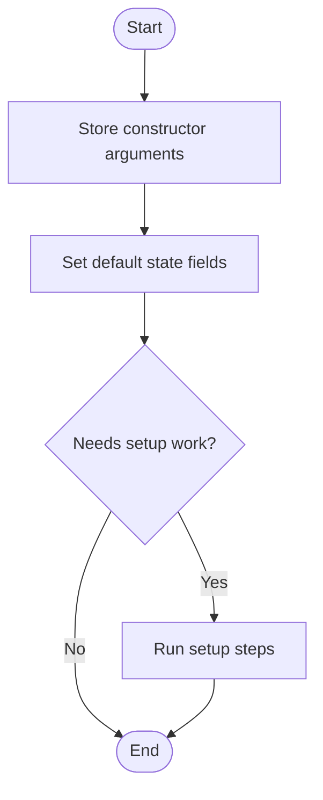
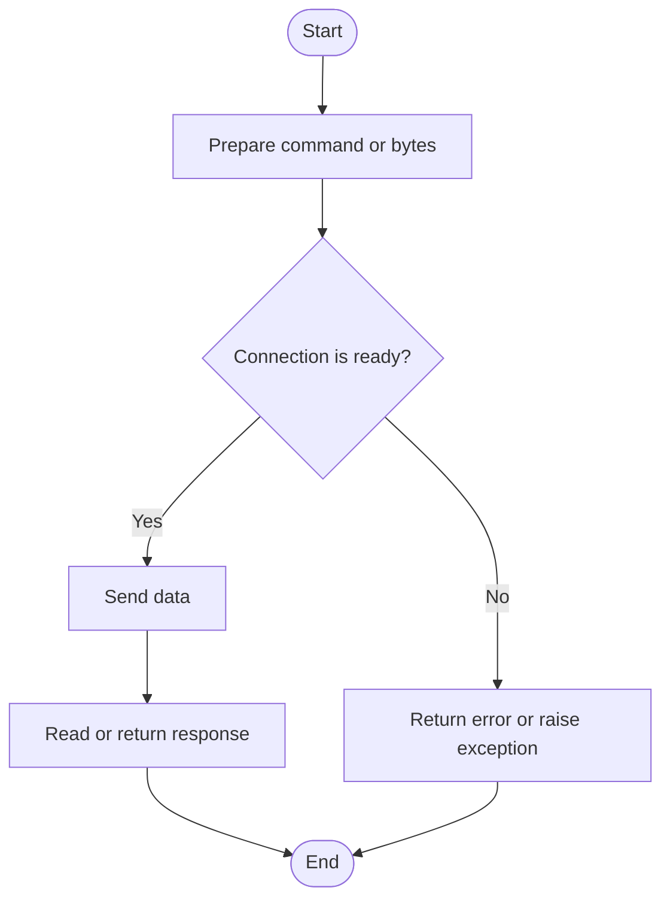
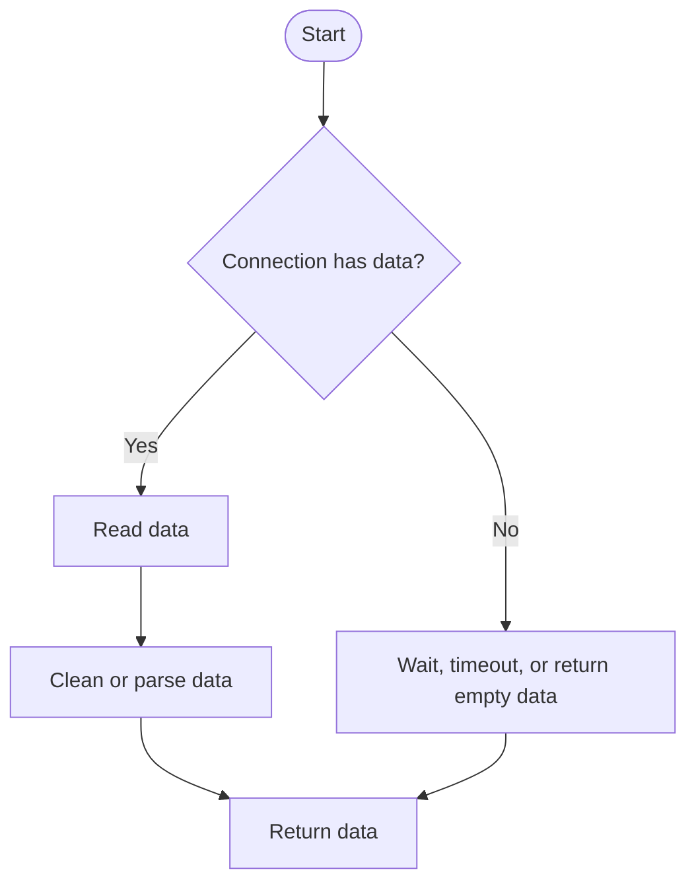
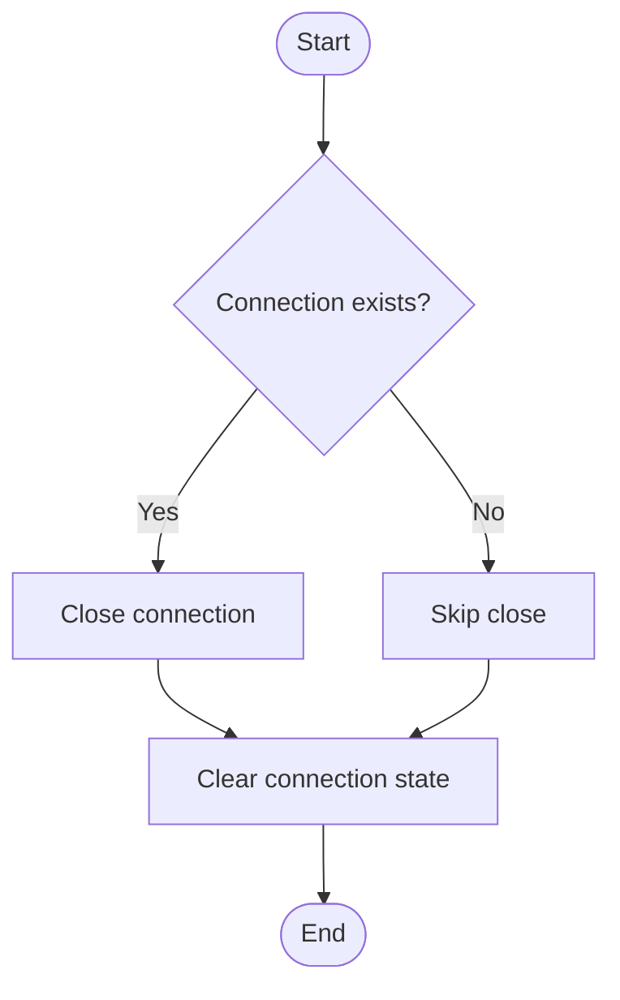
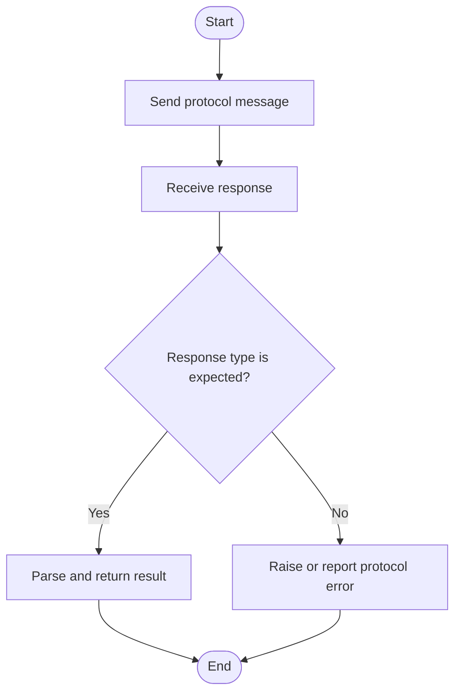
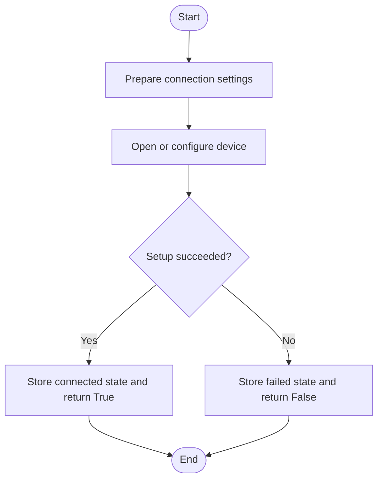
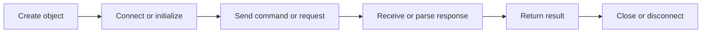

# DoIPConnection, In Simple English

Source: `src/ddt4all/core/doip/doip_connection.py`

`DoIPConnection` is one part of the core code. This version uses simple English. It keeps the same meaning as the normal document, but uses shorter sentences.

## Table Of Contents

- [Method Reference And Flowcharts](#method-reference-and-flowcharts)
- [Initialization Functions](#initialization-functions)
  - [`__init__(self, target_ip='192.168.0.12', target_port=13400)`](#init-self-target-ip-192-168-0-12-target-port-13400)
- [Main Functions](#main-functions)
  - [`vehicle_identification_request(self)`](#vehicle-identification-request-self)
  - [`send_message(self, message_type, payload=b'')`](#send-message-self-message-type-payload-b)
  - [`send_diagnostic_message(self, req_bytes)`](#send-diagnostic-message-self-req-bytes)
  - [`receive_message(self)`](#receive-message-self)
  - [`disconnect(self)`](#disconnect-self)
  - [`diagnostic_session_control(self, session_type)`](#diagnostic-session-control-self-session-type)
  - [`connect(self)`](#connect-self)
- [Auxiliary Functions](#auxiliary-functions)
  - [`alive_check(self)`](#alive-check-self)
- [Flow Summary](#flow-summary)

## Other Code Used By This Class

- `socket` and `struct`: used for network messages and binary packet layout.
- `DoIPMessageType`: names DoIP payload types.
- `DoIPProtocolError`: reports DoIP protocol failures.

## Stored Values

| Attribute | Purpose |
| --- | --- |
| `target_ip` | Target IP address. |
| `target_port` | Target TCP port. |
| `socket` | Network socket. |
| `connection_status` | Whether the connection is active. |
| `source_address` | DoIP source address. |
| `target_address` | DoIP target address. |
| `timeout` | Timeout value. |
| `extended_29bit` | Whether extended 29-bit addressing is enabled. |

## Method Reference And Flowcharts

## Initialization Functions

### `__init__(self, target_ip='192.168.0.12', target_port=13400)`

Creates a `DoIPConnection` object and sets its starting state.

## Main Functions

### `vehicle_identification_request(self)`

Send vehicle identification request using ISO 13400

### `send_message(self, message_type, payload=b'')`

Send DoIP message

### `send_diagnostic_message(self, req_bytes)`

Send diagnostic message with addressing using ISO 13400

### `receive_message(self)`

Receive DoIP message

### `disconnect(self)`

Close DoIP connection

### `diagnostic_session_control(self, session_type)`

Control diagnostic session using ISO 13400

### `connect(self)`

Open DoIP connection

## Auxiliary Functions

### `alive_check(self)`

Perform alive check using ISO 13400

## Flow Summary

This is the short version of how `DoIPConnection` is used.

