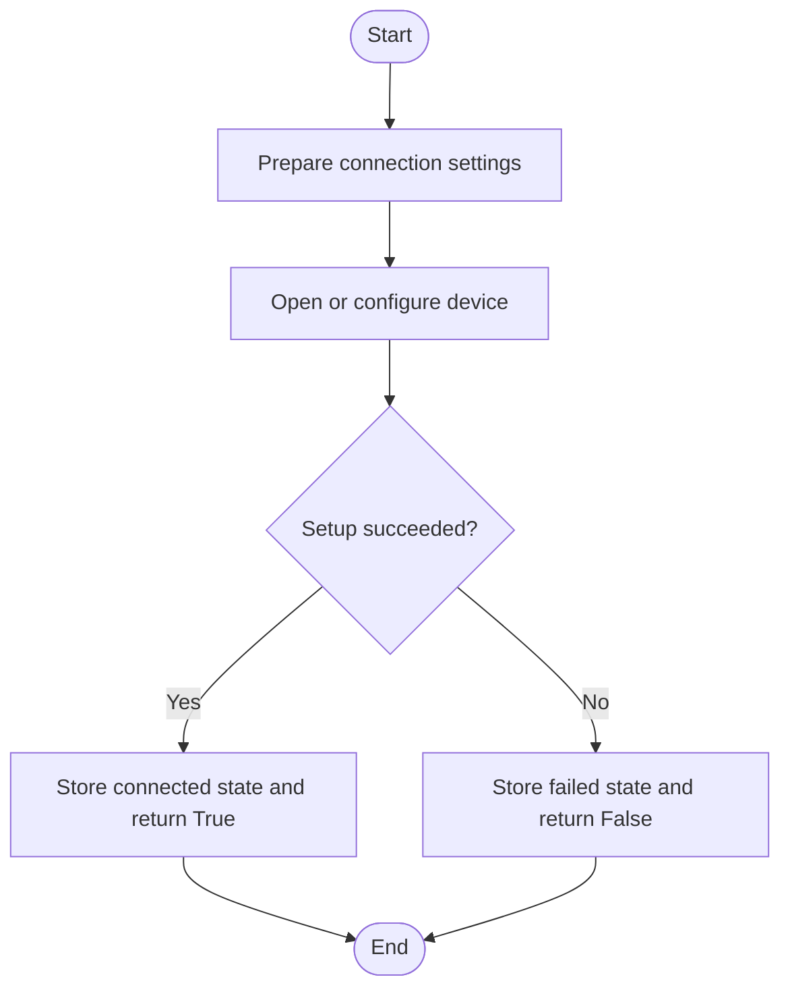
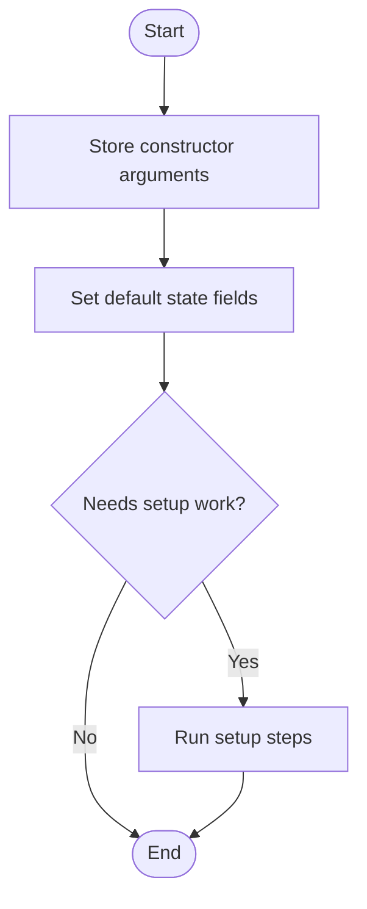
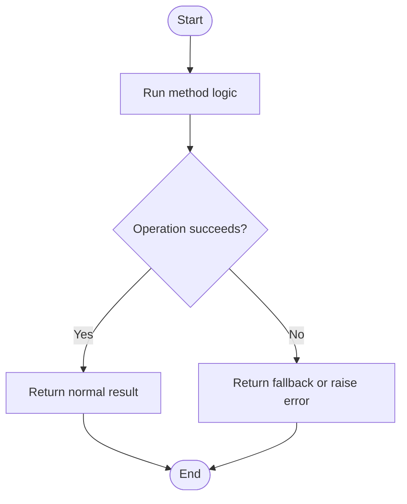
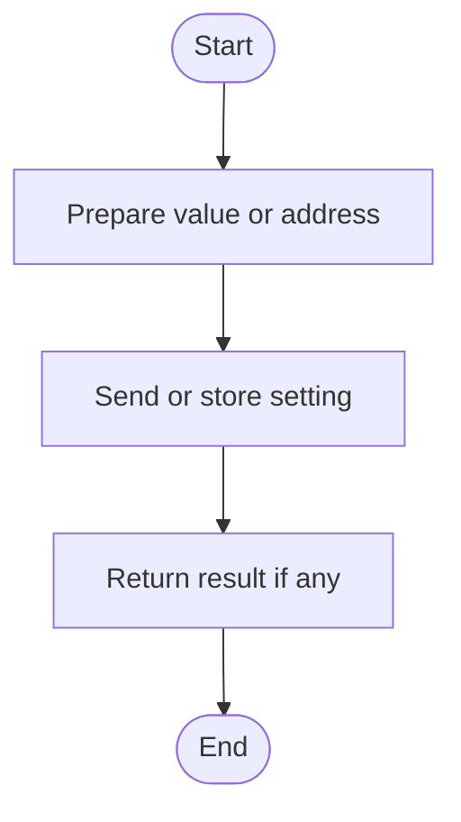
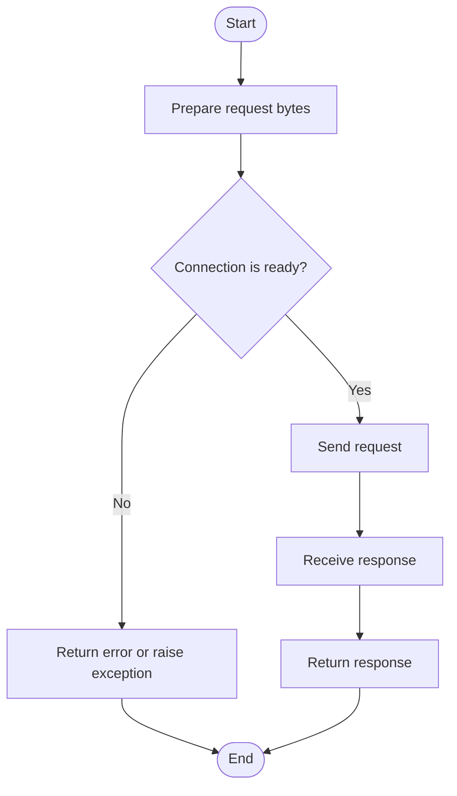
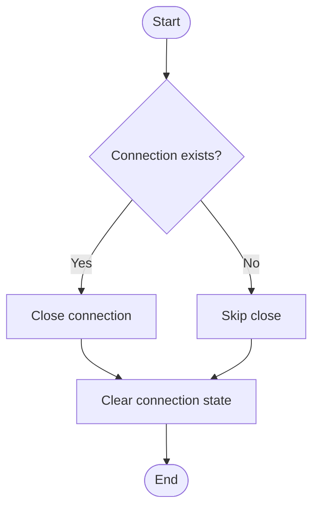
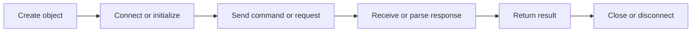

# DoIPDevice, In Simple English

Source: `src/ddt4all/core/doip/doip_devices.py`

`DoIPDevice` is one part of the core code. This version uses simple English. It keeps the same meaning as the normal document, but uses shorter sentences.

## Table Of Contents

- [Method Reference And Flowcharts](#method-reference-and-flowcharts)
- [Initialization Functions](#initialization-functions)
  - [`init_can(self)`](#init-can-self)
  - [`__init__(self, target_ip='192.168.0.12')`](#init-self-target-ip-192-168-0-12)
- [Main Functions](#main-functions)
  - [`start_session_can(self, start_session)`](#start-session-can-self-start-session)
  - [`set_can_addr(self, addr, ecu, canline=0)`](#set-can-addr-self-addr-ecu-canline-0)
  - [`request(self, req, positive='', cache=True, serviceDelay='0')`](#request-self-req-positive-cache-true-servicedelay-0)
  - [`disconnect(self)`](#disconnect-self)
  - [`connect(self)`](#connect-self)
- [Auxiliary Functions](#auxiliary-functions)
- [Flow Summary](#flow-summary)

## Other Code Used By This Class

- `socket` and `struct`: used for network messages and binary packet layout.
- `DoIPMessageType`: names DoIP payload types.
- `DoIPProtocolError`: reports DoIP protocol failures.

## Stored Values

| Attribute | Purpose |
| --- | --- |
| `doip` | Internal `doip` value used by the class. |
| `connectionStatus` | Connection status flag. |
| `currentaddress` | Current diagnostic address. |
| `startSession` | Last started diagnostic session. |
| `rsp_cache` | Response cache. |
| `device_type` | Detected or configured device type. |
| `settings` | Device-specific settings. |
| `timeout` | Timeout value. |
| `target_address` | DoIP target address. |

## Method Reference And Flowcharts

## Initialization Functions

### `init_can(self)`

Initialize CAN communication over DoIP

### `__init__(self, target_ip='192.168.0.12')`

Creates a `DoIPDevice` object and sets its starting state.

## Main Functions

### `start_session_can(self, start_session)`

Start diagnostic session over DoIP using ISO 13400

### `set_can_addr(self, addr, ecu, canline=0)`

Set CAN addressing for DoIP communication with Electric ECU support Special support for Electric ECUs and EVC (Electric Vehicle Controller) in newer vehicles.

### `request(self, req, positive='', cache=True, serviceDelay='0')`

Send diagnostic request over DoIP with proper error handling

### `disconnect(self)`

Close DoIP connection gracefully

### `connect(self)`

Open DoIP connection with vehicle identification

## Auxiliary Functions

This class has no methods in this group.

## Flow Summary

This is the short version of how `DoIPDevice` is used.

