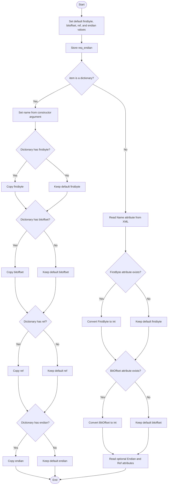
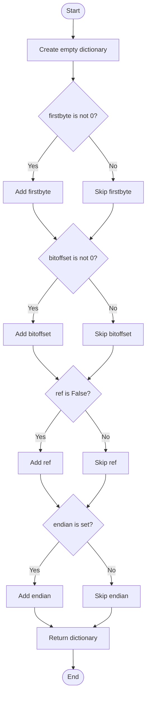
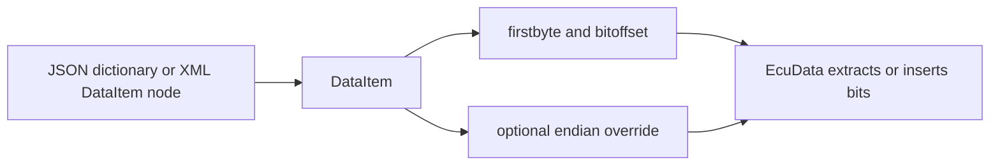

# DataItem

Source: `src/ddt4all/core/ecu/data_item.py`

[DataItem](data_item.md) describes where one named value is located inside a request or response byte stream. It does not know how to convert the value itself; it only stores the byte position, bit offset, optional endian override, and reference flag that other classes need when reading or writing data.

## Table Of Contents

- [Overview](#overview)
- [Collaborators](#collaborators)
- [State](#state)
- [Implementation Notes](#implementation-notes)
- [Method Reference And Flowcharts](#method-reference-and-flowcharts)
  - [Initialization Functions](#initialization-functions)
    - [`__init__(self, item, req_endian, name='')`](#init-self-item-req-endian-name)
  - [Main Functions](#main-functions)
  - [Auxiliary Functions](#auxiliary-functions)
    - [`dump(self)`](#dump-self)
- [Flow Summary](#flow-summary)

## Overview

[DataItem](data_item.md) is the positional half of ECU data handling. [EcuData](ecu_data.md) knows how many bits a value uses and how the raw bytes should be converted, while [DataItem](data_item.md) tells [EcuData](ecu_data.md) where those bits start in a concrete request or response.

The class supports two input formats. Dictionary input is used when loading JSON-style ECU data. XML node input is used when loading legacy XML ECU files. Both branches fill the same attributes, so the rest of the code can treat the result the same way.

Byte positions are stored as one-based values. [EcuData](ecu_data.md) converts [firstbyte](data_item.md#state) to a zero-based index when slicing Python lists or strings.

## Collaborators

- [EcuRequest](ecu_request.md): creates [DataItem](data_item.md) objects for send-byte input fields and receive-byte output fields.
- [EcuData](ecu_data.md): uses [firstbyte](data_item.md#state), [bitoffset](data_item.md#state), and [endian](data_item.md#state) when extracting values from ECU responses or inserting values into request bytes.
- XML ECU files: provide [Name](xml_ecu_files.md#name), [FirstByte](xml_ecu_files.md#firstbyte), [BitOffset](xml_ecu_files.md#bitoffset), [Endian](xml_ecu_files.md#endian), and [Ref](xml_ecu_files.md#ref) attributes.
- JSON ECU files: provide lowercase dictionary keys such as [firstbyte](data_item.md#state), [bitoffset](data_item.md#state), [ref](data_item.md#state), and [endian](data_item.md#state).

## State

| Attribute | Purpose |
| --- | --- |
| [firstbyte](data_item.md#state) | One-based byte position where the value starts. A value of `0` means no explicit start byte was stored. |
| [bitoffset](data_item.md#state) | Bit offset inside the first byte. A value of `0` means the value starts at the first bit used by the encoding logic. |
| [ref](data_item.md#state) | Whether the XML data item was marked as a reference with [Ref="1"](xml_ecu_files.md#ref). |
| [endian](data_item.md#state) | Optional endian override for this data item. [EcuData](ecu_data.md) lets this override the ECU/request endian setting. |
| [req_endian](data_item.md#state) | Endianness inherited from the request or ECU file. The current [DataItem](data_item.md) methods store it but do not use it directly. |
| [name](#state) | Data item name. For dictionary input, the name is passed separately; for XML input, it comes from the [Name](xml_ecu_files.md#name) attribute. |

## Implementation Notes

- Dictionary input and XML input use different field names: JSON uses lowercase keys, while XML uses capitalized attributes.
- [firstbyte](data_item.md#state) from XML is converted to `int`; dictionary input is copied as provided.
- [bitoffset](data_item.md#state) from XML is converted to `int`; dictionary input is copied as provided.
- [ref](data_item.md#state) defaults to `False`. XML sets it to `True` only when [Ref](xml_ecu_files.md#ref) exists and equals `1`.
- `dump` intentionally omits default values for [firstbyte](data_item.md#state), [bitoffset](data_item.md#state), and [endian](data_item.md#state), but it writes [ref](data_item.md#state) when [ref](data_item.md#state) is `False`. This mirrors the current code exactly, even though it may look surprising at first glance.
- [req_endian](data_item.md#state) is not included in `dump`, because it belongs to the surrounding request or ECU file context rather than to the serialized data item itself.

## Method Reference And Flowcharts

## Initialization Functions

### `__init__(self, item, req_endian, name='')`

Initializes a positional data item from either a dictionary or an XML node. It first sets defaults, stores the inherited request endianness, and then fills position and metadata fields from the selected input format. Dictionary input uses the separately supplied [name](#state); XML input reads the name from the node.

## Main Functions

This class has no methods in this group.

## Auxiliary Functions

### `dump(self)`

Serializes the stored data item position to a compact dictionary. The method writes only non-default position and endian fields, except for [ref](data_item.md#state), which is written when it is `False` according to the current implementation. The inherited [req_endian](data_item.md#state) and the data item [name](#state) are not included in the output.

## Flow Summary

[DataItem](data_item.md) turns a JSON or XML field-position definition into the small set of coordinates that [EcuData](ecu_data.md) needs for byte and bit operations.

