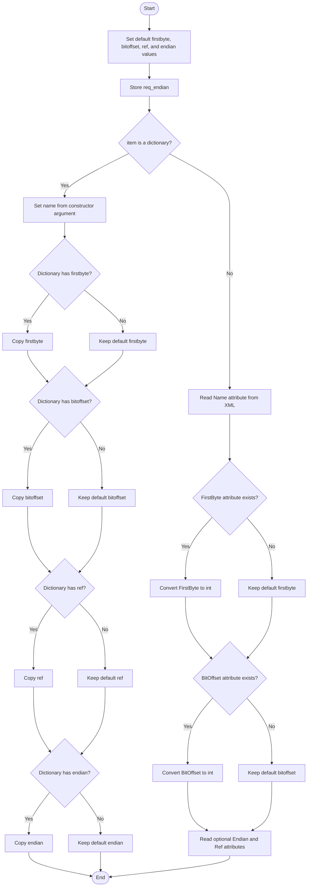
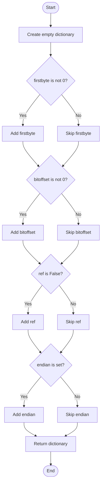
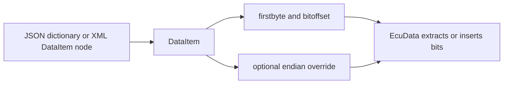

# DataItem, In Simple English

Source: `src/ddt4all/core/ecu/data_item.py`

[DataItem](data_item_easylang.md) tells the program where one value is located inside ECU bytes. It does not convert the value. It only stores the byte number, bit offset, optional byte-order override, and a reference flag.

## Table Of Contents

- [Simple Overview](#simple-overview)
- [Other Code Used By This Class](#other-code-used-by-this-class)
- [Stored Values](#stored-values)
- [Important Details For Beginners](#important-details-for-beginners)
- [Method Guide And Flowcharts](#method-guide-and-flowcharts)
  - [Initialization Functions](#initialization-functions)
    - [`__init__(self, item, req_endian, name='')`](#init-self-item-req-endian-name)
  - [Main Functions](#main-functions)
  - [Auxiliary Functions](#auxiliary-functions)
    - [`dump(self)`](#dump-self)
- [Simple Flow Summary](#simple-flow-summary)

## Simple Overview

[DataItem](data_item_easylang.md) is about position. It answers questions like: "Which byte does this value start in?" and "Which bit inside that byte is used first?"

[EcuData](ecu_data_easylang.md) knows how to convert bytes into a readable value. [DataItem](data_item_easylang.md) tells [EcuData](ecu_data_easylang.md) where to look.

The class can read its data from JSON-style dictionaries or from XML nodes. After loading, both formats become the same kind of Python object.

## Other Code Used By This Class

- [EcuRequest](ecu_request_easylang.md): creates [DataItem](data_item_easylang.md) objects for values sent to the ECU and values read from the ECU answer.
- [EcuData](ecu_data_easylang.md): uses the byte and bit position stored here.
- XML ECU files: provide attributes such as [Name](xml_ecu_files.md#name), [FirstByte](xml_ecu_files.md#firstbyte), [BitOffset](xml_ecu_files.md#bitoffset), [Endian](xml_ecu_files.md#endian), and [Ref](xml_ecu_files.md#ref).
- JSON ECU files: provide keys such as [firstbyte](data_item_easylang.md#stored-values), [bitoffset](data_item_easylang.md#stored-values), [ref](data_item_easylang.md#stored-values), and [endian](data_item_easylang.md#stored-values).

## Stored Values

| Attribute | Purpose |
| --- | --- |
| [firstbyte](data_item_easylang.md#stored-values) | The byte where the value starts. This number is one-based, so byte `1` means the first byte. |
| [bitoffset](data_item_easylang.md#stored-values) | The bit offset inside the first byte. |
| [ref](data_item_easylang.md#stored-values) | Whether the XML item was marked as a reference. |
| [endian](data_item_easylang.md#stored-values) | Optional byte-order override for this value. |
| [req_endian](data_item_easylang.md#stored-values) | Byte order inherited from the request or ECU file. This class stores it but does not use it directly. |
| [name](#stored-values) | Name of the data item. |

## Important Details For Beginners

- JSON input and XML input use different names for the same ideas.
- XML [FirstByte](xml_ecu_files.md#firstbyte) and [BitOffset](xml_ecu_files.md#bitoffset) are converted to integers.
- Dictionary values are copied as they are.
- [ref](data_item_easylang.md#stored-values) starts as `False`. XML sets it to `True` only when [Ref="1"](xml_ecu_files.md#ref).
- `dump` leaves out most default values, but it writes [ref](data_item_easylang.md#stored-values) when [ref](data_item_easylang.md#stored-values) is `False`, because that is what the current code does.
- [req_endian](data_item_easylang.md#stored-values) is not written by `dump`, because it belongs to the surrounding request or ECU file.

## Method Guide And Flowcharts

## Initialization Functions

### `__init__(self, item, req_endian, name='')`

Creates a [DataItem](data_item_easylang.md) from a dictionary or XML node. It starts with default values, stores the inherited byte order, and then reads byte position, bit offset, reference flag, and endian override.

## Main Functions

This class has no methods in this group.

## Auxiliary Functions

### `dump(self)`

Returns a small dictionary with the stored position data. Most default values are left out. The item name and inherited byte order are not included.

## Simple Flow Summary

[DataItem](data_item_easylang.md) reads a position definition and stores the coordinates needed to read or write a value in ECU bytes.

