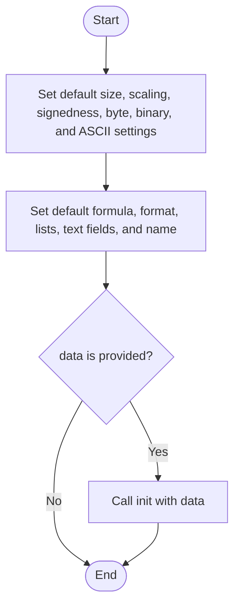
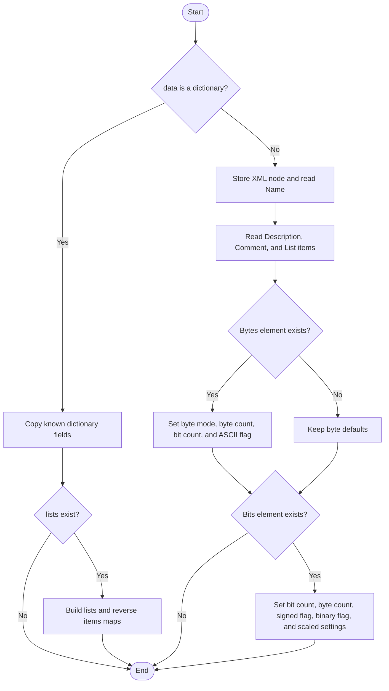
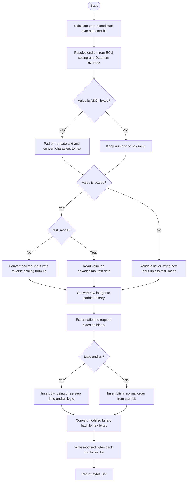
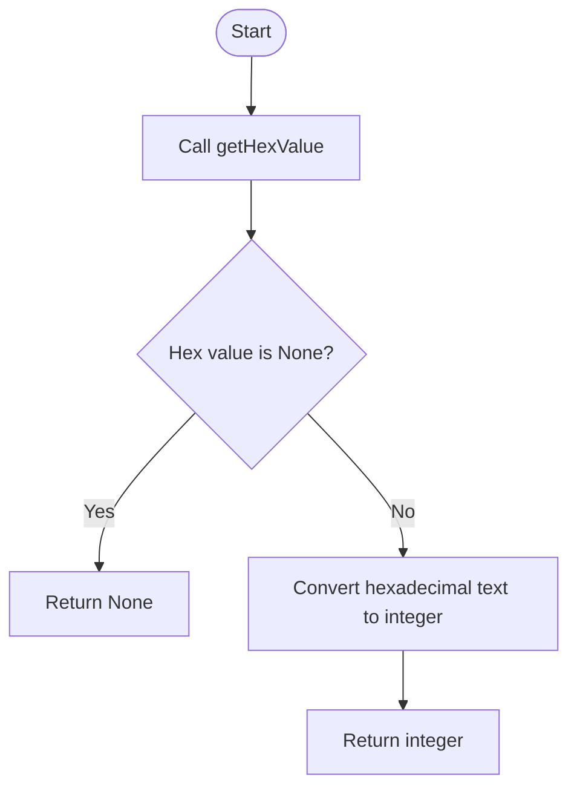
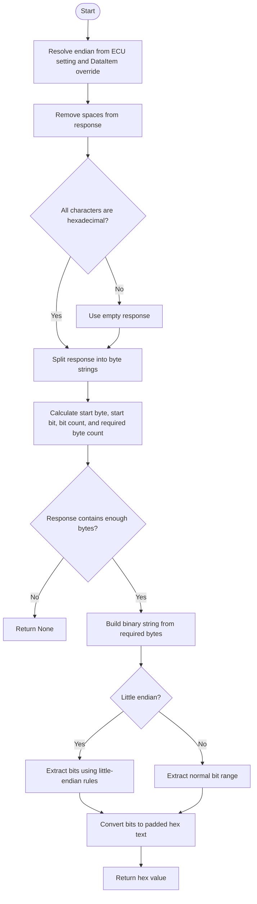
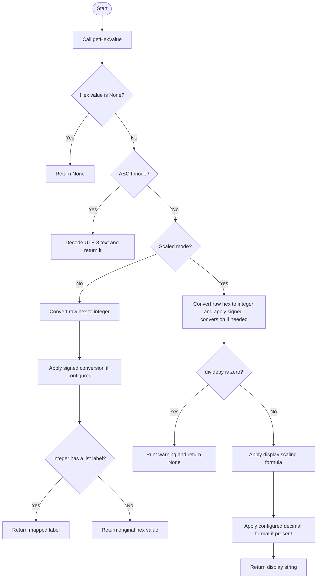
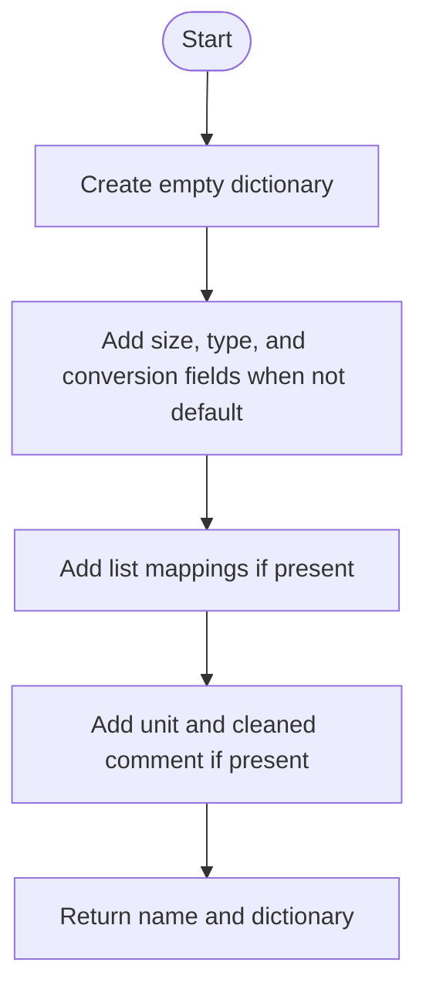
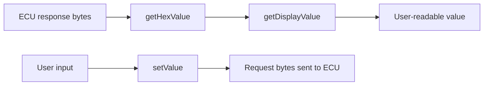

# EcuData

Source: `src/ddt4all/core/ecu/ecu_data.py`

[EcuData](ecu_data.md) describes how one named ECU value is encoded in raw diagnostic bytes. It knows the value size, signedness, scaling formula, ASCII mode, list mappings, display format, unit, and comment.

## Table Of Contents

- [Overview](#overview)
- [Collaborators](#collaborators)
- [State](#state)
- [Implementation Notes](#implementation-notes)
- [Method Reference And Flowcharts](#method-reference-and-flowcharts)
  - [Initialization Functions](#initialization-functions)
    - [`__init__(self, data, name='')`](#init-self-data-name)
    - [`init(self, data)`](#init-self-data)
  - [Main Functions](#main-functions)
    - [`setValue(self, value, bytes_list, dataitem, ecu_endian, test_mode=False)`](#setvalue-self-value-bytes-list-dataitem-ecu-endian-test-mode-false)
    - [`getIntValue(self, resp, dataitem, ecu_endian)`](#getintvalue-self-resp-dataitem-ecu-endian)
    - [`getHexValue(self, resp, dataitem, ecu_endian)`](#gethexvalue-self-resp-dataitem-ecu-endian)
    - [`getDisplayValue(self, elm_data, dataitem, ecu_endian)`](#getdisplayvalue-self-elm-data-dataitem-ecu-endian)
  - [Auxiliary Functions](#auxiliary-functions)
    - [`dump(self)`](#dump-self)
- [Flow Summary](#flow-summary)

## Overview

The class separates the definition of a value from the position of a value. [EcuData](ecu_data.md) describes conversion rules, while [DataItem](data_item.md) tells where the bits are located inside a request or response stream.

Read flow starts with [getHexValue](ecu_data.md#gethexvalue-self-resp-dataitem-ecu-endian), which extracts the raw bit range. [getDisplayValue](ecu_data.md#getdisplayvalue-self-elm-data-dataitem-ecu-endian) then converts that raw value into text, a list label, a scaled number, or decoded ASCII.

Write flow uses [setValue](ecu_data.md#setvalue-self-value-bytes-list-dataitem-ecu-endian-test-mode-false), which validates user input, applies reverse scaling when needed, converts the result to bits, and writes those bits into a mutable request byte list.

## Collaborators

- [DataItem](data_item.md): provides [firstbyte](data_item.md#state), [bitoffset](data_item.md#state), and optional endian override for extraction or insertion.
- [EcuRequest](ecu_request.md): uses [EcuData](ecu_data.md) when building request streams and decoding response streams.
- [utils.hex8_tosigned](utils.md#hex8-tosigned) and [utils.hex16_tosigned](utils.md#hex16-tosigned): convert raw unsigned values to signed display values for one-byte and two-byte fields.
- [utils.cleanhtml](utils.md#cleanhtml): removes HTML markup from comments during export.

## State

| Attribute | Purpose |
| --- | --- |
| [bitscount](ecu_data.md#state) | Number of bits that belong to this value. |
| [scaled](ecu_data.md#state) | Whether the raw number must be converted with step, offset, and divideby. |
| [signed](ecu_data.md#state) | Whether the raw number should be interpreted as signed. |
| [byte](ecu_data.md#state) | Whether the value is defined as byte-oriented XML data. |
| [binary](ecu_data.md#state) | Whether the XML definition marks the value as binary. |
| [bytescount](ecu_data.md#state) | Number of bytes needed to store the value. |
| [bytesascii](ecu_data.md#state) | Whether bytes should be decoded as UTF-8 text. |
| [step](ecu_data.md#state) | Multiplier used by the scaling formula. |
| [offset](ecu_data.md#state) | Offset used by the scaling formula. |
| [divideby](ecu_data.md#state) | Divisor used by the scaling formula. A zero divisor makes display conversion fail safely. |
| [format](ecu_data.md#state) | Optional decimal display format. |
| [lists](ecu_data.md#state) | Mapping from raw integer values to display labels. |
| [items](ecu_data.md#state) | Reverse mapping from display labels to raw integer values. |
| [description](ecu_data.md#state) | Long XML description text. |
| [unit](ecu_data.md#state) | Display unit. |
| [comment](ecu_data.md#state) | Comment text, cleaned during dump. |
| [name](#state) | Data name. |

## Implementation Notes

- The scaling formula for display is `(raw * step + offset) / divideby`; [setValue](ecu_data.md#setvalue-self-value-bytes-list-dataitem-ecu-endian-test-mode-false) applies the reverse formula for user input.
- ASCII values are padded or truncated to [bytescount](ecu_data.md#state) before writing.
- Only one-byte and two-byte signed values are converted with helper functions; larger signed values currently print a warning in the non-scaled display path.
- Little-endian bit extraction and insertion use custom multi-step logic. The code treats little-endian bit placement differently from a simple byte reversal.

## Method Reference And Flowcharts

## Initialization Functions

### `__init__(self, data, name='')`

Creates the data definition with defaults for an eight-bit, unscaled, unsigned, non-ASCII value. If [data](ecu_file.md#state) is provided, the constructor immediately delegates to [init](ecu_data.md#init-self-data) so dictionary and XML inputs use the same final object shape.

### `init(self, data)`

Loads conversion metadata from a dictionary or XML node. The dictionary branch copies known keys and rebuilds list mappings. The XML branch reads description, comment, list items, byte definitions, bit definitions, signed flags, binary flags, scaling parameters, display format, and unit.

## Main Functions

### `setValue(self, value, bytes_list, dataitem, ecu_endian, test_mode=False)`

Writes a user-provided value into an existing request byte list. It resolves endian rules from the ECU and [DataItem](data_item.md), converts ASCII or numeric input to a raw integer, applies reverse scaling when needed, validates hexadecimal input for unscaled fields, writes the result into the selected bit range, and returns the modified list. Invalid non-test input can return `None`.

### `getIntValue(self, resp, dataitem, ecu_endian)`

Returns the extracted raw value as an integer. This is a thin wrapper around [getHexValue](ecu_data.md#gethexvalue-self-resp-dataitem-ecu-endian); `None` is preserved when extraction fails.

### `getHexValue(self, resp, dataitem, ecu_endian)`

Extracts the raw hexadecimal value from a response string. It cleans whitespace, rejects non-hex data by treating it as empty, computes the required byte range from [DataItem](data_item.md) and [bitscount](ecu_data.md#state), checks response length, builds a binary representation, extracts the configured bit range with big-endian or custom little-endian logic, pads the result to the expected byte length, and returns hex text.

### `getDisplayValue(self, elm_data, dataitem, ecu_endian)`

Converts a raw ECU response into a display string. It first calls [getHexValue](ecu_data.md#gethexvalue-self-resp-dataitem-ecu-endian). ASCII data is decoded as UTF-8. Unscaled numeric data may be converted to signed form and mapped through [lists](ecu_data.md#state). Scaled data is converted with the scaling formula, guarded against division by zero, and optionally formatted with the configured decimal precision.

## Auxiliary Functions

### `dump(self)`

Exports the data definition as `(name, dictionary)`. The dictionary is compact: many default values are omitted, list mappings are converted to integer keys, and comments are cleaned with [cleanhtml](utils.md#cleanhtml).

## Flow Summary

[EcuData](ecu_data.md) is the conversion layer between bytes and meaningful values. [getHexValue](ecu_data.md#gethexvalue-self-resp-dataitem-ecu-endian) extracts raw data, [getDisplayValue](ecu_data.md#getdisplayvalue-self-elm-data-dataitem-ecu-endian) makes it readable, and [setValue](ecu_data.md#setvalue-self-value-bytes-list-dataitem-ecu-endian-test-mode-false) writes user input back into request bytes.

