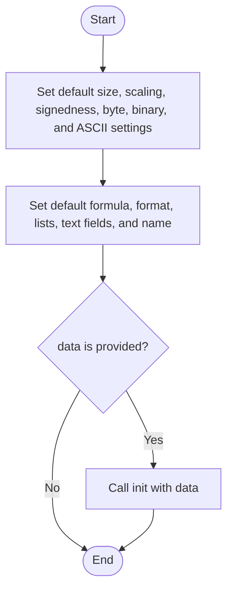
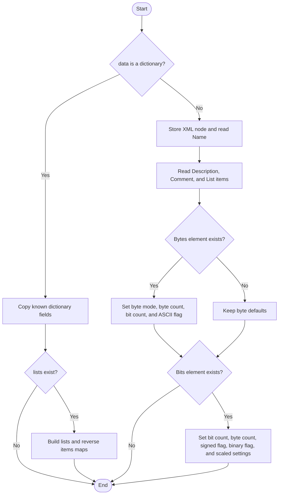
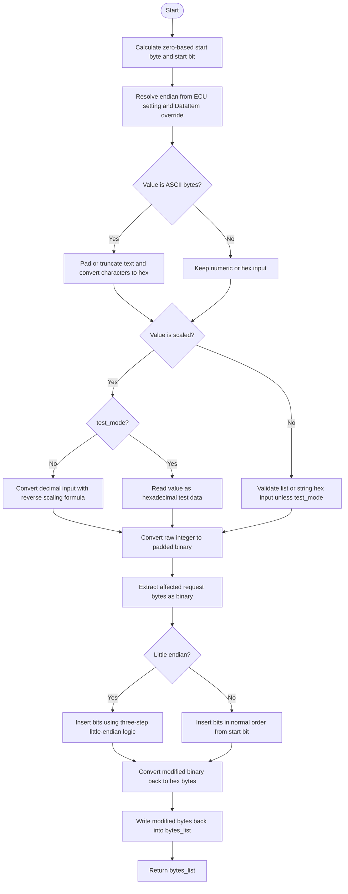
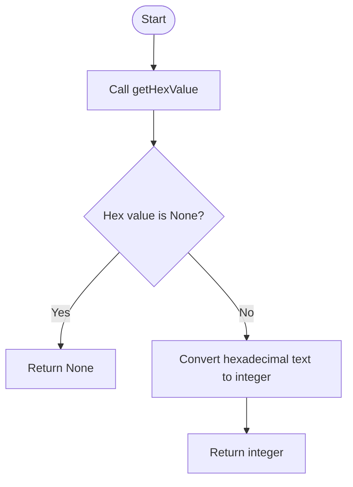
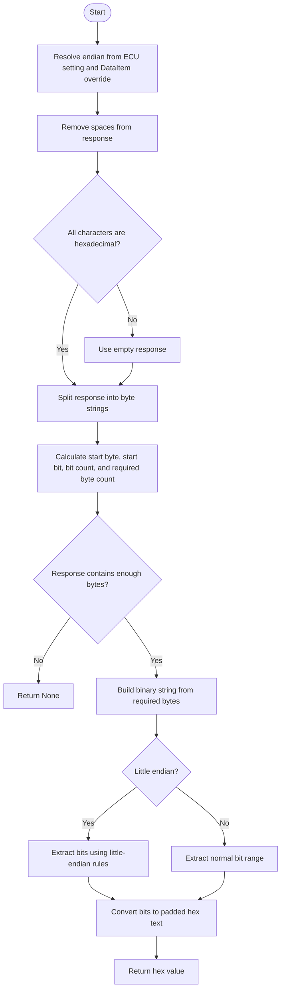
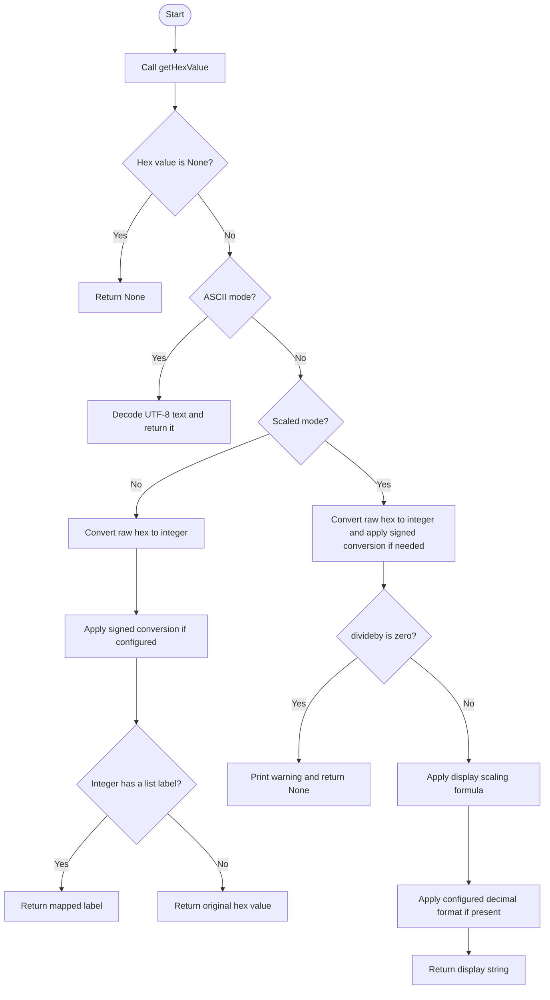
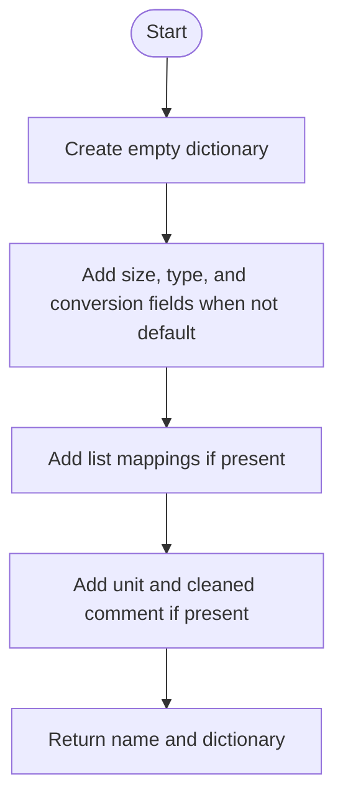
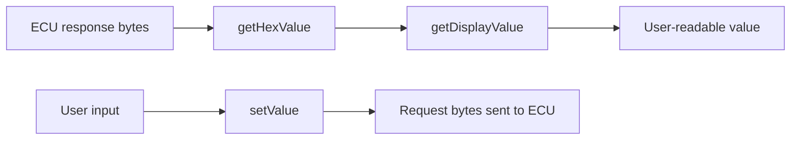

# EcuData, In Simple English

Source: `src/ddt4all/core/ecu/ecu_data.py`

[EcuData](ecu_data_easylang.md) explains how one ECU value is stored in bytes. It can turn raw bytes into a value for the user, and it can put a user value back into request bytes.

## Table Of Contents

- [Simple Overview](#simple-overview)
- [Other Code Used By This Class](#other-code-used-by-this-class)
- [Stored Values](#stored-values)
- [Important Details For Beginners](#important-details-for-beginners)
- [Method Guide And Flowcharts](#method-guide-and-flowcharts)
  - [Initialization Functions](#initialization-functions)
    - [`__init__(self, data, name='')`](#init-self-data-name)
    - [`init(self, data)`](#init-self-data)
  - [Main Functions](#main-functions)
    - [`setValue(self, value, bytes_list, dataitem, ecu_endian, test_mode=False)`](#setvalue-self-value-bytes-list-dataitem-ecu-endian-test-mode-false)
    - [`getIntValue(self, resp, dataitem, ecu_endian)`](#getintvalue-self-resp-dataitem-ecu-endian)
    - [`getHexValue(self, resp, dataitem, ecu_endian)`](#gethexvalue-self-resp-dataitem-ecu-endian)
    - [`getDisplayValue(self, elm_data, dataitem, ecu_endian)`](#getdisplayvalue-self-elm-data-dataitem-ecu-endian)
  - [Auxiliary Functions](#auxiliary-functions)
    - [`dump(self)`](#dump-self)
- [Simple Flow Summary](#simple-flow-summary)

## Simple Overview

[EcuData](ecu_data_easylang.md) says how to understand bytes. [DataItem](data_item_easylang.md) says where the bytes are. Both are needed.

To read a value, the code first cuts the right bits out of the ECU answer, then converts them into something readable.

To write a value, the code converts user input into raw bits and places those bits into the request bytes.

## Other Code Used By This Class

- [DataItem](data_item_easylang.md): tells where the value is inside the bytes.
- [EcuRequest](ecu_request_easylang.md): uses this class to build requests and read answers.
- [utils.hex8_tosigned](utils.md#hex8-tosigned) and [utils.hex16_tosigned](utils.md#hex16-tosigned): help with signed numbers.
- [utils.cleanhtml](utils.md#cleanhtml): cleans comments before export.

## Stored Values

| Attribute | Purpose |
| --- | --- |
| [bitscount](ecu_data_easylang.md#stored-values) | Number of bits in the value. |
| [scaled](ecu_data_easylang.md#stored-values) | Whether the value uses a formula. |
| [signed](ecu_data_easylang.md#stored-values) | Whether the number can be negative. |
| [byte](ecu_data_easylang.md#stored-values) | Whether it is byte-based. |
| [binary](ecu_data_easylang.md#stored-values) | Whether it is marked as binary. |
| [bytescount](ecu_data_easylang.md#stored-values) | Number of bytes in the value. |
| [bytesascii](ecu_data_easylang.md#stored-values) | Whether bytes are text. |
| [step](ecu_data_easylang.md#stored-values) | Formula multiplier. |
| [offset](ecu_data_easylang.md#stored-values) | Formula offset. |
| [divideby](ecu_data_easylang.md#stored-values) | Formula divisor. |
| [format](ecu_data_easylang.md#stored-values) | Optional number format. |
| [lists](ecu_data_easylang.md#stored-values) | Map from number to text label. |
| [items](ecu_data_easylang.md#stored-values) | Map from text label to number. |
| [description](ecu_data_easylang.md#stored-values) | Description text. |
| [unit](ecu_data_easylang.md#stored-values) | Unit text. |
| [comment](ecu_data_easylang.md#stored-values) | Comment text. |
| [name](#stored-values) | Value name. |

## Important Details For Beginners

- Display scaling uses this formula: `(raw * step + offset) / divideby`.
- When writing ASCII text, text is made exactly as long as [bytescount](ecu_data_easylang.md#stored-values).
- Signed conversion is safest for one-byte and two-byte values.
- Little-endian handling is custom and more complex than just reversing bytes.

## Method Guide And Flowcharts

## Initialization Functions

### `__init__(self, data, name='')`

Creates a value definition with simple default settings. If data is given, it calls [init](ecu_data_easylang.md#init-self-data) to load the real settings.

### `init(self, data)`

Loads the real settings from a dictionary or XML. These settings tell the code how many bits to read and how to convert the raw value.

## Main Functions

### `setValue(self, value, bytes_list, dataitem, ecu_endian, test_mode=False)`

Writes a user value into request bytes. It first converts the value into raw bits, then puts those bits into the correct byte and bit position.

### `getIntValue(self, resp, dataitem, ecu_endian)`

Gets the raw hex value with [getHexValue](ecu_data_easylang.md#gethexvalue-self-resp-dataitem-ecu-endian) and converts it into an integer.

### `getHexValue(self, resp, dataitem, ecu_endian)`

Cuts the correct bits out of a raw ECU answer and returns them as hex text. If the answer is too short, it returns `None`.

### `getDisplayValue(self, elm_data, dataitem, ecu_endian)`

Reads a value from an ECU answer and turns it into text for the user. It can decode ASCII, show a list label, handle signed numbers, or apply a formula.

## Auxiliary Functions

### `dump(self)`

Exports the data definition as a name and a dictionary. Default values are mostly left out to keep JSON smaller.

## Simple Flow Summary

[EcuData](ecu_data_easylang.md) turns ECU bytes into readable values and turns user values back into request bytes.

