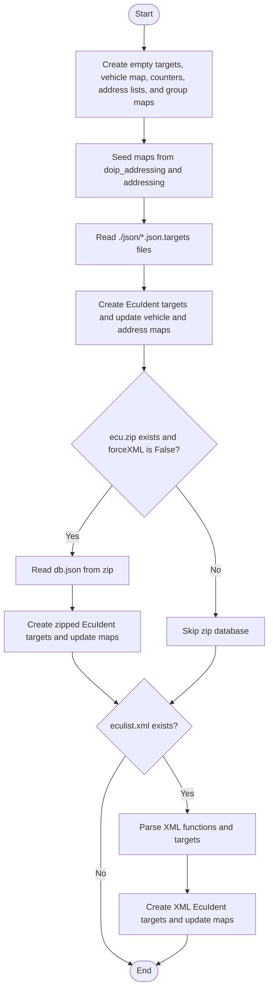
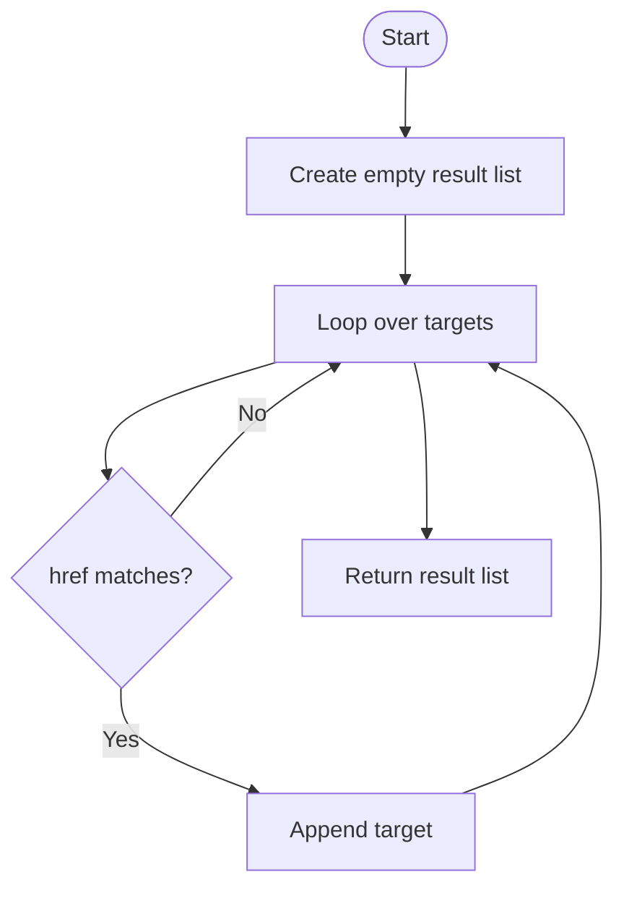
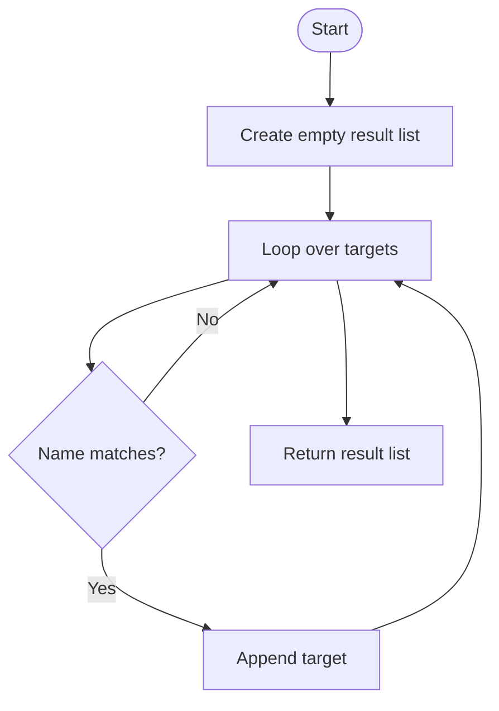
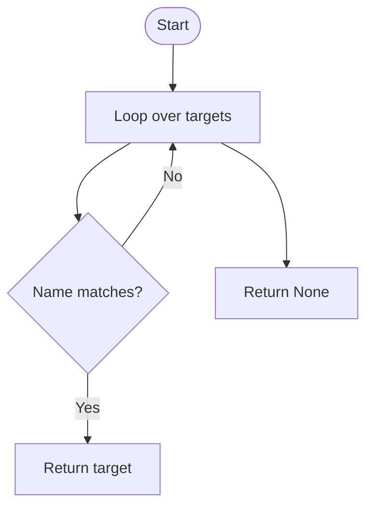
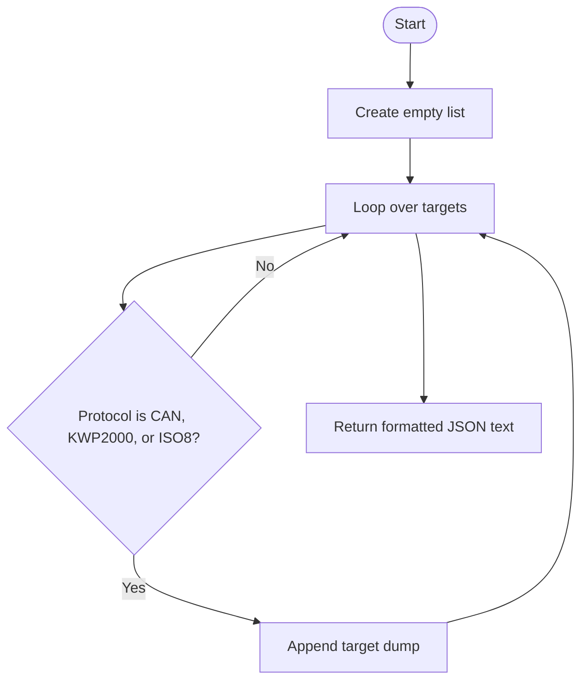
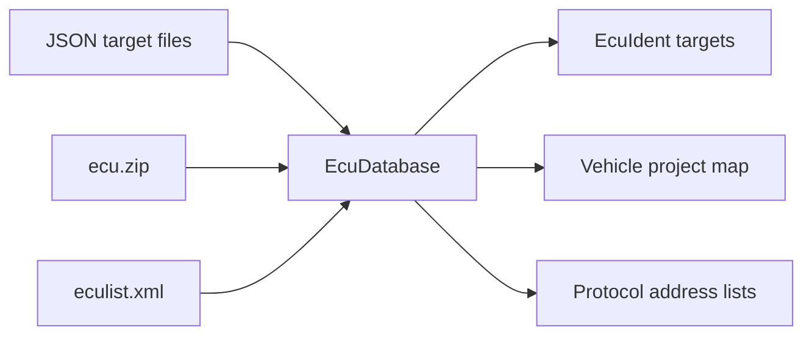

# EcuDatabase

Source: `src/ddt4all/core/ecu/ecu_database.py`

[EcuDatabase](ecu_database.md) builds the scanner lookup database. It collects known ECU identities, maps vehicle projects to diagnostic addresses, tracks available addresses by protocol, and maps addresses to ECU group names.

## Table Of Contents

- [Overview](#overview)
- [Collaborators](#collaborators)
- [State](#state)
- [Implementation Notes](#implementation-notes)
- [Method Reference And Flowcharts](#method-reference-and-flowcharts)
  - [Initialization Functions](#initialization-functions)
    - [`__init__(self, forceXML=False)`](#init-self-forcexml-false)
  - [Main Functions](#main-functions)
    - [`getTargetsByHref(self, href)`](#gettargetsbyhref-self-href)
    - [`getTargets(self, name)`](#gettargets-self-name)
    - [`getTarget(self, name)`](#gettarget-self-name)
  - [Auxiliary Functions](#auxiliary-functions)
    - [`dump(self)`](#dump-self)
- [Flow Summary](#flow-summary)

## Overview

The database is assembled from multiple sources. JSON `.targets` files are read first, [ecu.zip](ecu_zip.md) is read next when present and `forceXML` is not set, and [eculist.xml](eculist_xml.md) is parsed when available.

Each loaded target becomes an [EcuIdent](ecu_ident.md). The scanner later compares parsed ECU responses against these targets.

The [vehiclemap](ecu_database.md#state) lets scanning be limited to a vehicle project. Each project code maps to protocol/address pairs, so CAN and KWP scans can use a smaller address set.

## Collaborators

- [EcuIdent](ecu_ident.md): created for each known ECU identity.
- [EcuScanner](ecu_scanner.md): consumes targets, protocol address lists, vehicle maps, and address group names.
- [options.ecus_dir](../options.md#ecus-dir): supplies the XML ECU list directory.
- Global [addressing](ecu_database_module.md#addressing) and [doip_addressing](ecu_database_module.md#doip-addressing): seed address group mappings before file loading.

## State

| Attribute | Purpose |
| --- | --- |
| [targets](ecu_database.md#state) | All loaded [EcuIdent](ecu_ident.md) records. |
| [vehiclemap](ecu_database.md#state) | Project code to protocol/address entries. |
| [numecu](ecu_database.md#state) | Count incremented while loading database entries. |
| [available_addr_kwp](ecu_database.md#state) | Unique KWP addresses found in loaded data. |
| [available_addr_can](ecu_database.md#state) | Unique CAN addresses found in loaded data. |
| [available_addr_doip](ecu_database.md#state) | Unique DoIP addresses found in loaded data. |
| [addr_group_mapping_long](ecu_database.md#state) | Address to long group name. |
| [addr_group_mapping](ecu_database.md#state) | Address to short group name. |

## Implementation Notes

- The loader accepts both `diagnostic_version` and the misspelled `diagnotic_version` key for JSON target compatibility.
- [ecu.zip](ecu_zip.md) entries with empty auto-ident lists still create an [EcuIdent](ecu_ident.md) with empty identity values.
- The zip loading branch appends `ecu_ident` once inside the auto-ident handling and again after project mapping, which means some zip targets may be duplicated.
- `dump` exports only CAN, KWP2000, and ISO8 targets; DoIP targets are not included by that method.

## Method Reference And Flowcharts

## Initialization Functions

### `__init__(self, forceXML=False)`

Initializes the database containers, seeds address mappings from global addressing tables, loads JSON target files, optionally loads [ecu.zip](ecu_zip.md), parses [eculist.xml](eculist_xml.md) when present, and creates [EcuIdent](ecu_ident.md) targets plus project and address indexes.

## Main Functions

### `getTargetsByHref(self, href)`

Returns every target whose [href](ecu_ident.md#state) equals the requested ECU file reference. This is useful when several identities point to the same ECU file.

### `getTargets(self, name)`

Returns every target whose [name](#state) equals the requested name. The result may contain multiple protocol, address, or version variants.

### `getTarget(self, name)`

Returns the first target whose [name](#state) equals the requested name. It returns `None` if no target matches.

## Auxiliary Functions

### `dump(self)`

Exports scanner target data as formatted JSON for protocols currently included by the method: [CAN](protocols.md#can), [KWP2000](protocols.md#kwp2000), and [ISO8](protocols.md#iso8). Each exported entry comes from `EcuIdent.dump`.

## Flow Summary

[EcuDatabase](ecu_database.md) is the lookup table behind ECU discovery. It turns file-based target data into searchable [EcuIdent](ecu_ident.md) objects and scan address lists.

