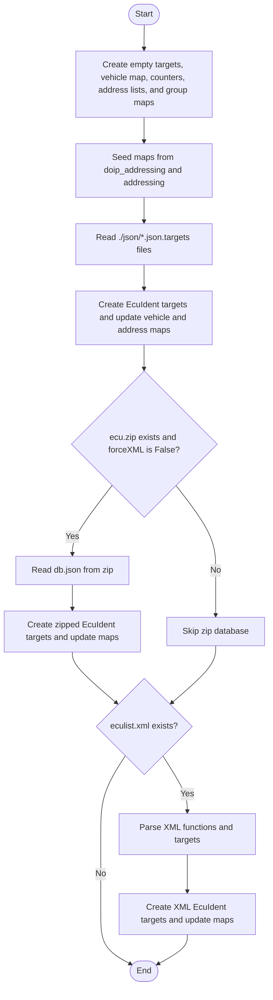
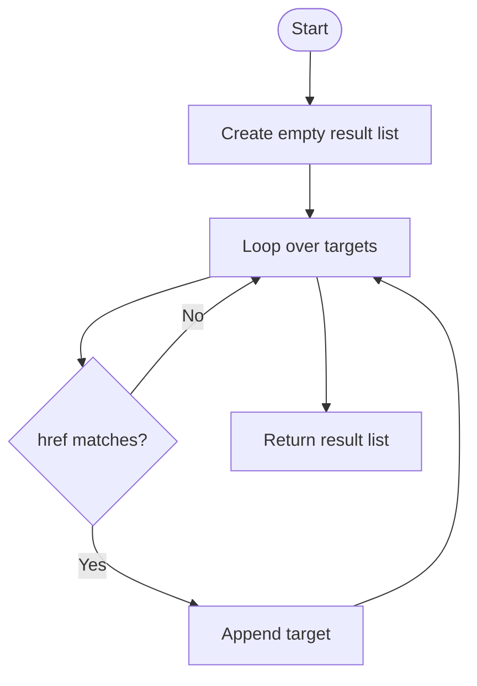
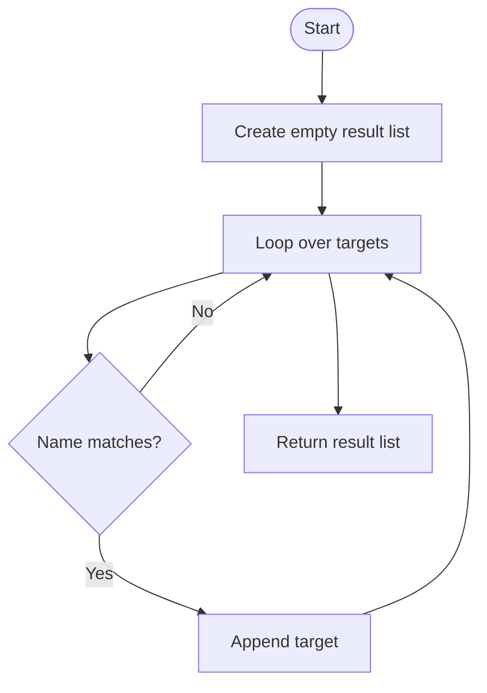
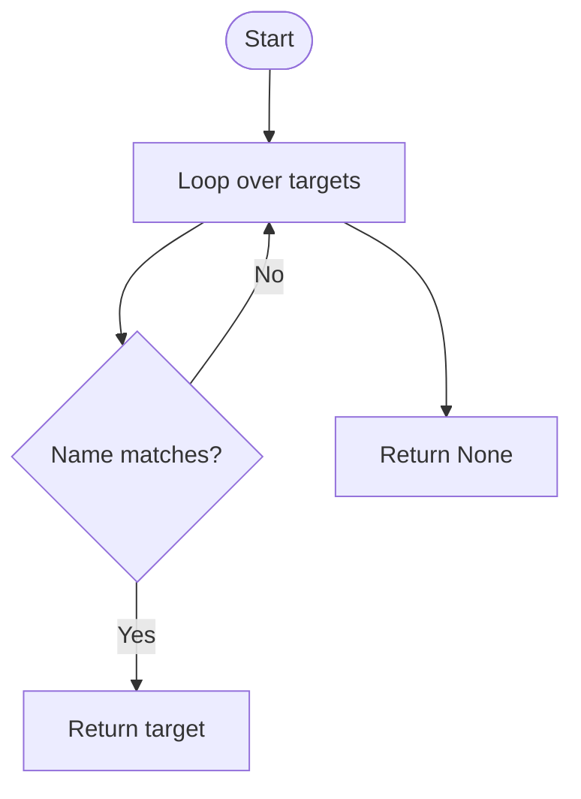
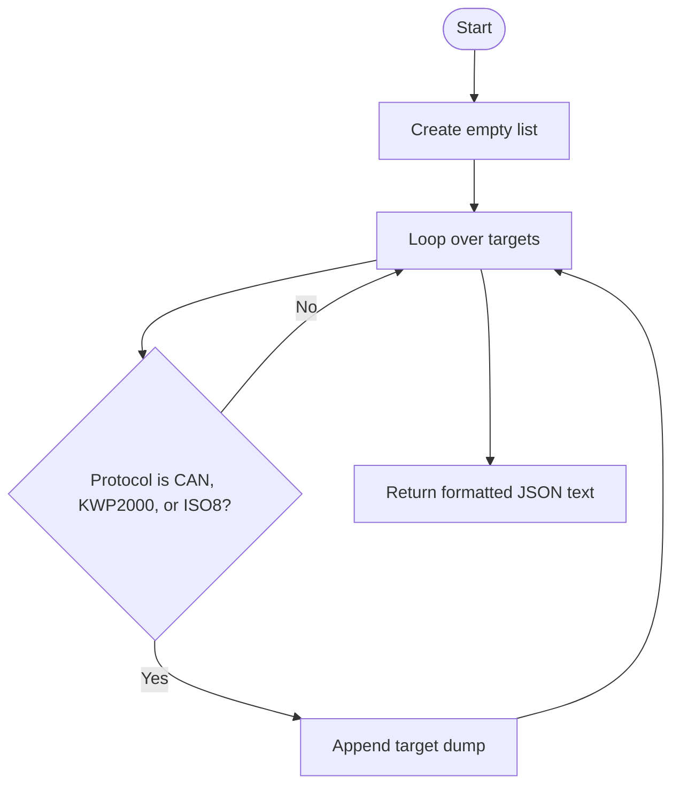
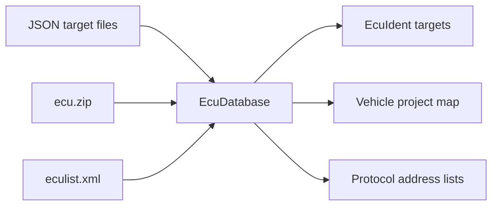

# EcuDatabase, In Simple English

Source: `src/ddt4all/core/ecu/ecu_database.py`

[EcuDatabase](ecu_database_easylang.md) loads the list of known ECUs. The scanner uses it to know which addresses to scan and which ECU identity values count as a match.

## Table Of Contents

- [Simple Overview](#simple-overview)
- [Other Code Used By This Class](#other-code-used-by-this-class)
- [Stored Values](#stored-values)
- [Important Details For Beginners](#important-details-for-beginners)
- [Method Guide And Flowcharts](#method-guide-and-flowcharts)
  - [Initialization Functions](#initialization-functions)
    - [`__init__(self, forceXML=False)`](#init-self-forcexml-false)
  - [Main Functions](#main-functions)
    - [`getTargetsByHref(self, href)`](#gettargetsbyhref-self-href)
    - [`getTargets(self, name)`](#gettargets-self-name)
    - [`getTarget(self, name)`](#gettarget-self-name)
  - [Auxiliary Functions](#auxiliary-functions)
    - [`dump(self)`](#dump-self)
- [Simple Flow Summary](#simple-flow-summary)

## Simple Overview

The class reads target data from JSON, zip, and XML sources.

Each target becomes an [EcuIdent](ecu_ident_easylang.md) object.

The scanner uses the target list for matching and the address lists for scanning.

## Other Code Used By This Class

- [EcuIdent](ecu_ident_easylang.md): stores one known ECU identity.
- [EcuScanner](ecu_scanner_easylang.md): uses this database during scans.
- [options.ecus_dir](../options.md#ecus-dir): tells where the XML ECU list can be found.
- [addressing](ecu_database_module.md#addressing) and [doip_addressing](ecu_database_module.md#doip-addressing): provide known address names.

## Stored Values

| Attribute | Purpose |
| --- | --- |
| [targets](ecu_database_easylang.md#stored-values) | All known ECU identity targets. |
| [vehiclemap](ecu_database_easylang.md#stored-values) | Vehicle project to addresses. |
| [numecu](ecu_database_easylang.md#stored-values) | Number of loaded ECU entries. |
| [available_addr_kwp](ecu_database_easylang.md#stored-values) | Known KWP addresses. |
| [available_addr_can](ecu_database_easylang.md#stored-values) | Known CAN addresses. |
| [available_addr_doip](ecu_database_easylang.md#stored-values) | Known DoIP addresses. |
| [addr_group_mapping_long](ecu_database_easylang.md#stored-values) | Address to long ECU group name. |
| [addr_group_mapping](ecu_database_easylang.md#stored-values) | Address to ECU group name. |

## Important Details For Beginners

- The JSON loader supports a misspelled key for compatibility with older data.
- Targets without auto-ident values can still be added.
- Zip loading may add some targets twice because of the current code structure.
- `dump` does not include DoIP targets.

## Method Guide And Flowcharts

## Initialization Functions

### `__init__(self, forceXML=False)`

Creates the database lists, reads JSON, zip, and XML data, and builds target and address lookup tables.

## Main Functions

### `getTargetsByHref(self, href)`

Returns all targets that point to the same ECU file path.

### `getTargets(self, name)`

Returns all targets with this name.

### `getTarget(self, name)`

Returns the first target with this name, or `None`.

## Auxiliary Functions

### `dump(self)`

Exports supported scanner targets to JSON text. DoIP targets are not included by this method.

## Simple Flow Summary

[EcuDatabase](ecu_database_easylang.md) loads known ECU data and gives the scanner targets and addresses.

