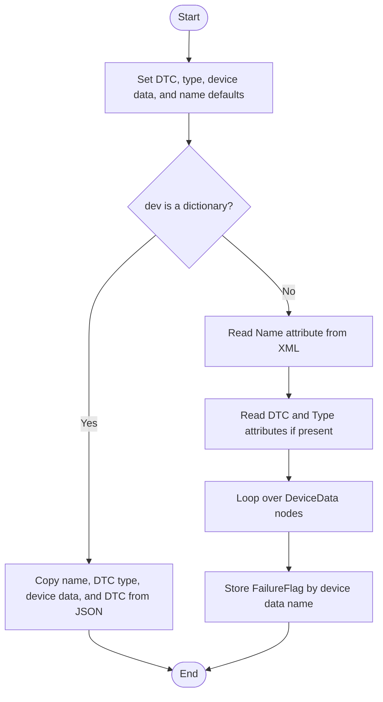
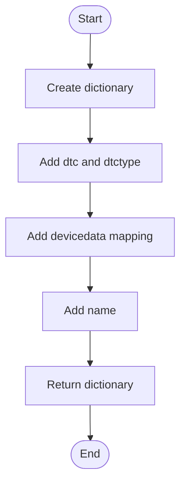
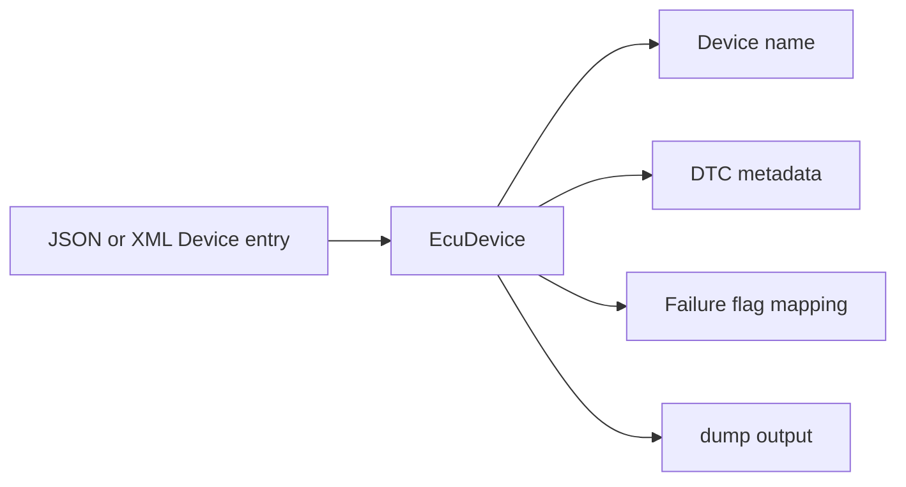

# EcuDevice

Source: `src/ddt4all/core/ecu/ecu_device.py`

[EcuDevice](ecu_device.md) represents one diagnostic device entry inside an ECU definition file. Its data is mainly about diagnostic trouble code metadata and named device data flags.

## Table Of Contents

- [Overview](#overview)
- [Collaborators](#collaborators)
- [State](#state)
- [Implementation Notes](#implementation-notes)
- [Method Reference And Flowcharts](#method-reference-and-flowcharts)
  - [Initialization Functions](#initialization-functions)
    - [`__init__(self, dev)`](#init-self-dev)
  - [Main Functions](#main-functions)
  - [Auxiliary Functions](#auxiliary-functions)
    - [`dump(self)`](#dump-self)
- [Flow Summary](#flow-summary)

## Overview

The class accepts either the JSON shape produced by `dump` or an XML `Device` node from an ECU definition. This keeps the JSON and XML loaders in [EcuFile](ecu_file.md) using the same in-memory object.

`devicedata` is a mapping from a device data name to its failure flag. The class does not interpret those flags; it only preserves them for later UI or export code.

## Collaborators

- [EcuFile](ecu_file.md): creates [EcuDevice](ecu_device.md) objects while loading an ECU definition file.
- XML DOM nodes or JSON dictionaries: provide the source data.

## State

| Attribute | Purpose |
| --- | --- |
| `dtc` | Diagnostic trouble code number read from the ECU definition. |
| `dtctype` | Diagnostic trouble code type read from the ECU definition. |
| `devicedata` | Mapping of device data names to failure flag identifiers. |
| [name](#state) | Device name from JSON or the XML [Name](xml_ecu_files.md#name) attribute. |

## Implementation Notes

- The JSON branch expects all four keys: [name](#state), `dtctype`, `devicedata`, and `dtc`.
- The XML branch treats missing numeric attributes as zero and missing [DeviceData](xml_ecu_files.md#devicedata) entries as an empty mapping.
- `dump` always writes all four fields, even if they still contain default values.

## Method Reference And Flowcharts

## Initialization Functions

### `__init__(self, dev)`

Initializes default DTC values, then loads either a JSON dictionary or an XML node. JSON input is copied directly. XML input reads [Name](xml_ecu_files.md#name), [DTC](diagnostic_terms.md#dtc), `Type`, and each [DeviceData](xml_ecu_files.md#devicedata) child with its [FailureFlag](xml_ecu_files.md#failureflag).

## Main Functions

This class has no methods in this group.

## Auxiliary Functions

### `dump(self)`

Returns a complete dictionary representation of the device entry. The output is suitable for JSON export and for reloading through the constructor dictionary branch.

## Flow Summary

[EcuDevice](ecu_device.md) is a simple persistence object for device-level DTC metadata inside an ECU file.

