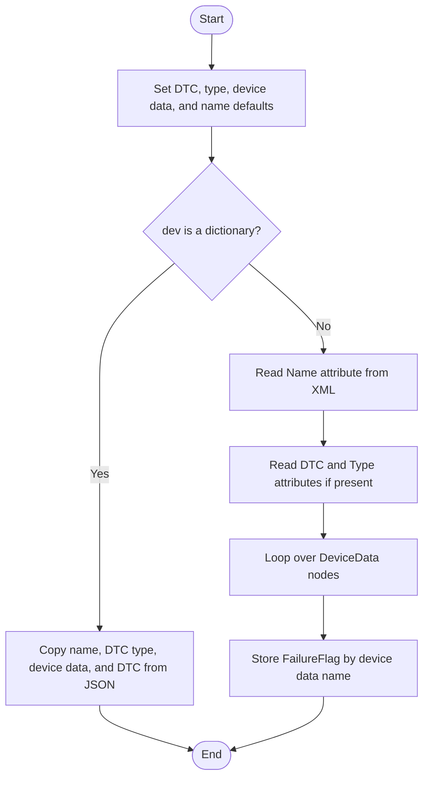
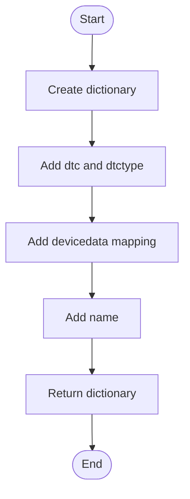
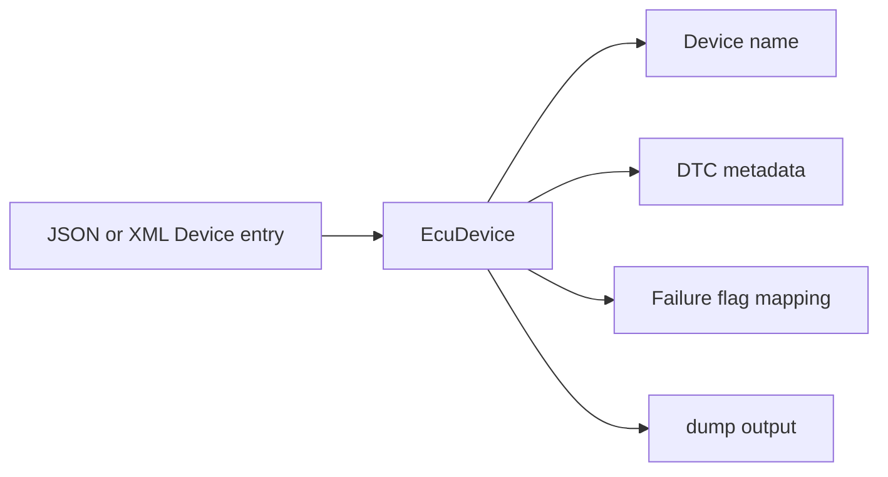

# EcuDevice, In Simple English

Source: `src/ddt4all/core/ecu/ecu_device.py`

[EcuDevice](ecu_device_easylang.md) stores one device entry from an ECU file. It mostly stores DTC information and failure-flag names.

## Table Of Contents

- [Simple Overview](#simple-overview)
- [Other Code Used By This Class](#other-code-used-by-this-class)
- [Stored Values](#stored-values)
- [Important Details For Beginners](#important-details-for-beginners)
- [Method Guide And Flowcharts](#method-guide-and-flowcharts)
  - [Initialization Functions](#initialization-functions)
    - [`__init__(self, dev)`](#init-self-dev)
  - [Main Functions](#main-functions)
  - [Auxiliary Functions](#auxiliary-functions)
    - [`dump(self)`](#dump-self)
- [Simple Flow Summary](#simple-flow-summary)

## Simple Overview

The class can read device data from JSON or XML. After that, the rest of the program can use the same object either way.

The class stores the DTC number, DTC type, device name, and a map of failure flags.

## Other Code Used By This Class

- [EcuFile](ecu_file_easylang.md): creates this object while loading an ECU file.
- JSON or XML: provides the stored values.

## Stored Values

| Attribute | Purpose |
| --- | --- |
| `dtc` | DTC number. |
| `dtctype` | DTC type. |
| `devicedata` | Names and failure flags for device data. |
| [name](#stored-values) | Device name. |

## Important Details For Beginners

- JSON input must contain the keys used by this class.
- XML input can omit some values; missing numbers stay at zero.
- `dump` writes all stored values to a dictionary.

## Method Guide And Flowcharts

## Initialization Functions

### `__init__(self, dev)`

Starts with default values, then reads either JSON or XML. JSON is copied directly. XML values are read from attributes and child nodes.

## Main Functions

This class has no methods in this group.

## Auxiliary Functions

### `dump(self)`

Returns all stored device values as a dictionary. The dictionary can later be loaded again.

## Simple Flow Summary

[EcuDevice](ecu_device_easylang.md) stores device-level DTC information from an ECU file.

