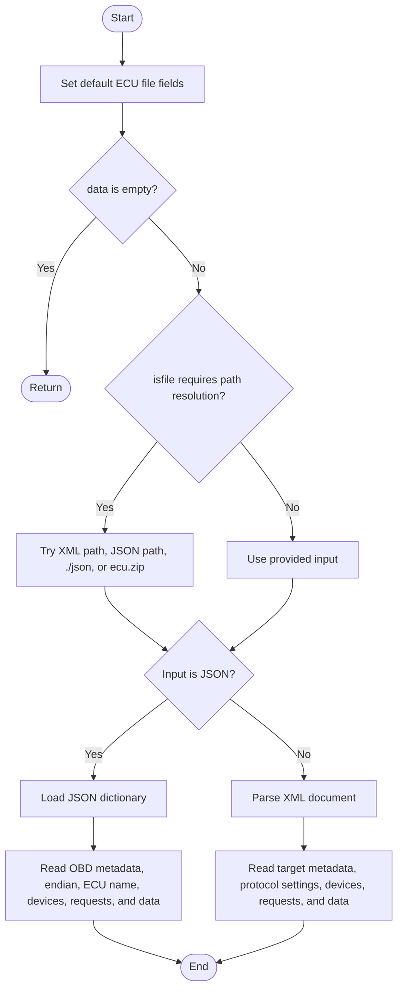
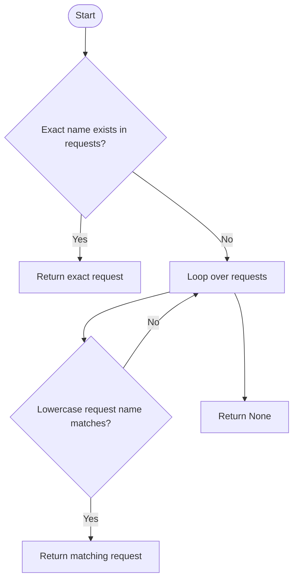
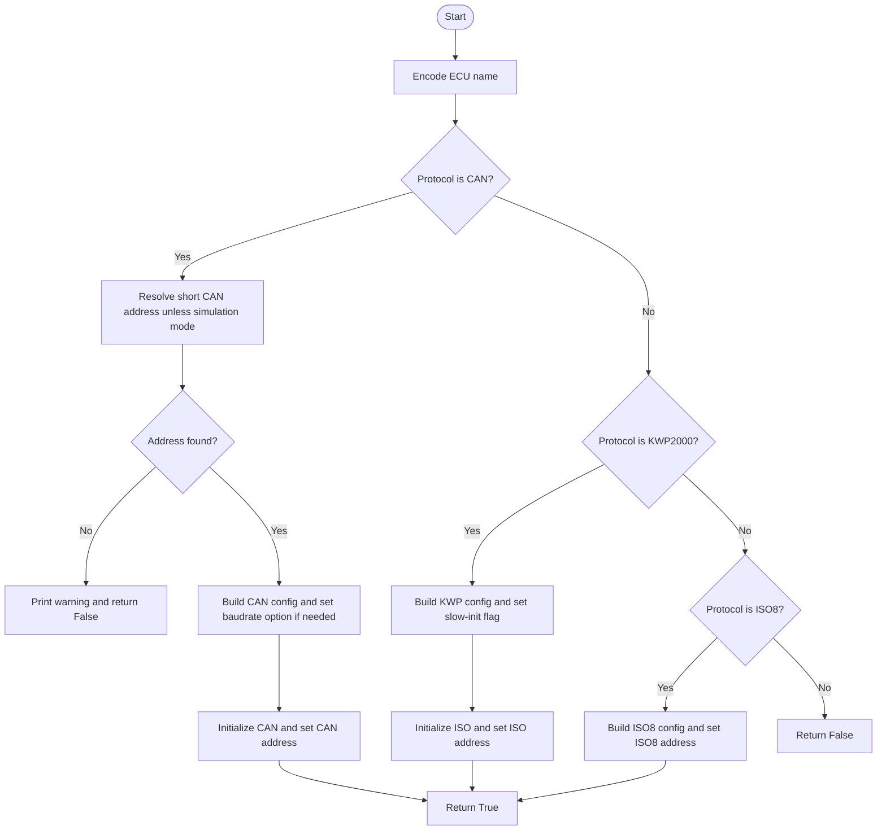
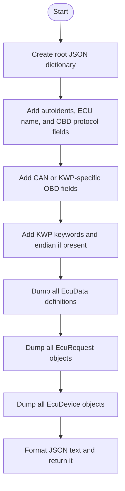
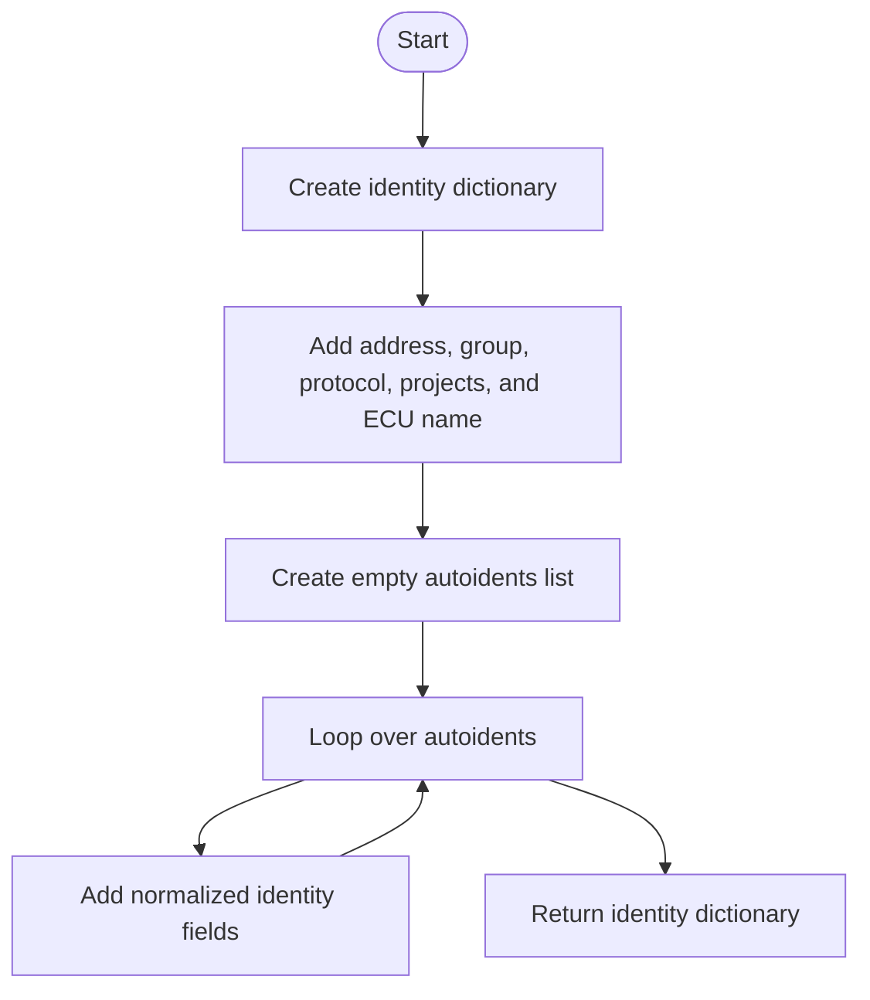
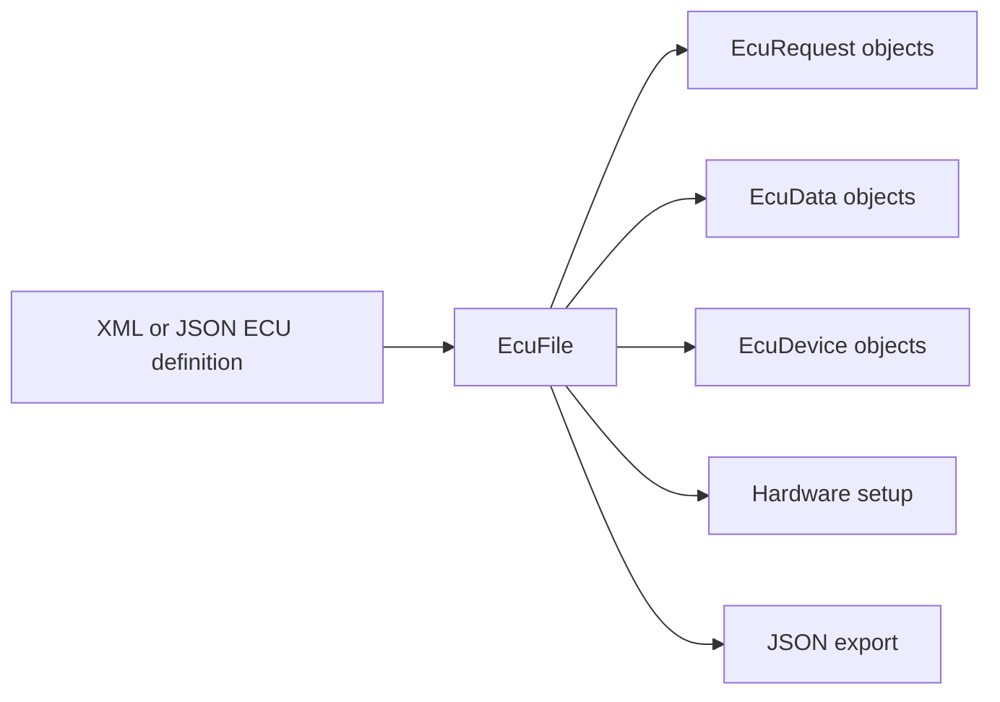

# EcuFile

Source: `src/ddt4all/core/ecu/ecu_file.py`

[EcuFile](ecu_file.md) is the in-memory representation of one ECU definition file. It can load XML or JSON, create request/data/device objects, store protocol metadata, connect the configured ECU to hardware, and export the object back to JSON.

## Table Of Contents

- [Overview](#overview)
- [Collaborators](#collaborators)
- [State](#state)
- [Implementation Notes](#implementation-notes)
- [Method Reference And Flowcharts](#method-reference-and-flowcharts)
  - [Initialization Functions](#initialization-functions)
    - [`__init__(self, data, isfile=False)`](#init-self-data-isfile-false)
  - [Main Functions](#main-functions)
    - [`get_request(self, name)`](#get-request-self-name)
    - [`connect_to_hardware(self, canline=0)`](#connect-to-hardware-self-canline-0)
  - [Auxiliary Functions](#auxiliary-functions)
    - [`dumpJson(self)`](#dumpjson-self)
    - [`dump_idents(self)`](#dump-idents-self)
- [Flow Summary](#flow-summary)

## Overview

The constructor handles several input forms: direct file path, file basename, JSON from disk, JSON from [./json](json_ecu_files.md#json-directory), JSON inside [ecu.zip](ecu_zip.md), or XML from disk. The final object shape is the same after loading.

Loaded child objects are stored in dictionaries: [requests](ecu_file.md#state) by request name, [data](ecu_file.md#state) by data name, and [devices](ecu_file.md#state) by device name. This makes later lookup fast and keeps request decoding tied to the same data definitions.

Hardware setup is protocol-dependent. CAN uses send and receive identifiers, KWP2000 uses ISO setup with fast-init information, and ISO8 uses its own ISO8 address setup. DoIP support is present in comments but not active in [connect_to_hardware](ecu_file.md#connect-to-hardware-self-canline-0).

## Collaborators

- [EcuDevice](ecu_device.md): created for each device entry.
- [EcuRequest](ecu_request.md): created for each request entry and linked back to this [EcuFile](ecu_file.md).
- [EcuData](ecu_data.md): created for each data definition.
- [utils.getChildNodesByName](utils.md#getchildnodesbyname): simplifies XML child lookup.
- `elm` and [options.elm](../options.md#elm): used by [connect_to_hardware](ecu_file.md#connect-to-hardware-self-canline-0) to configure the adapter.

## State

| Attribute | Purpose |
| --- | --- |
| [requests](ecu_file.md#state) | Request objects by request name. |
| [devices](ecu_file.md#state) | Device objects by device name. |
| [data](ecu_file.md#state) | Data definitions by data name. |
| [endianness](ecu_file.md#state) | Default endian setting for requests and data items. |
| [ecu_protocol](ecu_file.md#state) | Loaded protocol such as [CAN](protocols.md#can), [KWP2000](protocols.md#kwp2000), or [ISO8](protocols.md#iso8). |
| [ecu_send_id](ecu_file.md#state) | CAN transmit identifier. |
| [ecu_recv_id](ecu_file.md#state) | CAN receive identifier. |
| [fastinit](ecu_file.md#state) | KWP fast-init flag. |
| [kw1](ecu_file.md#state) | KWP keyword 1. |
| [kw2](ecu_file.md#state) | KWP keyword 2. |
| [funcname](ecu_file.md#state) | Functional ECU group or function name. |
| [funcaddr](ecu_file.md#state) | Functional diagnostic address. |
| [ecuname](ecu_file.md#state) | ECU name. |
| [projects](ecu_file.md#state) | Project codes that reference this ECU. |
| [autoidents](ecu_file.md#state) | Auto-identification entries read from XML. |
| [baudrate](ecu_file.md#state) | CAN baudrate when configured. |

## Implementation Notes

- The JSON loader expects top-level [devices](ecu_file.md#state), [requests](ecu_file.md#state), and [data](ecu_file.md#state) keys after optional OBD metadata.
- The XML loader gathers target metadata before reading `Device`, `Request`, and `Data` elements.
- [get_request](ecu_file.md#get-request-self-name) provides exact lookup first and case-insensitive fallback second.
- [dumpJson](ecu_file.md#dumpjson-self) changes indentation from spaces to tabs with a regular expression after `json.dumps`.

## Method Reference And Flowcharts

## Initialization Functions

### `__init__(self, data, isfile=False)`

Initializes an empty ECU file model, resolves the input path when `isfile` is true, loads JSON from disk, [./json](json_ecu_files.md#json-directory), or [ecu.zip](ecu_zip.md) when applicable, otherwise parses XML, and creates child [EcuDevice](ecu_device.md), [EcuRequest](ecu_request.md), and [EcuData](ecu_data.md) objects.

## Main Functions

### `get_request(self, name)`

Looks up a request by exact name and then by case-insensitive comparison. It returns the matching [EcuRequest](ecu_request.md) object or `None`.

### `connect_to_hardware(self, canline=0)`

Configures the active ELM adapter for this ECU protocol. CAN setup resolves a short address and sets CAN IDs, KWP2000 setup configures ISO with fast-init behavior, ISO8 setup configures ISO8 addressing, and unsupported protocols return `False`.

## Auxiliary Functions

### `dumpJson(self)`

Exports the whole loaded ECU file as formatted JSON text. It writes OBD metadata, optional KWP keywords, endian setting, all data definitions, all requests, and all devices.

### `dump_idents(self)`

Builds the compact identity dictionary used for target database generation. It includes address, group, protocol, projects, ECU name, and normalized auto-identification entries.

## Flow Summary

[EcuFile](ecu_file.md) is the central object for one ECU definition. It loads file content, owns request/data/device objects, provides request lookup, configures hardware addressing, and exports JSON.

