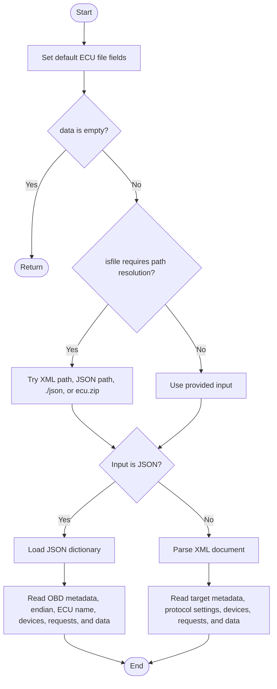
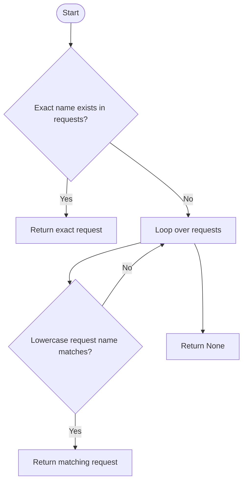
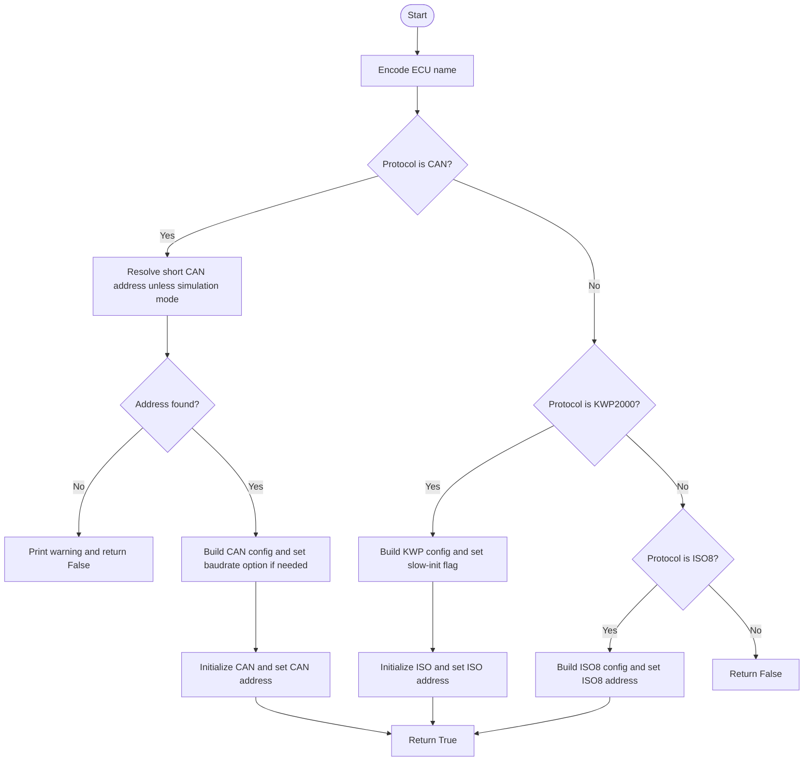
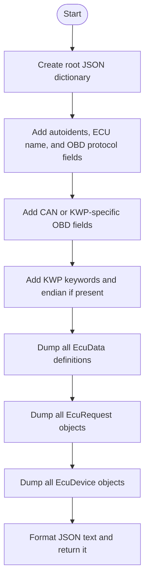
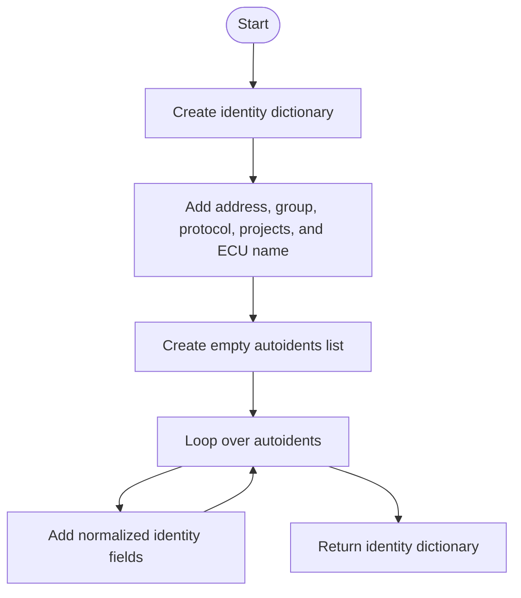
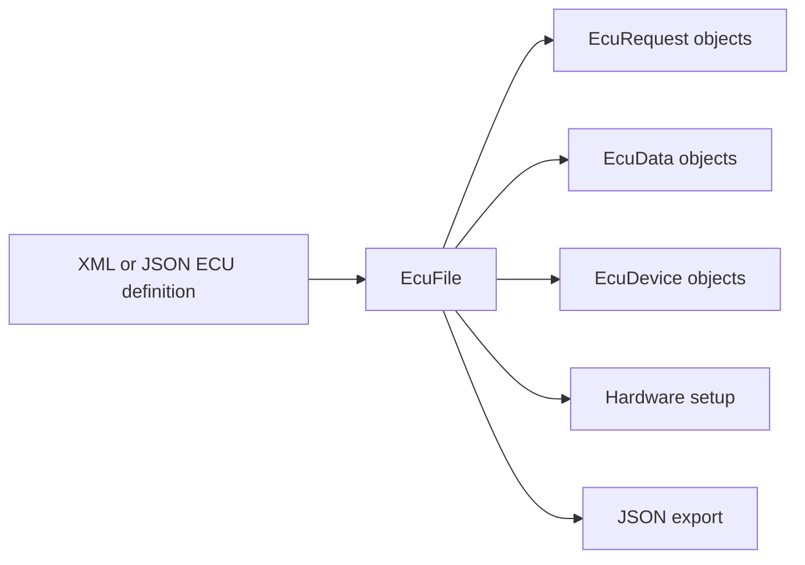

# EcuFile, In Simple English

Source: `src/ddt4all/core/ecu/ecu_file.py`

[EcuFile](ecu_file_easylang.md) represents one ECU file after it has been loaded. It stores requests, data values, devices, protocol settings, addresses, projects, and identity information.

## Table Of Contents

- [Simple Overview](#simple-overview)
- [Other Code Used By This Class](#other-code-used-by-this-class)
- [Stored Values](#stored-values)
- [Important Details For Beginners](#important-details-for-beginners)
- [Method Guide And Flowcharts](#method-guide-and-flowcharts)
  - [Initialization Functions](#initialization-functions)
    - [`__init__(self, data, isfile=False)`](#init-self-data-isfile-false)
  - [Main Functions](#main-functions)
    - [`get_request(self, name)`](#get-request-self-name)
    - [`connect_to_hardware(self, canline=0)`](#connect-to-hardware-self-canline-0)
  - [Auxiliary Functions](#auxiliary-functions)
    - [`dumpJson(self)`](#dumpjson-self)
    - [`dump_idents(self)`](#dump-idents-self)
- [Simple Flow Summary](#simple-flow-summary)

## Simple Overview

The constructor can load ECU data from XML or JSON. It can also find JSON in [ecu.zip](ecu_zip.md).

After loading, requests, data values, and devices are stored by name.

When connecting to hardware, the class chooses setup steps based on the protocol: CAN, KWP2000, or ISO8.

## Other Code Used By This Class

- [EcuDevice](ecu_device_easylang.md): stores device entries.
- [EcuRequest](ecu_request_easylang.md): stores request entries.
- [EcuData](ecu_data_easylang.md): stores value conversion rules.
- `elm` and [options.elm](../options.md#elm): configure the adapter for this ECU.

## Stored Values

| Attribute | Purpose |
| --- | --- |
| [requests](ecu_file_easylang.md#stored-values) | Requests by name. |
| [devices](ecu_file_easylang.md#stored-values) | Devices by name. |
| [data](ecu_file_easylang.md#stored-values) | Data values by name. |
| [endianness](ecu_file_easylang.md#stored-values) | Default byte order. |
| [ecu_protocol](ecu_file_easylang.md#stored-values) | Protocol name. |
| [ecu_send_id](ecu_file_easylang.md#stored-values) | CAN send ID. |
| [ecu_recv_id](ecu_file_easylang.md#stored-values) | CAN receive ID. |
| [fastinit](ecu_file_easylang.md#stored-values) | KWP fast-init setting. |
| [kw1](ecu_file_easylang.md#stored-values) | KWP keyword 1. |
| [kw2](ecu_file_easylang.md#stored-values) | KWP keyword 2. |
| [funcname](ecu_file_easylang.md#stored-values) | Function name. |
| [funcaddr](ecu_file_easylang.md#stored-values) | Function address. |
| [ecuname](ecu_file_easylang.md#stored-values) | ECU name. |
| [projects](ecu_file_easylang.md#stored-values) | Vehicle projects. |
| [autoidents](ecu_file_easylang.md#stored-values) | Identity entries. |
| [baudrate](ecu_file_easylang.md#stored-values) | CAN speed. |

## Important Details For Beginners

- JSON input must contain device, request, and data sections.
- XML input is parsed for target metadata, protocol settings, devices, requests, and data.
- [get_request](ecu_file_easylang.md#get-request-self-name) first tries exact spelling, then ignores case.
- [dumpJson](ecu_file_easylang.md#dumpjson-self) returns formatted JSON text.

## Method Guide And Flowcharts

## Initialization Functions

### `__init__(self, data, isfile=False)`

Starts with empty values, finds the ECU file if needed, reads JSON or XML, and creates device, request, and data objects.

## Main Functions

### `get_request(self, name)`

Finds a request by name. If exact spelling fails, it tries again without caring about letter case.

### `connect_to_hardware(self, canline=0)`

Sets up the adapter for this ECU. The steps depend on whether the ECU uses CAN, KWP2000, or ISO8.

## Auxiliary Functions

### `dumpJson(self)`

Exports the whole ECU file object to JSON text.

### `dump_idents(self)`

Returns the identity part of the ECU file. This is the data used to build scanner targets.

## Simple Flow Summary

[EcuFile](ecu_file_easylang.md) loads one ECU file and stores everything needed to use it: requests, data definitions, device info, protocol settings, and addresses.

