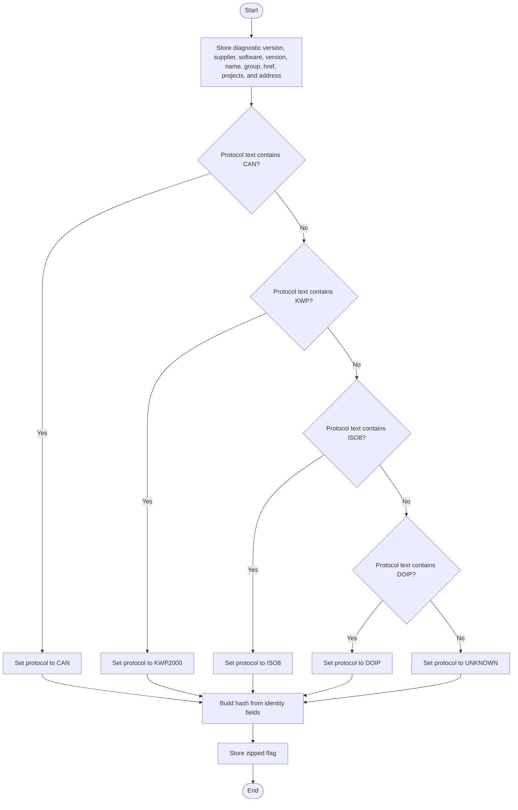
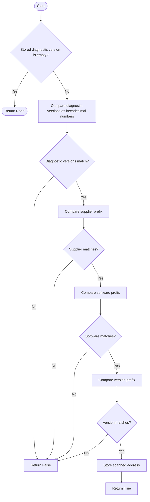
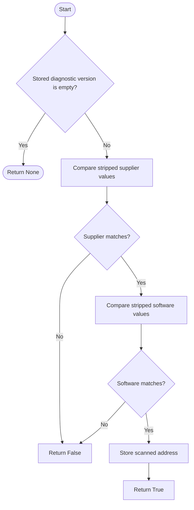
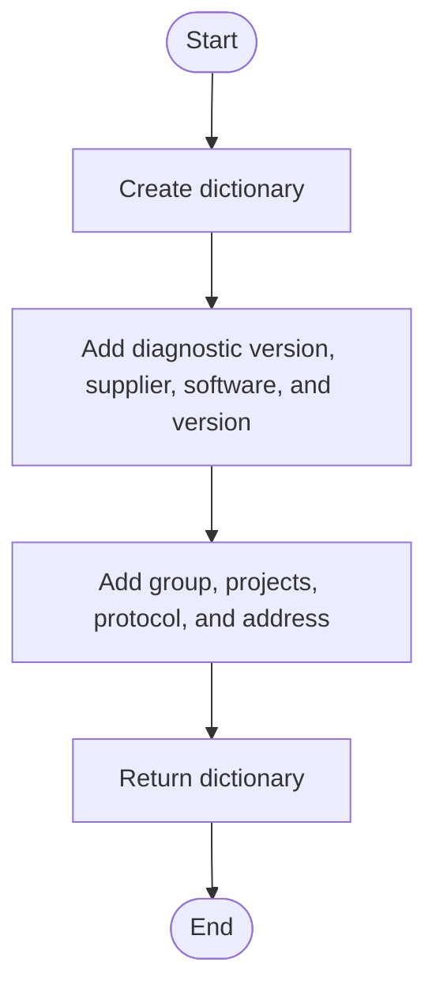
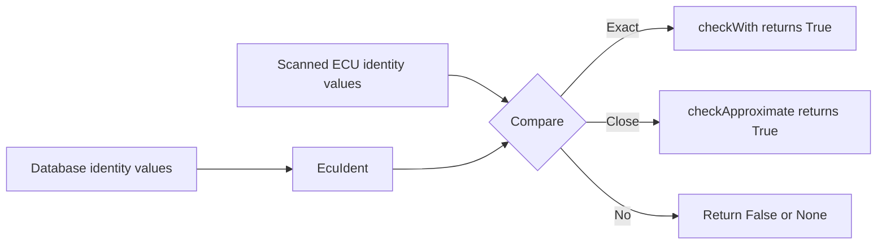

# EcuIdent

Source: `src/ddt4all/core/ecu/ecu_ident.py`

[EcuIdent](ecu_ident.md) is the small identity record used by the scanner and database. It describes one known ECU target by diagnostic version, supplier, software number, software version, protocol, project list, address, and file reference.

## Table Of Contents

- [Overview](#overview)
- [Collaborators](#collaborators)
- [State](#state)
- [Implementation Notes](#implementation-notes)
- [Method Reference And Flowcharts](#method-reference-and-flowcharts)
  - [Initialization Functions](#initialization-functions)
    - [`__init__(self, diagversion, supplier, soft, version, name, group, href, protocol, projects, address, zipped=False)`](#init-self-diagversion-supplier-soft-version-name-group-href-protocol-projects-address-zipped-false)
  - [Main Functions](#main-functions)
    - [`checkWith(self, diagversion, supplier, soft, version, addr)`](#checkwith-self-diagversion-supplier-soft-version-addr)
    - [`checkApproximate(self, diagversion, supplier, soft, addr)`](#checkapproximate-self-diagversion-supplier-soft-addr)
  - [Auxiliary Functions](#auxiliary-functions)
    - [`dump(self)`](#dump-self)
- [Flow Summary](#flow-summary)

## Overview

[EcuIdent](ecu_ident.md) does not communicate with a vehicle. It is a data object with two matching helpers. The important idea is that a scanned ECU answer is reduced to four identity fields, and those fields are compared against this object.

The class supports two levels of matching. [checkWith](ecu_ident.md#checkwith-self-diagversion-supplier-soft-version-addr) is the strict match and includes the software version. [checkApproximate](ecu_ident.md#checkapproximate-self-diagversion-supplier-soft-addr) is the looser match and ignores the version field, which lets the scanner still suggest a likely ECU file when only the version differs.

The constructor normalizes protocol names into a small internal set. This matters because database files may use protocol labels with longer text, while scanner code wants predictable values such as [CAN](protocols.md#can), [KWP2000](protocols.md#kwp2000), [ISO8](protocols.md#iso8), or [DOIP](protocols.md#doip).

## Collaborators

- [EcuDatabase](ecu_database.md): creates [EcuIdent](ecu_ident.md) objects while loading target data from JSON, zip, or XML sources.
- [EcuScanner](ecu_scanner.md): calls [checkWith](ecu_ident.md#checkwith-self-diagversion-supplier-soft-version-addr) and [checkApproximate](ecu_ident.md#checkapproximate-self-diagversion-supplier-soft-addr) while matching scanned ECU responses.
- [EcuFile](ecu_file.md): produces auto-identification data that can later become database targets.

## State

| Attribute | Purpose |
| --- | --- |
| [diagversion](ecu_ident.md#state) | Diagnostic version expected for the ECU identity. It is compared as a hexadecimal value in [checkWith](ecu_ident.md#checkwith-self-diagversion-supplier-soft-version-addr). |
| [supplier](ecu_ident.md#state) | Supplier code prefix expected from the ECU response. |
| [soft](ecu_ident.md#state) | Software identifier expected from the ECU response. |
| [version](ecu_ident.md#state) | Software version expected for an exact match. |
| [name](#state) | Human-readable ECU target name. |
| [group](ecu_ident.md#state) | Functional ECU group, such as a body, engine, or chassis group from the database. |
| [projects](ecu_file.md#state) | Vehicle project codes that reference this ECU. |
| [href](ecu_ident.md#state) | Path or archive reference to the ECU definition file. |
| [addr](ecu_ident.md#state) | Diagnostic address. Matching helpers update this to the scanned address when a match succeeds. |
| [protocol](ecu_ident.md#state) | Normalized protocol name used by scanner filtering. |
| [hash](ecu_ident.md#state) | Concatenation of the four identity fields. It is stored but not used by the current methods. |
| [zipped](ecu_ident.md#state) | Marks targets that came from the zipped ECU database. |

## Implementation Notes

- [checkWith](ecu_ident.md#checkwith-self-diagversion-supplier-soft-version-addr) uses prefix matching for supplier, software, and version after stripping whitespace. The database value can therefore be shorter than the ECU response field.
- [checkWith](ecu_ident.md#checkwith-self-diagversion-supplier-soft-version-addr) converts diagnostic versions from hexadecimal text before comparing them, so values with different text padding can still match.
- [checkApproximate](ecu_ident.md#checkapproximate-self-diagversion-supplier-soft-addr) does not compare [diagversion](ecu_ident.md#state) in the current implementation even though it accepts it as a parameter; it checks supplier and software only after rejecting empty database diagnostic versions.
- Both matching methods mutate [addr](ecu_ident.md#state) when they succeed. This lets one target record point to the actual scanned address.

## Method Reference And Flowcharts

## Initialization Functions

### `__init__(self, diagversion, supplier, soft, version, name, group, href, protocol, projects, address, zipped=False)`

Stores the identity fields, normalizes the protocol label, builds the combined [hash](ecu_ident.md#state) string, and records whether the target came from a zipped database. Protocol normalization is intentionally broad: any protocol string containing [CAN](protocols.md#can), `KWP`, [ISO8](protocols.md#iso8), or [DOIP](protocols.md#doip) is mapped to the internal protocol name used by scanner filters.

## Main Functions

### `checkWith(self, diagversion, supplier, soft, version, addr)`

Performs strict identity matching. It rejects targets without a diagnostic version, compares diagnostic versions numerically as hexadecimal values, compares supplier, software, and version as stripped prefixes, updates [addr](ecu_ident.md#state) on success, and returns `True`; failed comparisons return `False`.

### `checkApproximate(self, diagversion, supplier, soft, addr)`

Performs a minimal match for cases where the exact software version is not found. The current logic requires a non-empty database diagnostic version, then checks supplier and software for exact stripped equality, updates [addr](ecu_ident.md#state) on success, and returns `True`.

## Auxiliary Functions

### `dump(self)`

Serializes the identity target to a dictionary using the field names expected by JSON database output. The dump includes identity values, group, projects, protocol, and address, but not [href](ecu_ident.md#state), [hash](ecu_ident.md#state), or [zipped](ecu_ident.md#state).

## Flow Summary

[EcuIdent](ecu_ident.md) is the comparison target used during ECU discovery. It receives known identity values from database loading and answers yes or no when the scanner asks whether a real ECU response matches those values.

