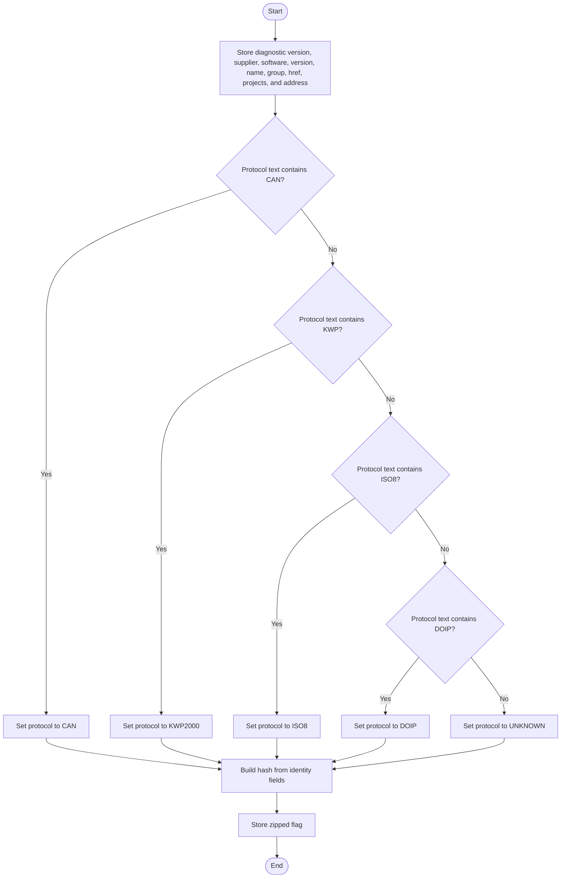
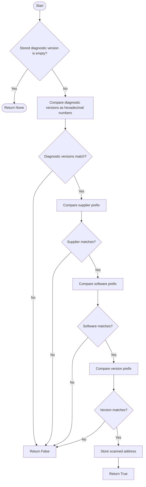
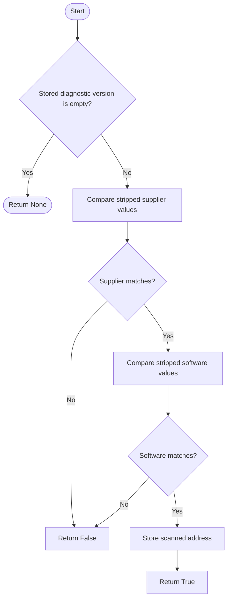
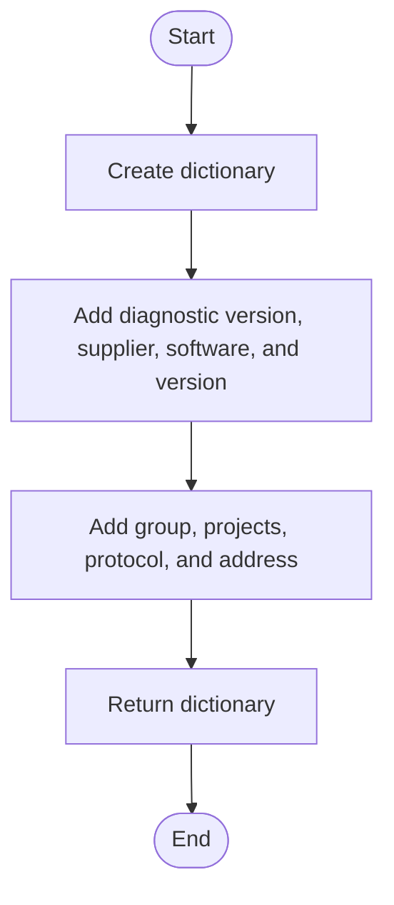
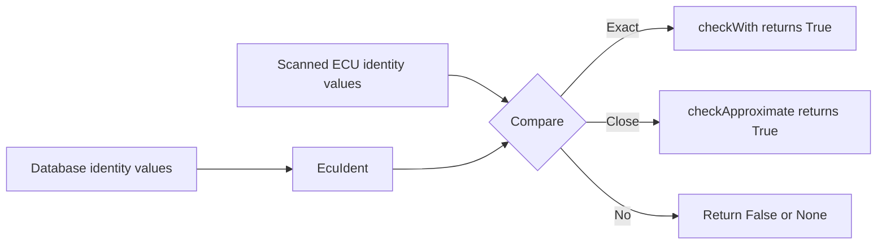

# EcuIdent, In Simple English

Source: `src/ddt4all/core/ecu/ecu_ident.py`

[EcuIdent](ecu_ident_easylang.md) stores the identity of one known ECU. The scanner compares real ECU answers with these stored values to decide which ECU file should be used.

## Table Of Contents

- [Simple Overview](#simple-overview)
- [Other Code Used By This Class](#other-code-used-by-this-class)
- [Stored Values](#stored-values)
- [Important Details For Beginners](#important-details-for-beginners)
- [Method Guide And Flowcharts](#method-guide-and-flowcharts)
  - [Initialization Functions](#initialization-functions)
    - [`__init__(self, diagversion, supplier, soft, version, name, group, href, protocol, projects, address, zipped=False)`](#init-self-diagversion-supplier-soft-version-name-group-href-protocol-projects-address-zipped-false)
  - [Main Functions](#main-functions)
    - [`checkWith(self, diagversion, supplier, soft, version, addr)`](#checkwith-self-diagversion-supplier-soft-version-addr)
    - [`checkApproximate(self, diagversion, supplier, soft, addr)`](#checkapproximate-self-diagversion-supplier-soft-addr)
  - [Auxiliary Functions](#auxiliary-functions)
    - [`dump(self)`](#dump-self)
- [Simple Flow Summary](#simple-flow-summary)

## Simple Overview

[EcuIdent](ecu_ident_easylang.md) does not talk to the car. It only stores known identity data.

When the scanner gets an answer from an ECU, it compares the answer with many [EcuIdent](ecu_ident_easylang.md) objects. If all important fields match, the ECU is identified.

There is also a close-match check. A close match means the supplier and software look right, but the version is not the exact one from the database.

## Other Code Used By This Class

- [EcuDatabase](ecu_database_easylang.md): creates these objects from database files.
- [EcuScanner](ecu_scanner_easylang.md): uses these objects to match ECU answers.
- [EcuFile](ecu_file_easylang.md): can provide identity data that becomes scanner target data.

## Stored Values

| Attribute | Purpose |
| --- | --- |
| [diagversion](ecu_ident_easylang.md#stored-values) | Expected diagnostic version. |
| [supplier](ecu_ident_easylang.md#stored-values) | Expected supplier code. |
| [soft](ecu_ident_easylang.md#stored-values) | Expected software number. |
| [version](ecu_ident_easylang.md#stored-values) | Expected software version for an exact match. |
| [name](#stored-values) | ECU name. |
| [group](ecu_ident_easylang.md#stored-values) | ECU group. |
| [projects](ecu_file_easylang.md#stored-values) | Vehicle projects that use this ECU. |
| [href](ecu_ident_easylang.md#stored-values) | Where the ECU file is stored. |
| [addr](ecu_ident_easylang.md#stored-values) | Diagnostic address. |
| [protocol](ecu_ident_easylang.md#stored-values) | Protocol name like [CAN](protocols.md#can) or [KWP2000](protocols.md#kwp2000). |
| [hash](ecu_ident_easylang.md#stored-values) | Combined identity text. |
| [zipped](ecu_ident_easylang.md#stored-values) | Whether this target came from a zip database. |

## Important Details For Beginners

- The strict match checks diagnostic version, supplier, software, and version.
- Supplier, software, and version are compared as prefixes. This means a shorter database value can still match a longer ECU answer.
- The close match ignores the version field and mainly checks supplier and software.
- When a match works, the object stores the address that was scanned.

## Method Guide And Flowcharts

## Initialization Functions

### `__init__(self, diagversion, supplier, soft, version, name, group, href, protocol, projects, address, zipped=False)`

Stores the ECU identity fields and turns the protocol text into one standard value. For example, protocol text that contains [CAN](protocols.md#can) becomes [CAN](protocols.md#can).

## Main Functions

### `checkWith(self, diagversion, supplier, soft, version, addr)`

Checks if an ECU answer is an exact match. If it matches, the method stores the scanned address and returns `True`.

### `checkApproximate(self, diagversion, supplier, soft, addr)`

Checks if an ECU answer is close enough. It ignores the version field, but supplier and software must match exactly after spaces are removed.

## Auxiliary Functions

### `dump(self)`

Returns the identity data as a dictionary that can be written to JSON. It does not include every internal field.

## Simple Flow Summary

[EcuIdent](ecu_ident_easylang.md) is the known ECU record. The scanner compares a real ECU answer with this record and decides whether it is an exact match, a close match, or not a match.

