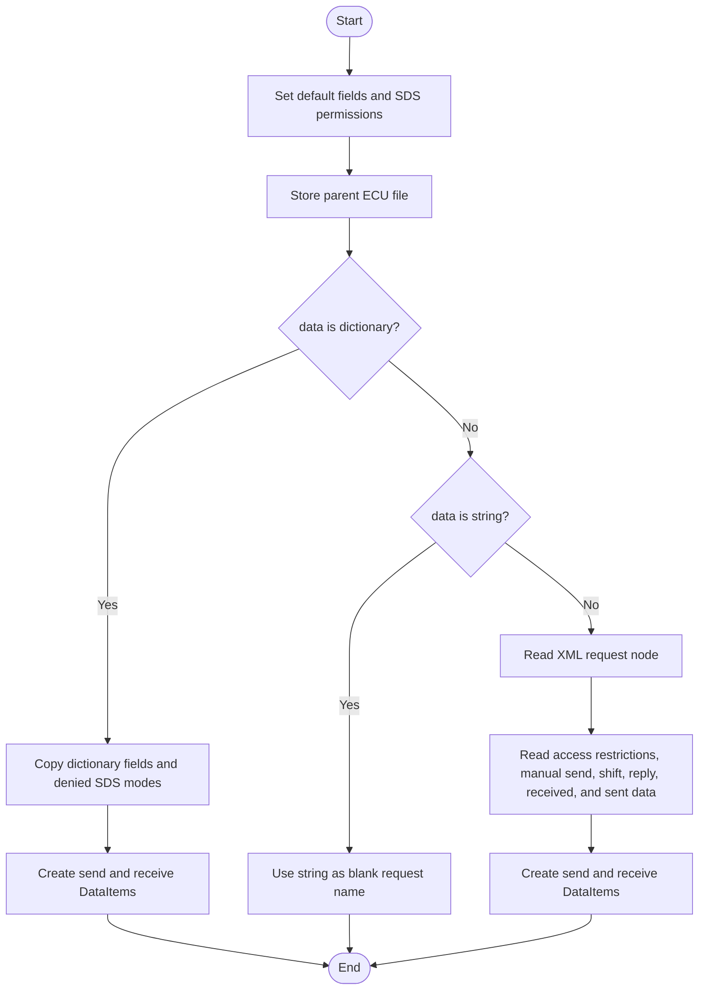
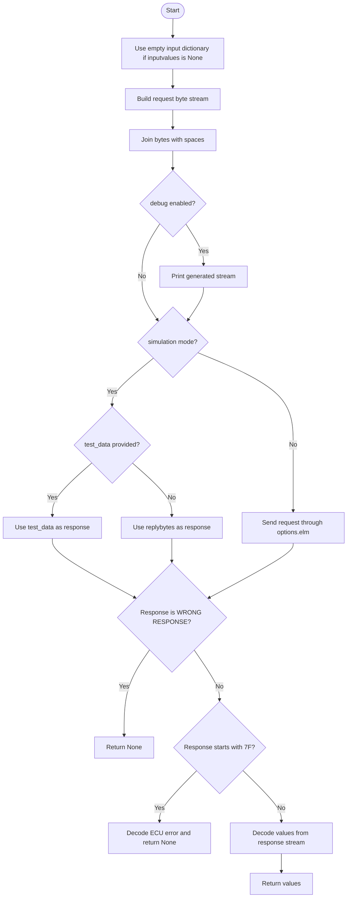
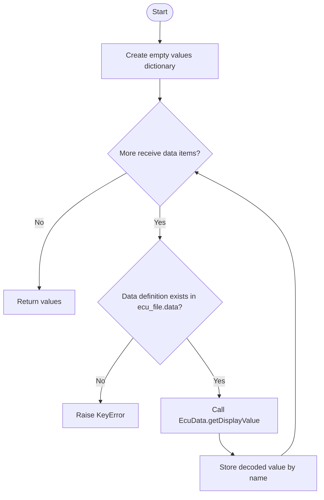
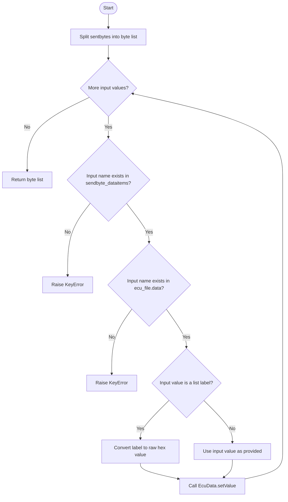
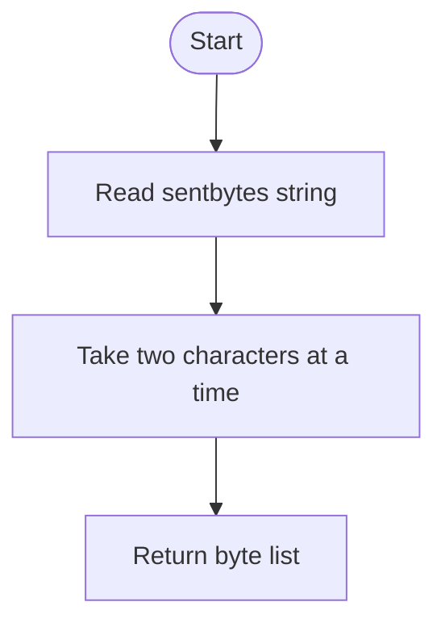
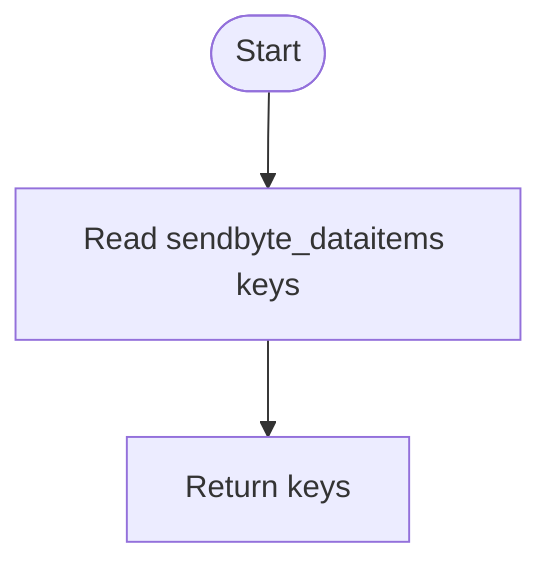
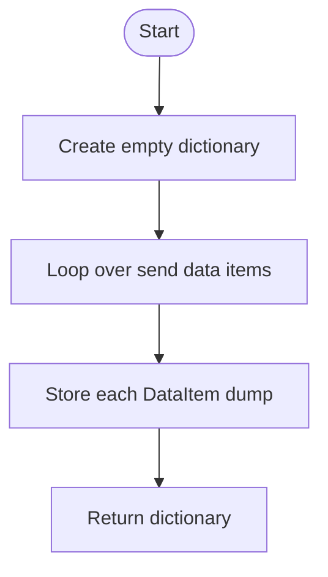
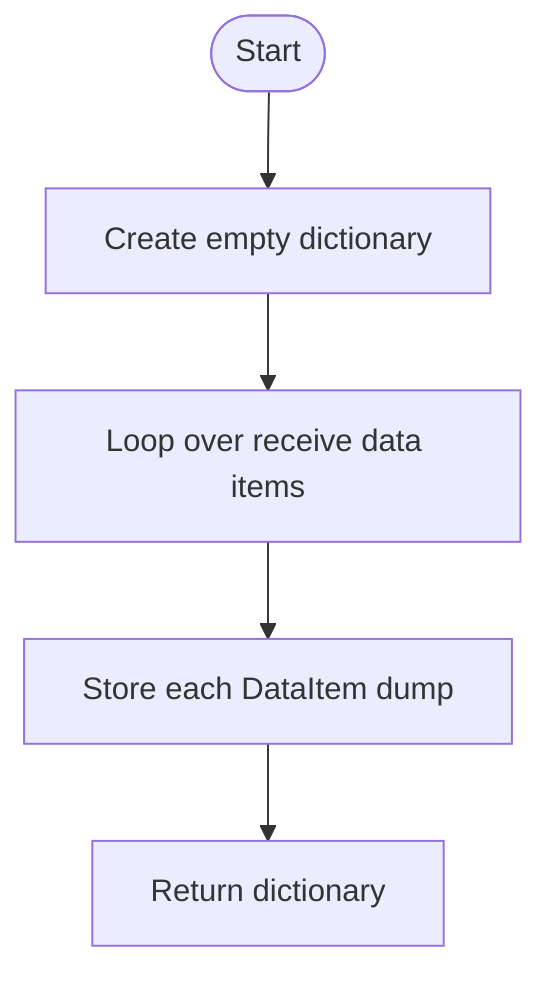
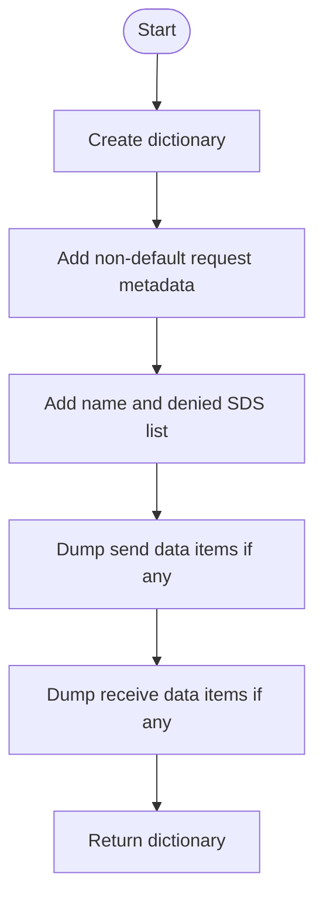
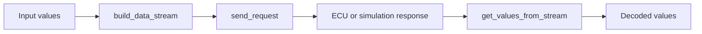

# EcuRequest

Source: `src/ddt4all/core/ecu/ecu_request.py`

[EcuRequest](ecu_request.md) represents one diagnostic request from an ECU file. It knows the bytes to send, which fields can be inserted into those bytes, which values can be decoded from the answer, and which diagnostic session modes are denied.

## Table Of Contents

- [Overview](#overview)
- [Collaborators](#collaborators)
- [State](#state)
- [Implementation Notes](#implementation-notes)
- [Method Reference And Flowcharts](#method-reference-and-flowcharts)
  - [Initialization Functions](#initialization-functions)
    - [`__init__(self, data, ecu_file)`](#init-self-data-ecu-file)
  - [Main Functions](#main-functions)
    - [`send_request(self, inputvalues=None, test_data=None)`](#send-request-self-inputvalues-none-test-data-none)
    - [`get_values_from_stream(self, stream)`](#get-values-from-stream-self-stream)
    - [`build_data_stream(self, data)`](#build-data-stream-self-data)
  - [Auxiliary Functions](#auxiliary-functions)
    - [`get_formatted_sentbytes(self)`](#get-formatted-sentbytes-self)
    - [`get_data_inputs(self)`](#get-data-inputs-self)
    - [`dump_sentdataitems(self)`](#dump-sentdataitems-self)
    - [`dump_dataitems(self)`](#dump-dataitems-self)
    - [`dump(self)`](#dump-self)
- [Flow Summary](#flow-summary)

## Overview

The class is the bridge between static ECU file definitions and live communication. [build_data_stream](ecu_request.md#build-data-stream-self-data) prepares bytes, [send_request](ecu_request.md#send-request-self-inputvalues-none-test-data-none) sends them or uses simulation data, and [get_values_from_stream](ecu_request.md#get-values-from-stream-self-stream) decodes the returned bytes.

Send-side [DataItem](data_item.md) objects define where input values are placed in [sentbytes](ecu_request.md#state). Receive-side [DataItem](data_item.md) objects define where returned values are read from the response stream. Both sides use [EcuData](ecu_data.md) definitions stored on the parent [EcuFile](ecu_file.md).

The [sds](ecu_request.md#state) dictionary records Start Diagnostic Session restrictions. A value of `False` means that access mode is denied for this request.

## Collaborators

- [EcuFile](ecu_file.md): owns the request and provides shared data definitions and endianness.
- [DataItem](data_item.md): stores byte and bit positions for input and output fields.
- [EcuData](ecu_data.md): converts values into request bytes and converts response bytes into display values.
- [options.elm](../options.md#elm): sends the request when the application is not in simulation mode.

## State

| Attribute | Purpose |
| --- | --- |
| [minbytes](ecu_request.md#state) | Minimum expected response size from the ECU definition. |
| [shiftbytescount](ecu_request.md#state) | Configured byte shift for response handling. |
| [replybytes](ecu_request.md#state) | Default or expected response bytes, also used in simulation mode without explicit test data. |
| [manualsend](ecu_request.md#state) | Whether the XML request contains [ManuelSend](xml_ecu_files.md#manuelsend). |
| [sentbytes](ecu_request.md#state) | Base request byte string before input values are inserted. |
| [dataitems](ecu_request.md#state) | Receive-side [DataItem](data_item.md) objects by value name. |
| [sendbyte_dataitems](ecu_request.md#state) | Send-side [DataItem](data_item.md) objects by value name. |
| [name](#state) | Request name. |
| [ecu_file](ecu_request.md#state) | Parent ECU file that supplies data definitions and endianness. |
| [sds](ecu_request.md#state) | Allowed or denied diagnostic session modes. |

## Implementation Notes

- [build_data_stream](ecu_request.md#build-data-stream-self-data) raises `KeyError` when an input name has no send-side [DataItem](data_item.md) or no matching [EcuData](ecu_data.md) definition.
- [send_request](ecu_request.md#send-request-self-inputvalues-none-test-data-none) treats responses starting with [WRONG RESPONSE](diagnostic_responses.md#wrong-response) or [7F](diagnostic_responses.md#negative-response) as failures and returns `None`.
- Simulation mode uses `test_data` when provided; otherwise it returns and decodes [replybytes](ecu_request.md#state).
- [get_formatted_sentbytes](ecu_request.md#get-formatted-sentbytes-self) assumes [sentbytes](ecu_request.md#state) is continuous hexadecimal text without spaces.

## Method Reference And Flowcharts

## Initialization Functions

### `__init__(self, data, ecu_file)`

Initializes the request from dictionary data, a blank request name, or an XML node. It sets defaults, stores the parent ECU file, loads denied diagnostic session modes, and creates send-side and receive-side [DataItem](data_item.md) objects.

## Main Functions

### `send_request(self, inputvalues=None, test_data=None)`

Builds the outgoing stream, sends it through simulation data or [options.elm](../options.md#elm), handles protocol-level negative responses, decodes returned values, and returns the decoded dictionary.

### `get_values_from_stream(self, stream)`

Loops over receive-side data items and decodes each named value from the response stream using the matching [EcuData](ecu_data.md) definition. Missing data definitions raise `KeyError`.

### `build_data_stream(self, data)`

Starts with the configured [sentbytes](ecu_request.md#state), then writes each provided input into the correct bit range. Text labels from list mappings are converted back to their numeric raw value before [EcuData.setValue](ecu_data.md#setvalue-self-value-bytes-list-dataitem-ecu-endian-test-mode-false) writes the data.

## Auxiliary Functions

### `get_formatted_sentbytes(self)`

Splits the continuous hexadecimal [sentbytes](ecu_request.md#state) string into a list of two-character byte strings.

### `get_data_inputs(self)`

Returns the names of all send-side data items that callers may provide to [build_data_stream](ecu_request.md#build-data-stream-self-data) or [send_request](ecu_request.md#send-request-self-inputvalues-none-test-data-none).

### `dump_sentdataitems(self)`

Exports only send-side data item definitions, keyed by input value name.

### `dump_dataitems(self)`

Exports only receive-side data item definitions, keyed by receive value name.

### `dump(self)`

Exports the request to a compact dictionary. It includes non-default request metadata, the request name, denied SDS modes, and dumped send and receive data items.

## Flow Summary

[EcuRequest](ecu_request.md) owns the full request lifecycle: prepare bytes, send or simulate the request, detect ECU errors, and decode named values from the response.

