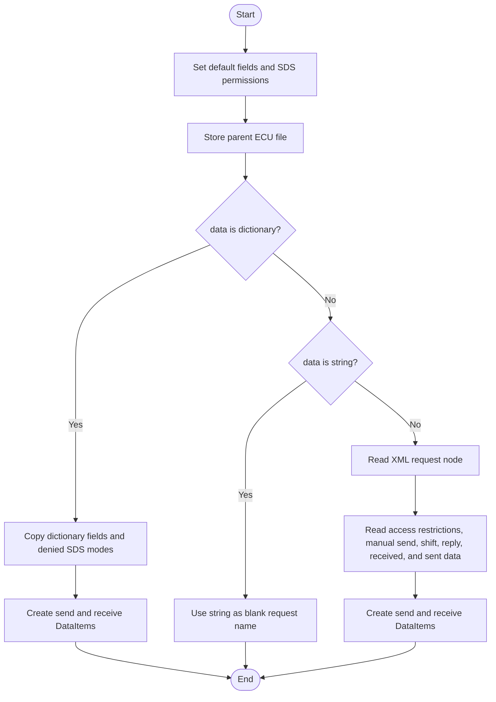
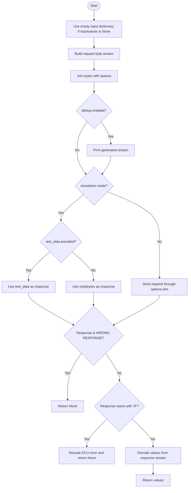
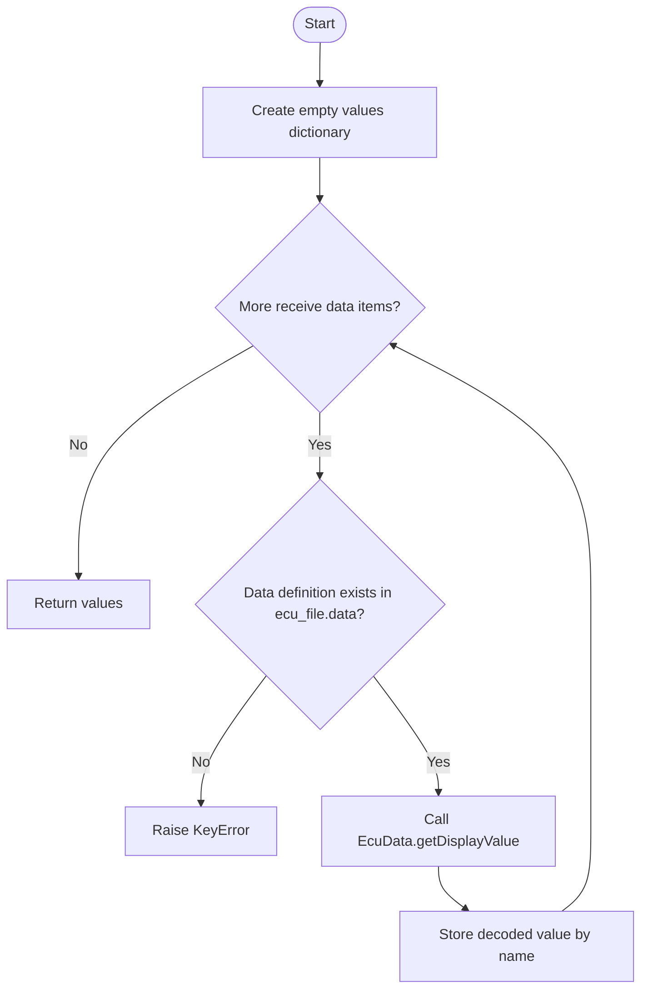
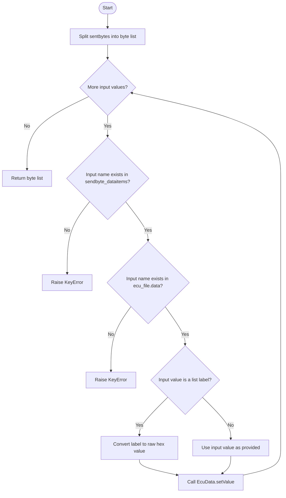
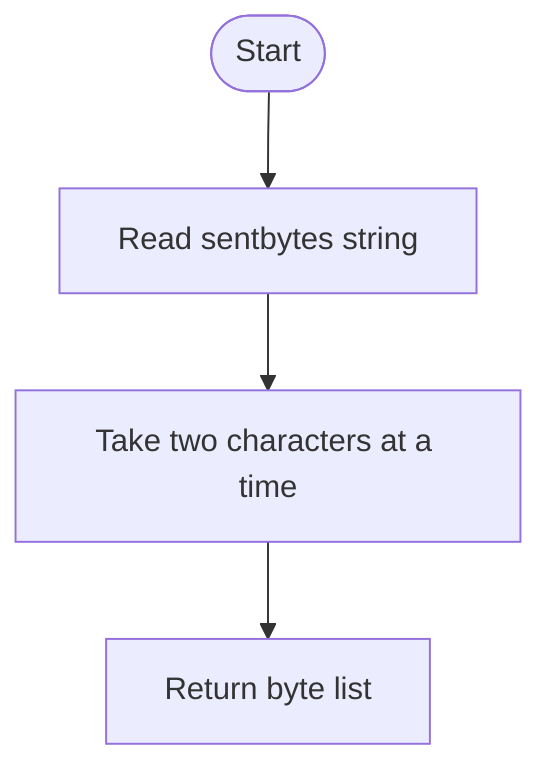
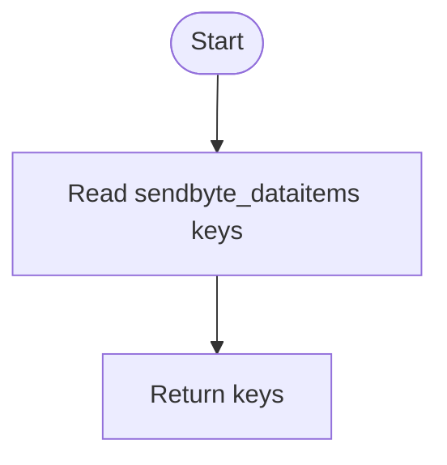
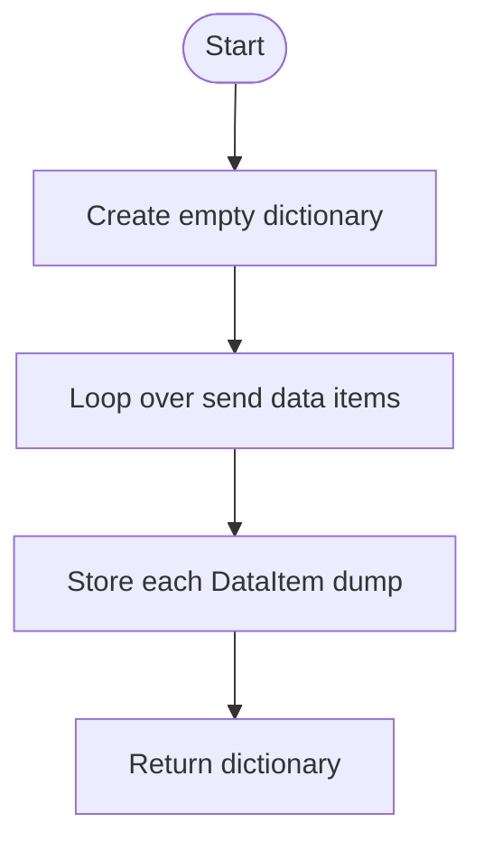
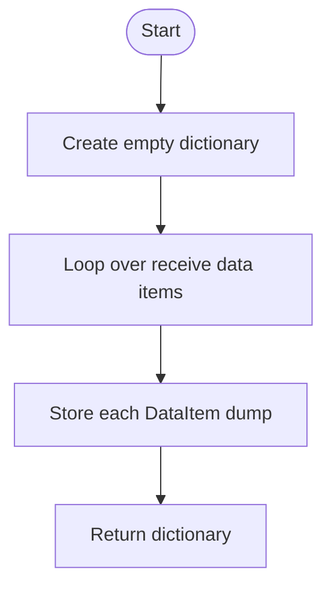
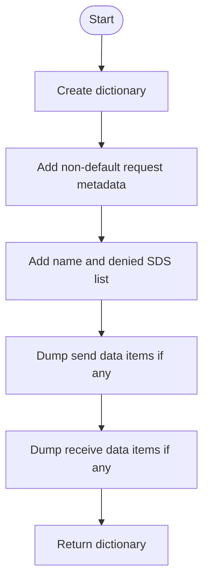
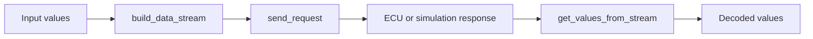

# EcuRequest, In Simple English

Source: `src/ddt4all/core/ecu/ecu_request.py`

[EcuRequest](ecu_request_easylang.md) describes one request that can be sent to an ECU. It knows what bytes to send, where user input goes, and how to read values from the ECU answer.

## Table Of Contents

- [Simple Overview](#simple-overview)
- [Other Code Used By This Class](#other-code-used-by-this-class)
- [Stored Values](#stored-values)
- [Important Details For Beginners](#important-details-for-beginners)
- [Method Guide And Flowcharts](#method-guide-and-flowcharts)
  - [Initialization Functions](#initialization-functions)
    - [`__init__(self, data, ecu_file)`](#init-self-data-ecu-file)
  - [Main Functions](#main-functions)
    - [`send_request(self, inputvalues=None, test_data=None)`](#send-request-self-inputvalues-none-test-data-none)
    - [`get_values_from_stream(self, stream)`](#get-values-from-stream-self-stream)
    - [`build_data_stream(self, data)`](#build-data-stream-self-data)
  - [Auxiliary Functions](#auxiliary-functions)
    - [`get_formatted_sentbytes(self)`](#get-formatted-sentbytes-self)
    - [`get_data_inputs(self)`](#get-data-inputs-self)
    - [`dump_sentdataitems(self)`](#dump-sentdataitems-self)
    - [`dump_dataitems(self)`](#dump-dataitems-self)
    - [`dump(self)`](#dump-self)
- [Simple Flow Summary](#simple-flow-summary)

## Simple Overview

This class connects an ECU file definition with a real request.

First it builds the bytes to send. Then it sends them or uses test data. Then it reads named values from the answer.

Input fields and output fields both use [DataItem](data_item_easylang.md) positions and [EcuData](ecu_data_easylang.md) conversion rules.

## Other Code Used By This Class

- [EcuFile](ecu_file_easylang.md): owns this request and provides data definitions.
- [DataItem](data_item_easylang.md): tells where a field is in the bytes.
- [EcuData](ecu_data_easylang.md): converts between bytes and values.
- [options.elm](../options.md#elm): sends the request to hardware in real mode.

## Stored Values

| Attribute | Purpose |
| --- | --- |
| [minbytes](ecu_request_easylang.md#stored-values) | Minimum answer size. |
| [shiftbytescount](ecu_request_easylang.md#stored-values) | Byte shift setting. |
| [replybytes](ecu_request_easylang.md#stored-values) | Default answer bytes. |
| [manualsend](ecu_request_easylang.md#stored-values) | Whether request is manual-send. |
| [sentbytes](ecu_request_easylang.md#stored-values) | Bytes to send before user input is inserted. |
| [dataitems](ecu_request_easylang.md#stored-values) | Fields read from the answer. |
| [sendbyte_dataitems](ecu_request_easylang.md#stored-values) | Fields written into the request. |
| [name](#stored-values) | Request name. |
| [ecu_file](ecu_request_easylang.md#stored-values) | Parent ECU file. |
| [sds](ecu_request_easylang.md#stored-values) | Diagnostic session access flags. |

## Important Details For Beginners

- Input names must exist in both [sendbyte_dataitems](ecu_request_easylang.md#stored-values) and the parent ECU file data map.
- A response starting with [WRONG RESPONSE](diagnostic_responses.md#wrong-response) or [7F](diagnostic_responses.md#negative-response) means failure.
- In simulation mode, explicit `test_data` is used first. If no test data is given, [replybytes](ecu_request_easylang.md#stored-values) is used.
- [sentbytes](ecu_request_easylang.md#stored-values) is split into pairs of hex characters.

## Method Guide And Flowcharts

## Initialization Functions

### `__init__(self, data, ecu_file)`

Creates the request from JSON, XML, or a simple name. It also creates the input and output field positions.

## Main Functions

### `send_request(self, inputvalues=None, test_data=None)`

Builds the request, sends it or simulates it, checks for errors, and returns decoded values.

### `get_values_from_stream(self, stream)`

Reads every configured output value from the ECU answer.

### `build_data_stream(self, data)`

Starts with the base send bytes and places each user input value into the correct field.

## Auxiliary Functions

### `get_formatted_sentbytes(self)`

Splits the send-byte string into a list like one entry per byte.

### `get_data_inputs(self)`

Returns the names of input values this request accepts.

### `dump_sentdataitems(self)`

Exports only the fields written into the request.

### `dump_dataitems(self)`

Exports only the fields read from the answer.

### `dump(self)`

Exports the request as a dictionary for JSON.

## Simple Flow Summary

[EcuRequest](ecu_request_easylang.md) builds request bytes, gets an ECU answer, and turns that answer into named values.

