# EcuScanner

Source: `src/ddt4all/core/ecu/ecu_scanner.py`

[EcuScanner](ecu_scanner.md) discovers ECUs that respond on CAN, KWP2000/ISO, or DoIP transports and matches their identification data against the loaded [EcuDatabase](ecu_database.md). It stores exact matches in [ecus](ecu_scanner.md#state), near matches in [approximate_ecus](ecu_scanner.md#state), updates optional UI progress/label widgets, and writes scan findings to the main window log view.

## Table Of Contents

- [Method Reference And Flowcharts](#method-reference-and-flowcharts)
- [Initialization Functions](#initialization-functions)
  - [`__init__(self)`](#init-self)
  - [`clear(self)`](#clear-self)
- [Main Functions](#main-functions)
  - [`scan_kwp(self, progress=None, label=None, vehiclefilter=None)`](#scan-kwp-self-progress-none-label-none-vehiclefilter-none)
  - [`scan_doip(self, progress=None, label=None, vehiclefilter=None)`](#scan-doip-self-progress-none-label-none-vehiclefilter-none)
  - [`scan(self, progress=None, label=None, vehiclefilter=None, canline=0)`](#scan-self-progress-none-label-none-vehiclefilter-none-canline-0)
- [Auxiliary Functions](#auxiliary-functions)
  - [`identify_old(self, addr, label, force=False)`](#identify-old-self-addr-label-force-false)
  - [`identify_new(self, addr, label)`](#identify-new-self-addr-label)
  - [`identify_from_frame(self, addr, can_response)`](#identify-from-frame-self-addr-can-response)
  - [`getNumEcuDb(self)`](#getnumecudb-self)
  - [`getNumAddr(self)`](#getnumaddr-self)
  - [`check_ecu2(self, diagversion, supplier, soft, version, label, addr, protocol)`](#check-ecu2-self-diagversion-supplier-soft-version-label-addr-protocol)
  - [`check_ecu(self, can_response, label, addr, protocol)`](#check-ecu-self-can-response-label-addr-protocol)
  - [`addTarget(self, target)`](#addtarget-self-target)
- [Scan Matching Summary](#scan-matching-summary)

## Collaborators

- [EcuDatabase](ecu_database.md): provides known ECU targets, address mappings, available protocol addresses, and vehicle project filters.
- [EcuIdent](ecu_ident.md): represents one known ECU identification target and performs exact or approximate matching.
- [options.elm](../options.md#elm): provides CAN/KWP transport setup, session start, request, and protocol close operations.
- [DoIPDevice](../doip/doip_devices.md): provides DoIP transport setup and request handling.
- [options.main_window.logview](../options.md#main-window-logview): receives HTML-formatted scan result messages.
- [progress](ecu_scanner.md#collaborators), [label](ecu_scanner.md#collaborators), and [qapp](ecu_scanner.md#state): optional UI hooks used during scans.

## State

| Attribute | Purpose |
| --- | --- |
| `totalecu` | Scan counter placeholder reset by [clear](ecu_scanner.md#clear-self); not currently incremented by scanner methods. |
| [ecus](ecu_scanner.md#state) | Exact ECU matches keyed by display name. |
| [approximate_ecus](ecu_scanner.md#state) | Best approximate ECU matches keyed by ECU name. |
| [ecu_database](ecu_scanner.md#state) | Loaded [EcuDatabase](ecu_database.md) instance used for matching and scan address discovery. |
| [num_ecu_found](ecu_scanner.md#state) | Number of exact and approximate matches found during the current scanner lifetime or since [clear](ecu_scanner.md#clear-self). |
| [report_data](ecu_scanner.md#state) | Report data placeholder reset by [clear](ecu_scanner.md#clear-self); not currently populated by scanner methods. |
| [qapp](ecu_scanner.md#state) | Optional Qt application object used to process UI events during progress updates. |
| [current_doip_device](ecu_scanner.md#state) | Created temporarily by [scan_doip](ecu_scanner.md#scan-doip-self-progress-none-label-none-vehiclefilter-none) when DoIP scanning is active. |

## Method Reference And Flowcharts

<a id="initialization-functions"></a>
## Initialization Functions

<a id="init-self"></a>
### `__init__(self)`

Initializes the scanner state and loads a fresh ECU database.

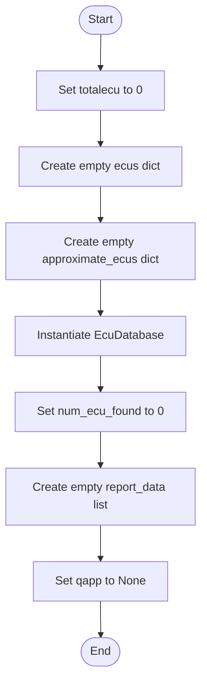

<a id="clear-self"></a>
### `clear(self)`

Resets scan result state while keeping the loaded database object.

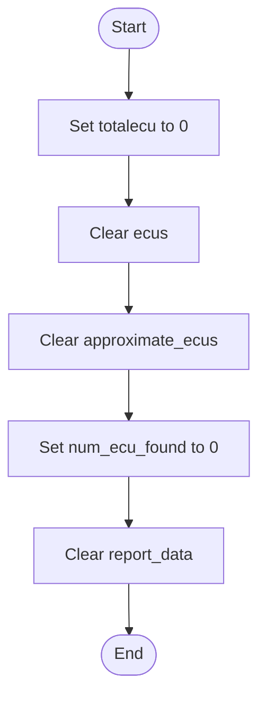

<a id="main-functions"></a>
## Main Functions

<a id="scan-kwp-self-progress-none-label-none-vehiclefilter-none"></a>
### `scan_kwp(self, progress=None, label=None, vehiclefilter=None)`

Scans KWP2000/ISO addresses. Simulation mode injects one known ECU result and uses sample responses for selected addresses; hardware mode initializes ISO, starts [10C0](diagnostic_requests.md#10c0), and requests [2180](diagnostic_requests.md#2180).

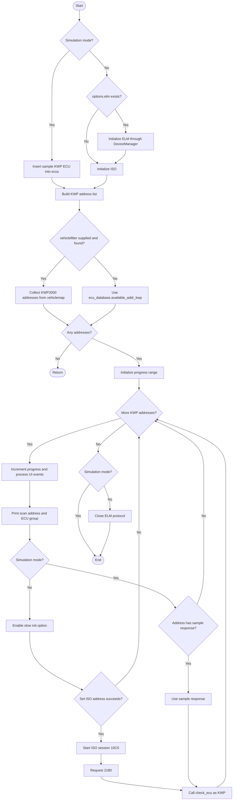

<a id="scan-doip-self-progress-none-label-none-vehiclefilter-none"></a>
### `scan_doip(self, progress=None, label=None, vehiclefilter=None)`

Scans DoIP addresses using an independent [DoIPDevice](../doip/doip_devices.md). Hardware mode connects to the configured DoIP endpoint, scans project or database addresses, starts a diagnostic session per address, sends tester-present, reads identification data with [2180](diagnostic_requests.md#2180), and then closes the DoIP connection.

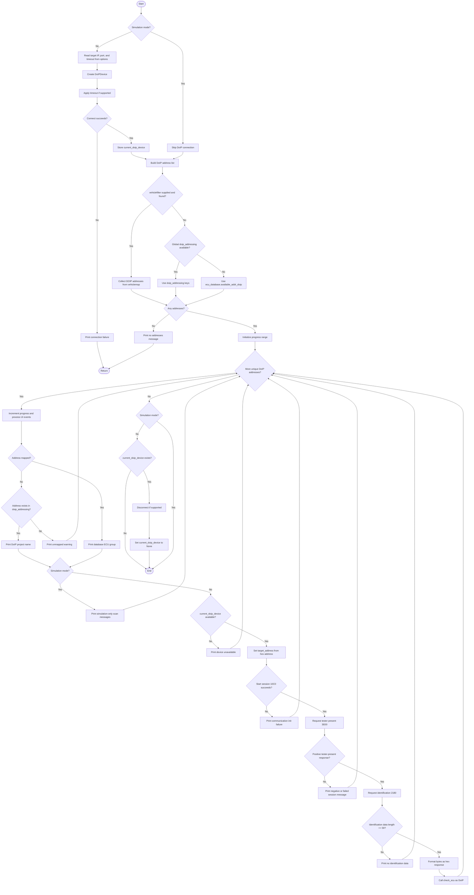

<a id="scan-self-progress-none-label-none-vehiclefilter-none-canline-0"></a>
### `scan(self, progress=None, label=None, vehiclefilter=None, canline=0)`

Scans CAN addresses. It optionally filters addresses by vehicle project, initializes CAN transport when not simulating, and tries the new identification method before falling back to the legacy method.

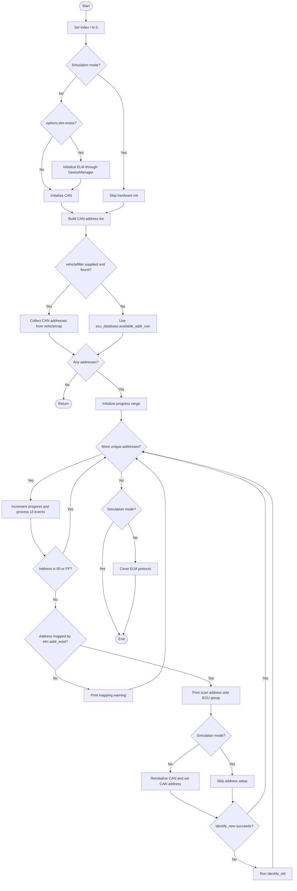

<a id="auxiliary-functions"></a>
## Auxiliary Functions

<a id="identify-old-self-addr-label-force-false"></a>
### `identify_old(self, addr, label, force=False)`

Uses the legacy [2180](diagnostic_requests.md#2180) identification request on CAN, then delegates response parsing and matching to [check_ecu](ecu_scanner.md#check-ecu-self-can-response-label-addr-protocol).

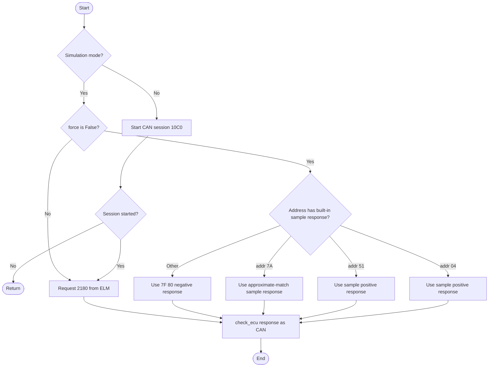

<a id="identify-new-self-addr-label"></a>
### `identify_new(self, addr, label)`

Uses the newer UDS-style identification sequence on CAN: diagnostic version ([22F1A0](diagnostic_requests.md#22f1a0)), supplier ([22F18A](diagnostic_requests.md#22f18a)), software number ([22F194](diagnostic_requests.md#22f194)), and software version ([22F195](diagnostic_requests.md#22f195)). When all required data is available, it delegates matching to [check_ecu2](ecu_scanner.md#check-ecu2-self-diagversion-supplier-soft-version-label-addr-protocol).

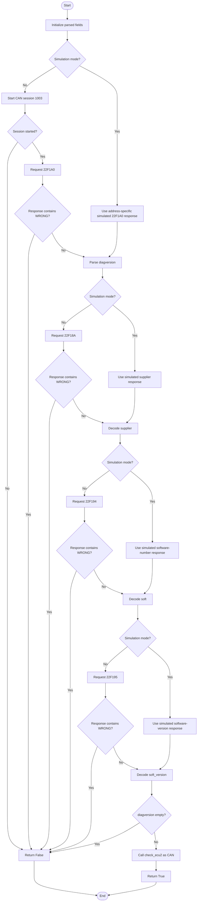

<a id="identify-from-frame-self-addr-can-response"></a>
### `identify_from_frame(self, addr, can_response)`

Matches an already captured CAN response without opening a diagnostic session.

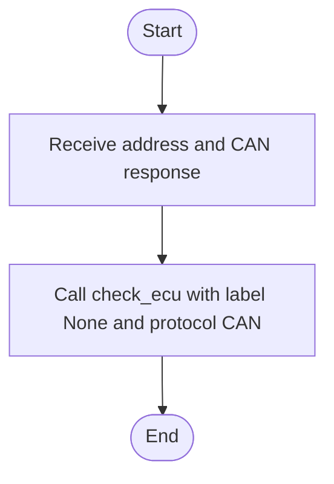

<a id="getnumecudb-self"></a>
### `getNumEcuDb(self)`

Returns the number of ECU database entries reported by [EcuDatabase](ecu_database.md).

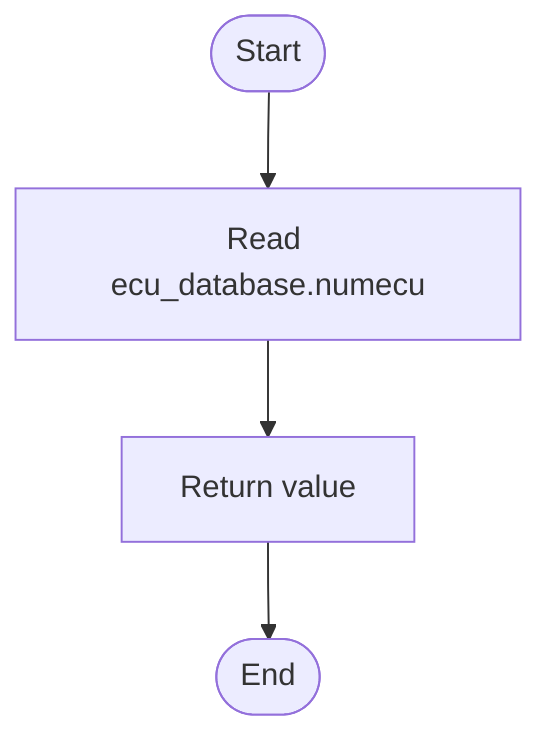

<a id="getnumaddr-self"></a>
### `getNumAddr(self)`

Counts unique diagnostic addresses known by the ELM address maps [elm.dnat](../elm/elm_module.md#address-tables) and [elm.dnat_ext](../elm/elm_module.md#address-tables).

```mermaid
flowchart TD
    A([Start]) --> B[Create empty count list]
    B --> C{More keys in elm.dnat?}
    C -- Yes --> D{Key already counted?}
    D -- No --> E[Append key]
    D -- Yes --> C
    E --> C
    C -- No --> F{More keys in elm.dnat_ext?}
    F -- Yes --> G{Key already counted?}
    G -- No --> H[Append key]
    G -- Yes --> F
    H --> F
    F -- No --> I[Return len(count)]
    I --> J([End])
```

<a id="check-ecu2-self-diagversion-supplier-soft-version-label-addr-protocol"></a>
### `check_ecu2(self, diagversion, supplier, soft, version, label, addr, protocol)`

Matches parsed identification fields against database targets. Exact matches are stored in [ecus](ecu_scanner.md#state); approximate matches are filtered by closest version and stored in [approximate_ecus](ecu_scanner.md#state); unmatched responses are logged.

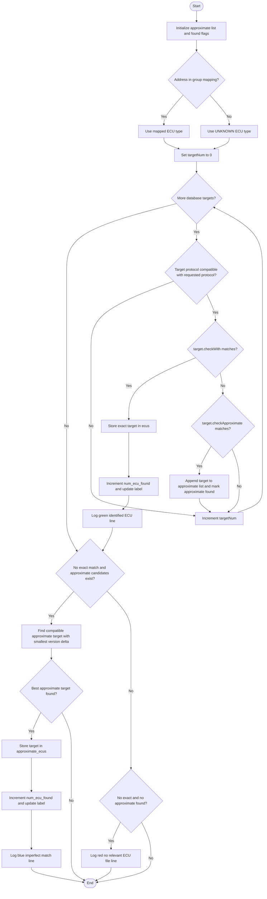

<a id="check-ecu-self-can-response-label-addr-protocol"></a>
### `check_ecu(self, can_response, label, addr, protocol)`

Parses a raw identification response into [diagversion](ecu_ident.md#state), [supplier](ecu_ident.md#state), [soft](ecu_ident.md#state), and [version](ecu_ident.md#state), then delegates matching to [check_ecu2](ecu_scanner.md#check-ecu2-self-diagversion-supplier-soft-version-label-addr-protocol). It supports the legacy long response layout, a DoIP-specific branch, and a shorter CAN/KWP layout.

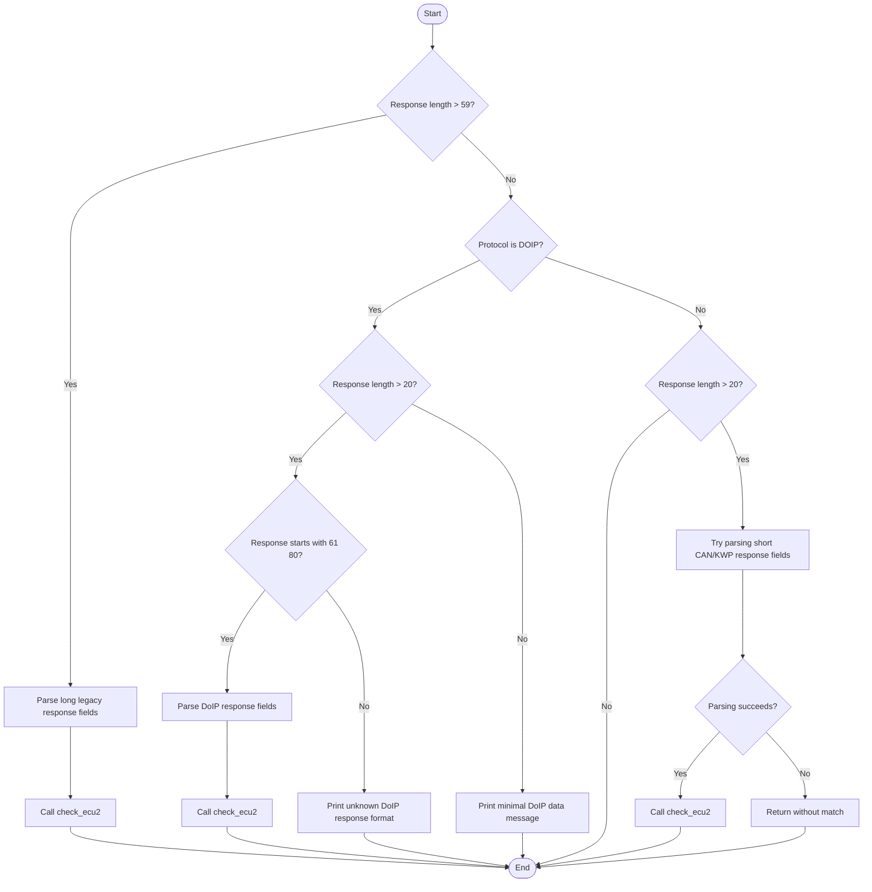

<a id="addtarget-self-target"></a>
### `addTarget(self, target)`

Adds an [EcuIdent](ecu_ident.md)-like target directly to the exact-match dictionary using its [name](#state).

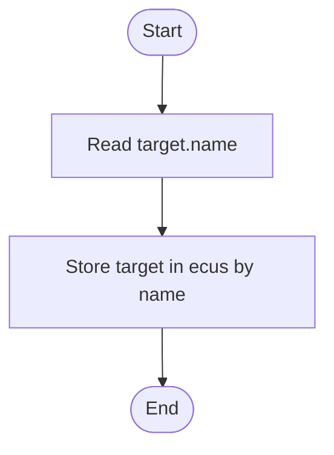

## Scan Matching Summary

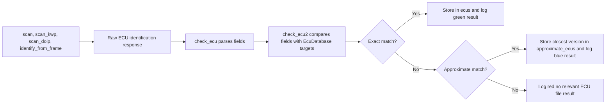
