# EcuScanner, In Simple English

Source: `src/ddt4all/core/ecu/ecu_scanner.py`

[EcuScanner](ecu_scanner_easylang.md) searches for ECUs. An ECU is a small computer in a car.

The scanner can talk to ECUs with CAN, KWP2000 / ISO, or DoIP. When an ECU answers, the scanner reads identity data from the answer. Then it compares this data with the loaded [EcuDatabase](ecu_database_easylang.md).

If the answer matches exactly, the scanner stores the ECU in [ecus](ecu_scanner_easylang.md#stored-values).

If the answer is close, but not perfect, the scanner stores the ECU in [approximate_ecus](ecu_scanner_easylang.md#stored-values).

The scanner can also update progress widgets in the user interface and write messages to the main log window.

## Table Of Contents

- [Method Reference And Flowcharts](#method-reference-and-flowcharts)
- [Initialization Functions](#initialization-functions)
  - [`__init__(self)`](#init-self)
  - [`clear(self)`](#clear-self)
- [Main Functions](#main-functions)
  - [`scan_kwp(self, progress=None, label=None, vehiclefilter=None)`](#scan-kwp-self-progress-none-label-none-vehiclefilter-none)
  - [`scan_doip(self, progress=None, label=None, vehiclefilter=None)`](#scan-doip-self-progress-none-label-none-vehiclefilter-none)
  - [`scan(self, progress=None, label=None, vehiclefilter=None, canline=0)`](#scan-self-progress-none-label-none-vehiclefilter-none-canline-0)
- [Auxiliary Functions](#auxiliary-functions)
  - [`identify_old(self, addr, label, force=False)`](#identify-old-self-addr-label-force-false)
  - [`identify_new(self, addr, label)`](#identify-new-self-addr-label)
  - [`identify_from_frame(self, addr, can_response)`](#identify-from-frame-self-addr-can-response)
  - [`getNumEcuDb(self)`](#getnumecudb-self)
  - [`getNumAddr(self)`](#getnumaddr-self)
  - [`check_ecu2(self, diagversion, supplier, soft, version, label, addr, protocol)`](#check-ecu2-self-diagversion-supplier-soft-version-label-addr-protocol)
  - [`check_ecu(self, can_response, label, addr, protocol)`](#check-ecu-self-can-response-label-addr-protocol)
  - [`addTarget(self, target)`](#addtarget-self-target)
- [Scan Matching Summary](#scan-matching-summary)

## Other Code Used By This Class

- [EcuDatabase](ecu_database_easylang.md): gives the scanner the known ECU list, address names, scan addresses, and vehicle project filters.
- [EcuIdent](ecu_ident_easylang.md): represents one known ECU from the database. It can check if an ECU answer matches it.
- [options.elm](../options.md#elm): talks to the adapter for CAN and KWP scans.
- [DoIPDevice](../doip/doip_devices_easylang.md): talks to ECUs over DoIP.
- [options.main_window.logview](../options.md#main-window-logview): shows scan messages in the main window.
- [progress](ecu_scanner_easylang.md#other-code-used-by-this-class), [label](ecu_scanner_easylang.md#other-code-used-by-this-class), and [qapp](ecu_scanner_easylang.md#stored-values): optional user interface objects used while scanning.

## Stored Values

| Attribute | Simple meaning |
| --- | --- |
| `totalecu` | A counter-like value. It is reset by [clear](ecu_scanner_easylang.md#clear-self), but this class does not currently increase it. |
| [ecus](ecu_scanner_easylang.md#stored-values) | Exact ECU matches, stored by display name. |
| [approximate_ecus](ecu_scanner_easylang.md#stored-values) | Best close ECU matches, stored by ECU name. |
| [ecu_database](ecu_scanner_easylang.md#stored-values) | The loaded [EcuDatabase](ecu_database_easylang.md) object used for scans and matching. |
| [num_ecu_found](ecu_scanner_easylang.md#stored-values) | Number of exact and close matches found since the scanner was created or cleared. |
| [report_data](ecu_scanner_easylang.md#stored-values) | Report data list. It is reset by [clear](ecu_scanner_easylang.md#clear-self), but this class does not currently fill it. |
| [qapp](ecu_scanner_easylang.md#stored-values) | Optional Qt application object. It lets the UI update during long scans. |
| [current_doip_device](ecu_scanner_easylang.md#stored-values) | Temporary DoIP device used during a DoIP scan. |

## Method Reference And Flowcharts

## Initialization Functions

### `__init__(self)`

Creates a new scanner object. It sets empty result containers and loads a fresh ECU database.

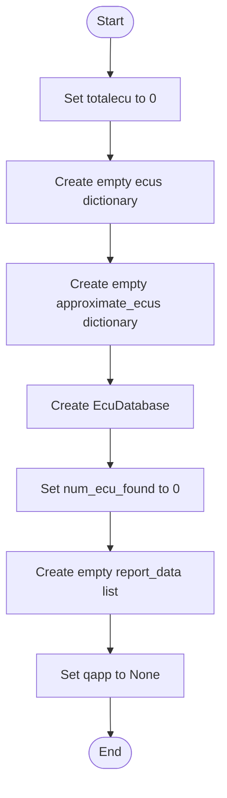

### `clear(self)`

Clears scan results and counters. It keeps the already loaded database.

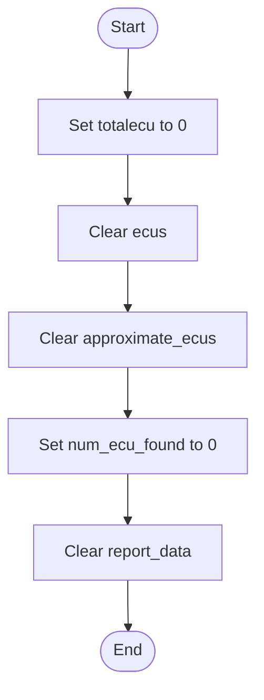

## Main Functions

### `scan_kwp(self, progress=None, label=None, vehiclefilter=None)`

Scans KWP2000 / ISO addresses.

In simulation mode, it first adds one example KWP ECU to [ecus](ecu_scanner_easylang.md#stored-values).

In real mode, it initializes the ELM device and ISO communication.

Then it builds the address list:

- if `vehiclefilter` is set, it uses KWP2000 addresses for that vehicle project
- otherwise, it uses all known KWP addresses from the database

For each address, real mode sets the ISO address, starts session [10C0](diagnostic_requests.md#10c0), and sends request [2180](diagnostic_requests.md#2180).

Simulation mode uses example answers for selected addresses.

Each answer is passed to [check_ecu](ecu_scanner_easylang.md#check-ecu-self-can-response-label-addr-protocol) with protocol `KWP`.

At the end, it closes the protocol in real mode.

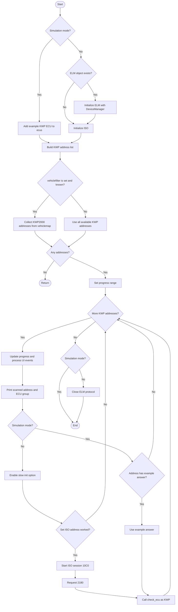

### `scan_doip(self, progress=None, label=None, vehiclefilter=None)`

Scans DoIP addresses.

DoIP means diagnostics over IP. It uses a network connection instead of the normal ELM CAN / KWP adapter.

In real mode, the method reads the DoIP target IP, port, and timeout from `options`. Then it creates a [DoIPDevice](../doip/doip_devices_easylang.md) and connects to it.

Then it builds the address list:

- if `vehiclefilter` is set, it uses DoIP addresses for that vehicle project
- otherwise, it uses addresses from [doip_addressing](ecu_database_module.md#doip-addressing) when available
- if [doip_addressing](ecu_database_module.md#doip-addressing) is not available, it uses DoIP addresses from the database

For each address, it prints the ECU group or a warning. In real mode, it sets the DoIP target address, starts session [10C0](diagnostic_requests.md#10c0), sends tester-present request [3E00](diagnostic_requests.md#3e00), and then requests identity data with [2180](diagnostic_requests.md#2180).

If enough identity data is returned, the bytes are converted to a hex string and passed to [check_ecu](ecu_scanner_easylang.md#check-ecu-self-can-response-label-addr-protocol) with protocol [DoIP](protocols.md#doip).

In simulation mode, it only prints what would be scanned.

At the end, real mode closes the DoIP connection.

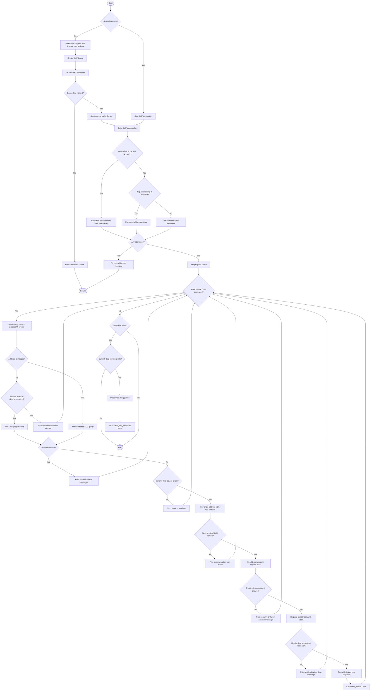

### `scan(self, progress=None, label=None, vehiclefilter=None, canline=0)`

Scans CAN addresses.

In real mode, it initializes the ELM device and CAN communication.

Then it builds the address list:

- if `vehiclefilter` is set, it uses CAN addresses for that vehicle project
- otherwise, it uses all known CAN addresses from the database

It skips invalid addresses `00` and `FF`. It also skips addresses that are not mapped by the ELM code.

For each valid address, it sets the CAN address. Then it tries [identify_new](ecu_scanner_easylang.md#identify-new-self-addr-label). If that fails, it tries [identify_old](ecu_scanner_easylang.md#identify-old-self-addr-label-force-false).

At the end, it closes the protocol in real mode.

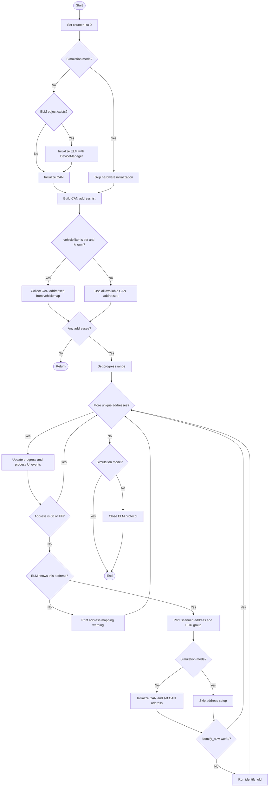

## Auxiliary Functions

### `identify_old(self, addr, label, force=False)`

Uses the older CAN identity request.

In real mode, it starts CAN session [10C0](diagnostic_requests.md#10c0). If the session fails, it stops. If the session works, it sends request [2180](diagnostic_requests.md#2180).

In simulation mode, it uses built-in example answers for some addresses.

After it has an answer, it calls [check_ecu](ecu_scanner_easylang.md#check-ecu-self-can-response-label-addr-protocol).

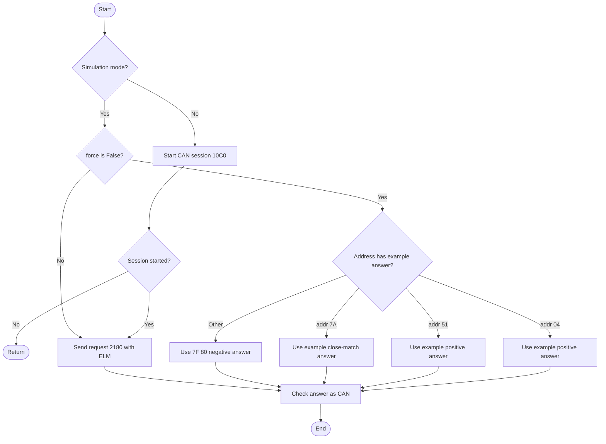

### `identify_new(self, addr, label)`

Uses the newer CAN identity method.

In real mode, it starts CAN session [1003](diagnostic_requests.md#1003). If that fails, the method returns `False`.

Then it asks the ECU for four values:

| Request | Meaning |
| --- | --- |
| [22F1A0](diagnostic_requests.md#22f1a0) | Diagnostic version |
| [22F18A](diagnostic_requests.md#22f18a) | Supplier |
| [22F194](diagnostic_requests.md#22f194) | Software number |
| [22F195](diagnostic_requests.md#22f195) | Software version |

If any request returns `WRONG`, the method returns `False`.

If all data is valid, it calls [check_ecu2](ecu_scanner_easylang.md#check-ecu2-self-diagversion-supplier-soft-version-label-addr-protocol) and returns `True`.

In simulation mode, it uses built-in example answers.

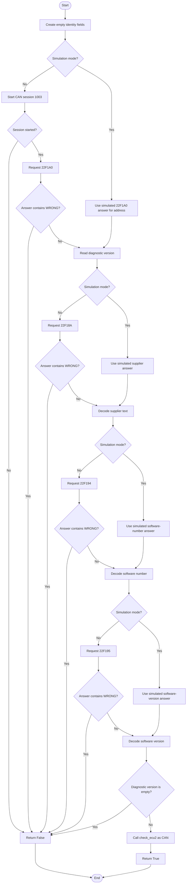

### `identify_from_frame(self, addr, can_response)`

Checks an already captured CAN answer.

It does not open a diagnostic session. It just passes the answer to [check_ecu](ecu_scanner_easylang.md#check-ecu-self-can-response-label-addr-protocol).

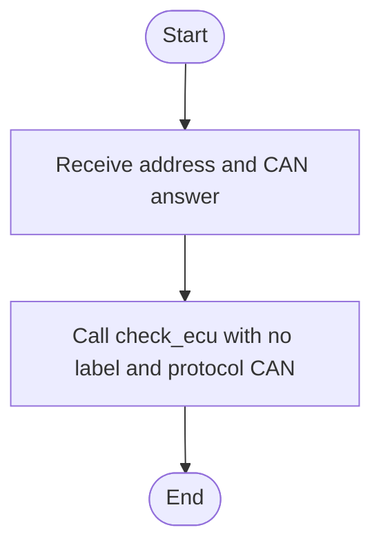

### `getNumEcuDb(self)`

Returns the number of ECU entries in the database.

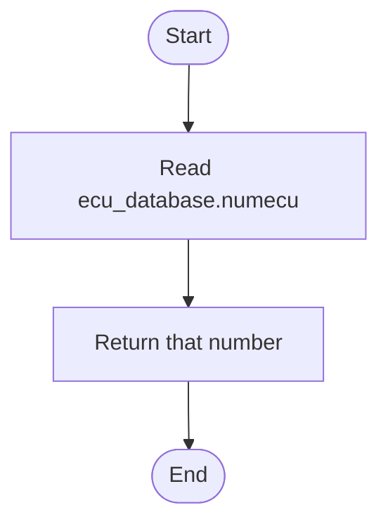

### `getNumAddr(self)`

Counts unique diagnostic addresses from [elm.dnat](../elm/elm_module.md#address-tables) and [elm.dnat_ext](../elm/elm_module.md#address-tables).

It does not count the same address twice.

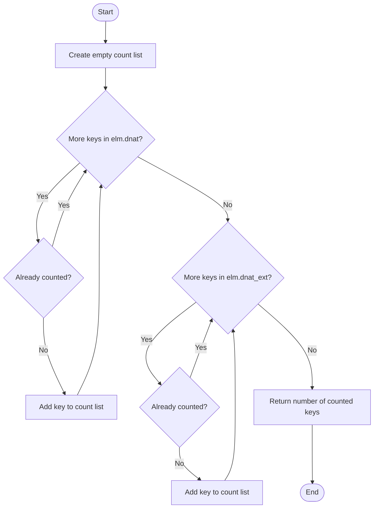

### `check_ecu2(self, diagversion, supplier, soft, version, label, addr, protocol)`

Compares parsed ECU identity values with all known targets in the database.

The parsed values are:

- diagnostic version
- supplier
- software number
- software version
- address
- protocol

The method first checks if the protocol fits. Then it tries to find an exact match.

If there is no exact match, it remembers close matches. A close match has the same diagnostic version, supplier, and software number, but not necessarily the same version.

If there are several close matches, it keeps the one with the closest version number.

It writes different log messages:

- green for exact matches
- blue for close matches
- red when no useful ECU file was found

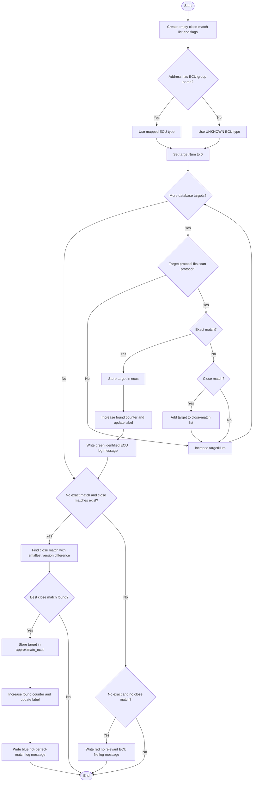

### `check_ecu(self, can_response, label, addr, protocol)`

Reads identity values from a raw ECU answer.

The raw answer is a string of hexadecimal bytes.

The method supports three formats:

- a long legacy format
- a DoIP format
- a shorter CAN / KWP format

After it reads the values, it calls [check_ecu2](ecu_scanner_easylang.md#check-ecu2-self-diagversion-supplier-soft-version-label-addr-protocol).

If parsing fails, it stops without adding a match.

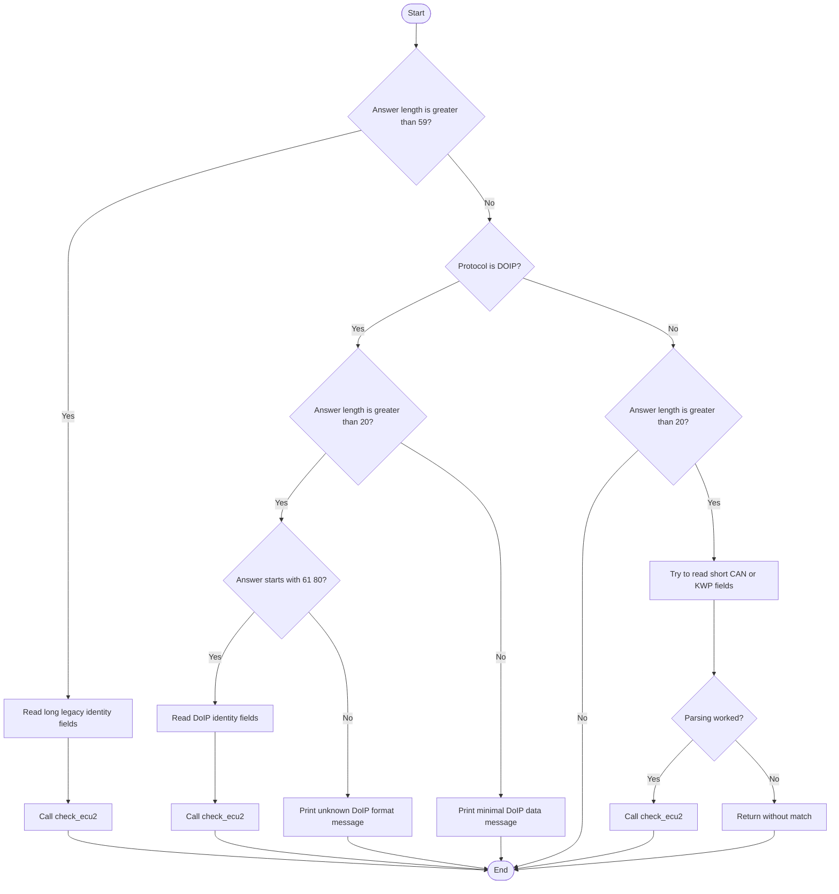

### `addTarget(self, target)`

Adds one target directly to the exact ECU match dictionary.

The key is `target.name`.

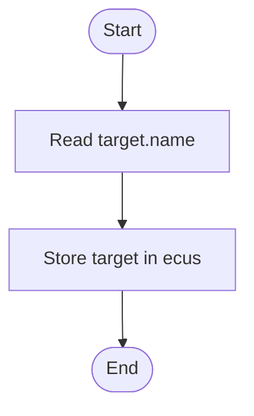

## Scan Matching Summary

This is the short version of the whole scan process.

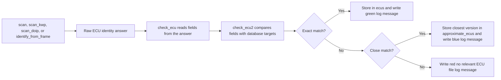
