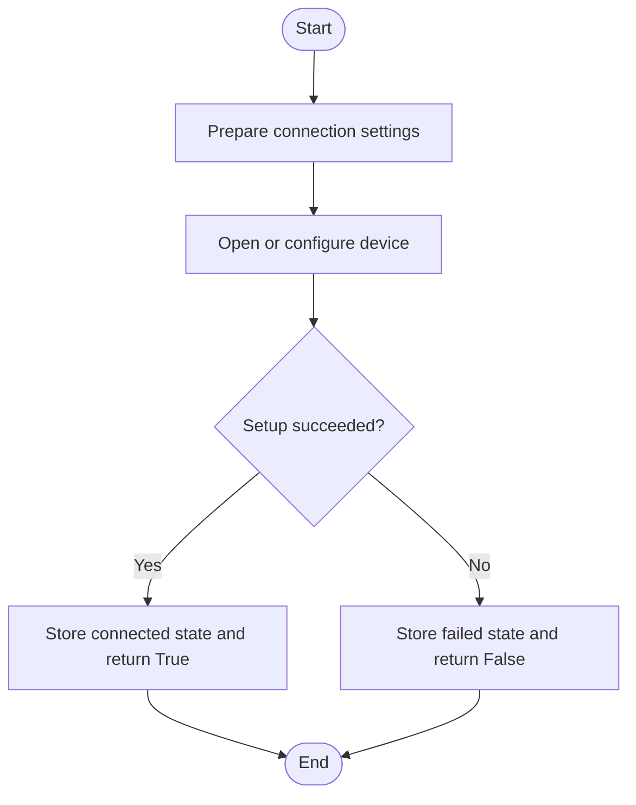
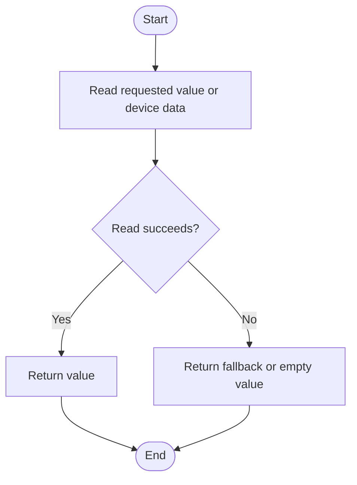
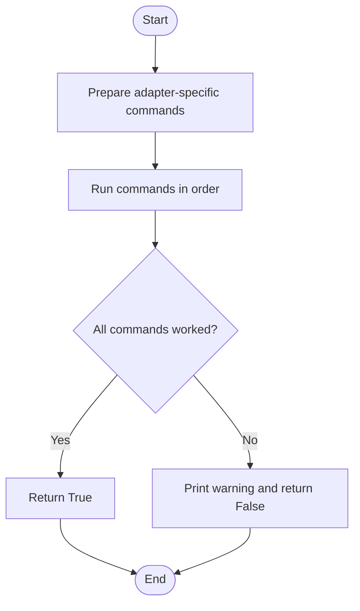
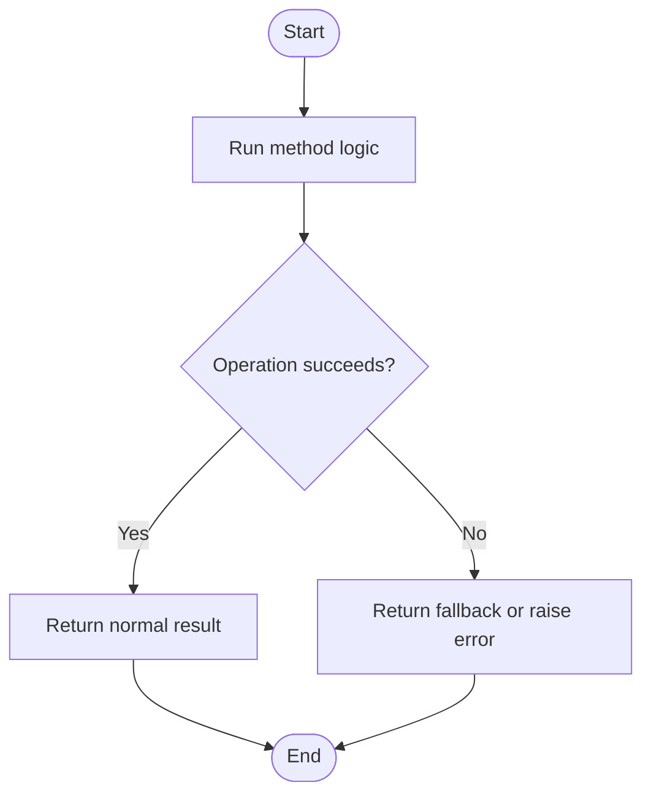

# DeviceManager, In Simple English

Source: `src/ddt4all/core/elm/device_manager.py`

`DeviceManager` is one part of the core code. This version uses simple English. It keeps the same meaning as the normal document, but uses shorter sentences.

## Table Of Contents

- [Method Reference And Flowcharts](#method-reference-and-flowcharts)
- [Initialization Functions](#initialization-functions)
  - [`initialize_device(elm_instance, device_type=None)`](#initialize-device-elm-instance-device-type-none)
- [Main Functions](#main-functions)
  - [`normalize_adapter_type(adapter_type)`](#normalize-adapter-type-adapter-type)
  - [`enable_enhanced_features(elm_instance, device_type)`](#enable-enhanced-features-elm-instance-device-type)
  - [`detect_device_type(elm_instance)`](#detect-device-type-elm-instance)
- [Auxiliary Functions](#auxiliary-functions)
  - [`get_optimal_settings(device_type)`](#get-optimal-settings-device-type)
  - [`_swap_vgate_pins(elm_instance)`](#swap-vgate-pins-elm-instance)
  - [`_swap_usbcan_pins(elm_instance)`](#swap-usbcan-pins-elm-instance)
  - [`_swap_obdlink_pins(elm_instance)`](#swap-obdlink-pins-elm-instance)
  - [`_swap_els27_pins(elm_instance)`](#swap-els27-pins-elm-instance)
  - [`_swap_derlek_diag3_pins(elm_instance)`](#swap-derlek-diag3-pins-elm-instance)
  - [`_swap_derlek_diag2_pins(elm_instance)`](#swap-derlek-diag2-pins-elm-instance)
  - [`_enable_stpx_mode(elm_instance)`](#enable-stpx-mode-elm-instance)
  - [`_auto_swap_pins(elm_instance, device_type)`](#auto-swap-pins-elm-instance-device-type)
- [Flow Summary](#flow-summary)

## Other Code Used By This Class

- `Port`: handles low-level serial, Bluetooth, WiFi, or DoIP transport when used by ELM.
- `options`: provides runtime flags and adapter settings.
- `DeviceManager`: applies adapter-specific settings for supported devices.

## Method Reference And Flowcharts

## Initialization Functions

### `initialize_device(elm_instance, device_type=None)`

Complete device initialization with enhanced features

## Main Functions

### `normalize_adapter_type(adapter_type)`

Normalize UI adapter types to internal device types

### `enable_enhanced_features(elm_instance, device_type)`

Enable enhanced features based on device type

### `detect_device_type(elm_instance)`

Auto-detect device type from ELM responses

## Auxiliary Functions

### `get_optimal_settings(device_type)`

Get optimal connection settings for specific device types

### `_swap_vgate_pins(elm_instance)`

Swap pins for VGate adapters using STN protocol

### `_swap_usbcan_pins(elm_instance)`

Swap pins for USB CAN adapters

### `_swap_obdlink_pins(elm_instance)`

Swap pins for OBDLink adapters

### `_swap_els27_pins(elm_instance)`

Swap pins for ELS27 adapters

### `_swap_derlek_diag3_pins(elm_instance)`

Swap pins for DerleK USB-DIAG3 adapters

### `_swap_derlek_diag2_pins(elm_instance)`

Swap pins for DerleK USB-DIAG2 adapters

### `_enable_stpx_mode(elm_instance)`

Enable STPX mode for enhanced long command support

### `_auto_swap_pins(elm_instance, device_type)`

Auto-swap pins based on device type

## Flow Summary

This is the short version of how `DeviceManager` is used.

