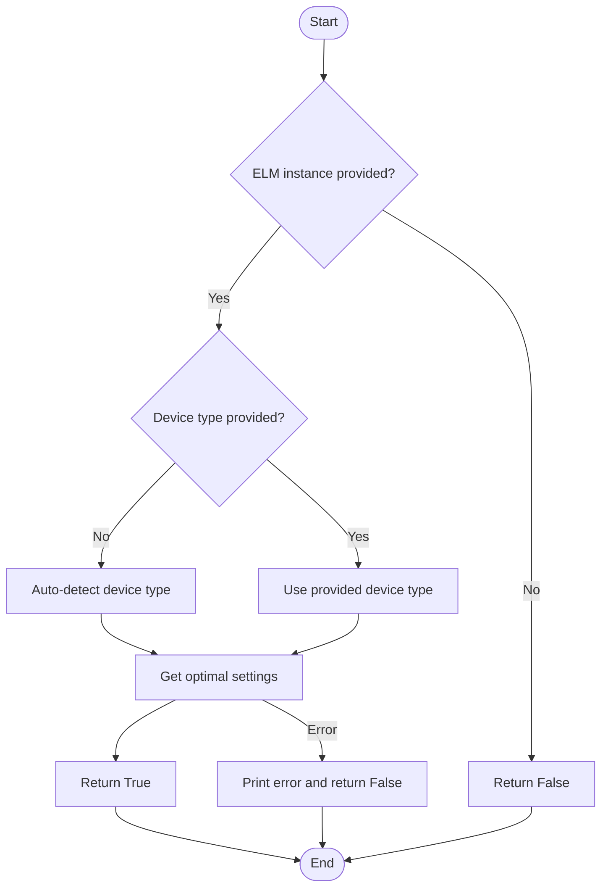
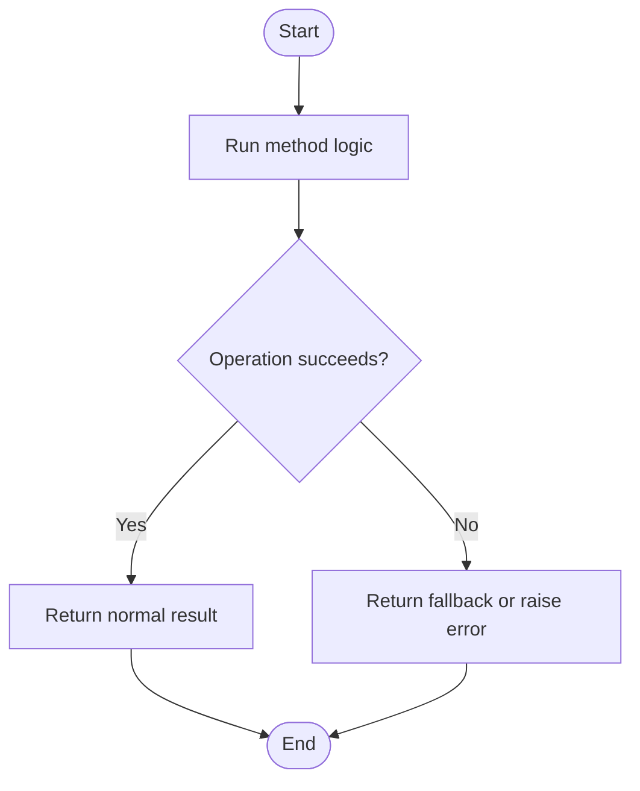
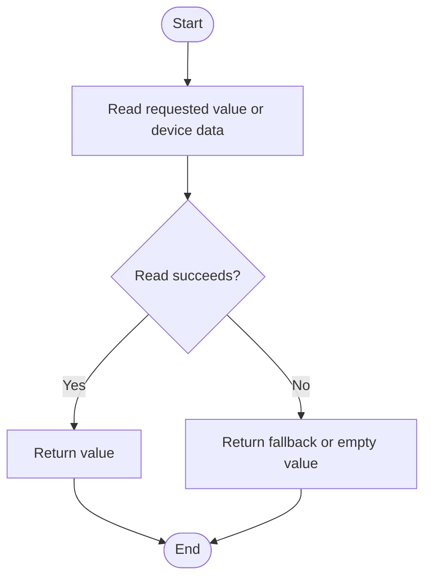

# DeviceManager, In Simple English

Source: `src/ddt4all/core/elm/device_manager.py`

`DeviceManager` is one part of the core code. This version uses simple English. It keeps the same meaning as the normal document, but uses shorter sentences.

## Table Of Contents

- [Method Reference And Flowcharts](#method-reference-and-flowcharts)
- [Initialization Functions](#initialization-functions)
  - [`initialize_device(elm_instance, device_type=None)`](#initialize-device-elm-instance-device-type-none)
- [Main Functions](#main-functions)
  - [`normalize_adapter_type(adapter_type)`](#normalize-adapter-type-adapter-type)
  - [`detect_device_type(elm_instance)`](#detect-device-type-elm-instance)
- [Auxiliary Functions](#auxiliary-functions)
  - [`get_optimal_settings(device_type)`](#get-optimal-settings-device-type)
- [Flow Summary](#flow-summary)

## Other Code Used By This Class

- `options`: provides the message translator and runtime settings.

## Method Reference And Flowcharts

## Initialization Functions

### `initialize_device(elm_instance, device_type=None)`

Complete device initialization with enhanced features

```mermaid
flowchart TD
    A([Start]) --> B{ELM instance provided?}
    B -- No --> Z[Return False]
    B -- Yes --> C{Device type provided?}
    C -- No --> D[Auto-detect device type]
    C -- Yes --> E[Use provided device type]
    D --> F[Get optimal settings]
    E --> F
    F --> H[Return True]
    F -- Error --> Y[Print error and return False]
    H --> I([End])
    Y --> I
    Z --> I
```

## Main Functions

### `normalize_adapter_type(adapter_type)`

Normalize UI adapter types to internal device types

```mermaid
flowchart TD
    A([Start]) --> B[Run method logic]
    B --> C{Operation succeeds?}
    C -- Yes --> D[Return normal result]
    C -- No --> E[Return fallback or raise error]
    D --> F([End])
    E --> F
```

### `detect_device_type(elm_instance)`

Auto-detect device type from ELM responses

```mermaid
flowchart TD
    A([Start]) --> B[Run method logic]
    B --> C{Operation succeeds?}
    C -- Yes --> D[Return normal result]
    C -- No --> E[Return fallback or raise error]
    D --> F([End])
    E --> F
```

## Auxiliary Functions

### `get_optimal_settings(device_type)`

Get optimal connection settings for specific device types

```mermaid
flowchart TD
    A([Start]) --> B[Read requested value or device data]
    B --> C{Read succeeds?}
    C -- Yes --> D[Return value]
    C -- No --> E[Return fallback or empty value]
    D --> F([End])
    E --> F
```

## Flow Summary

This is the short version of how `DeviceManager` is used.

```mermaid
flowchart LR
    A[Call a static method] --> B[Normalize, detect, or read settings]
    B --> C[Return result]
```
