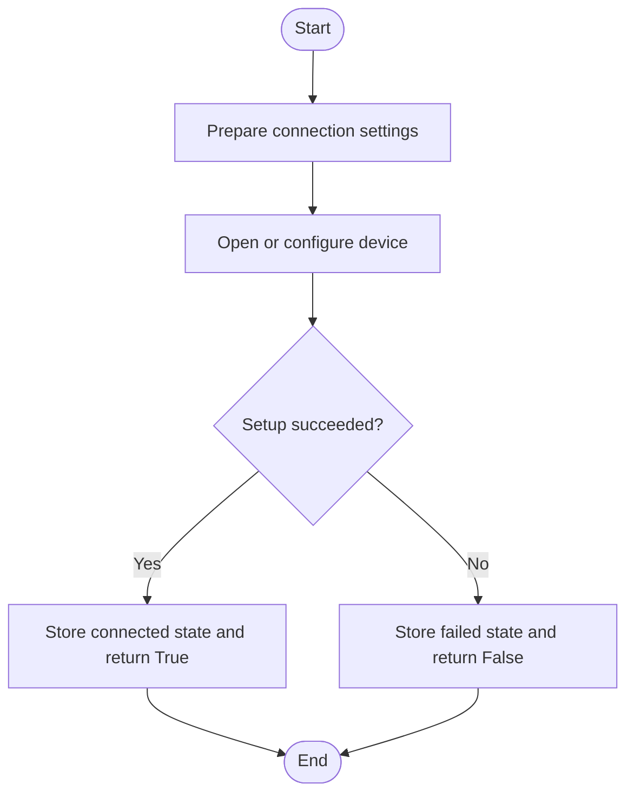
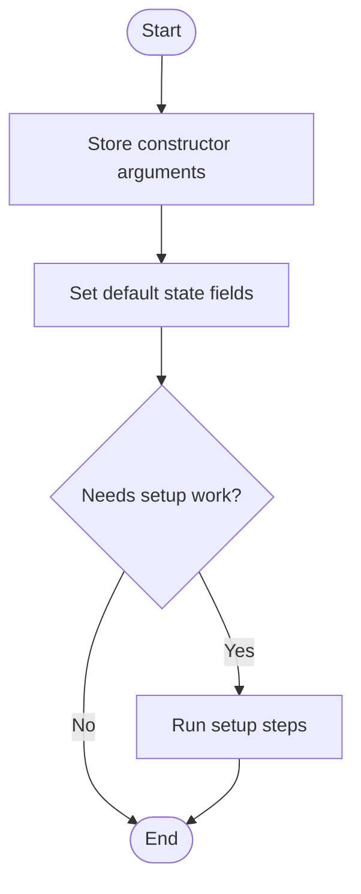
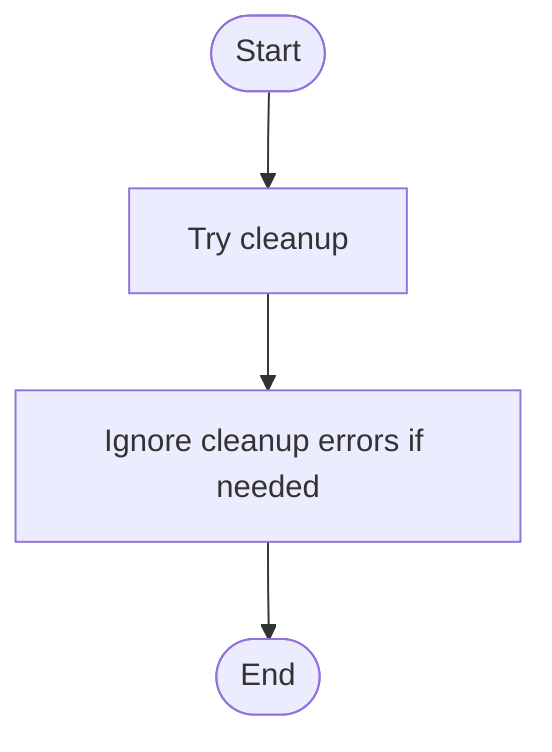
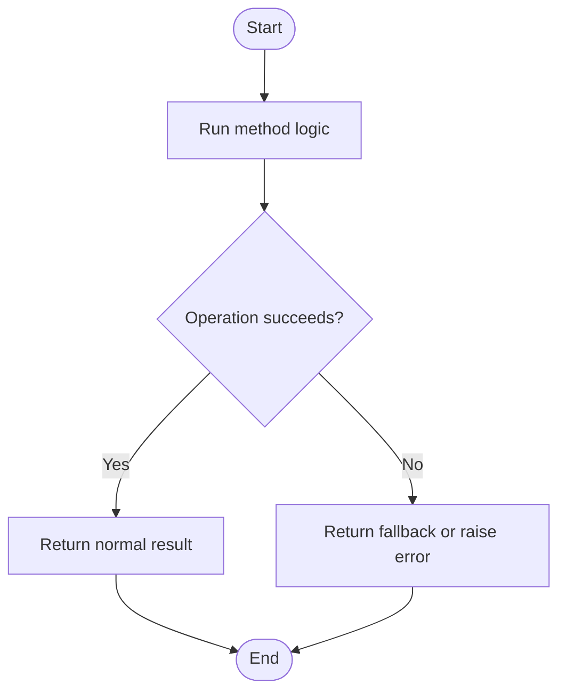
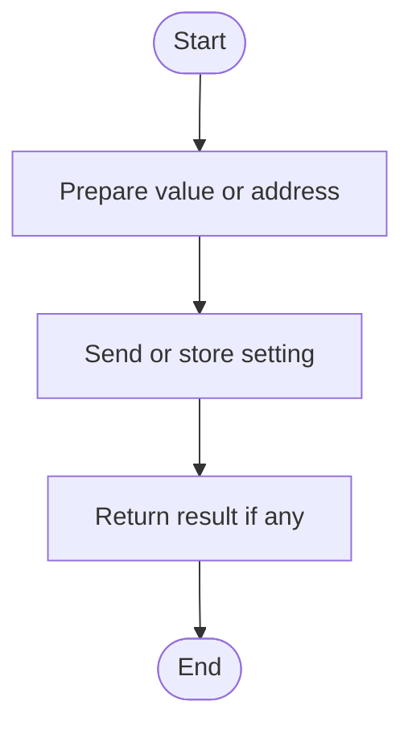
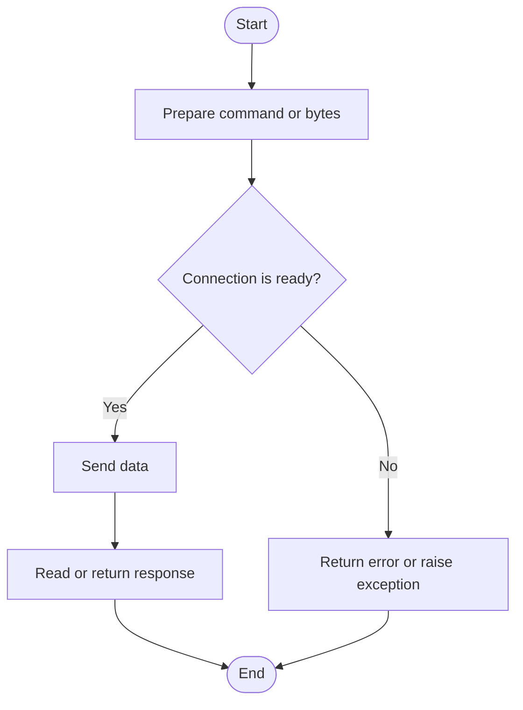
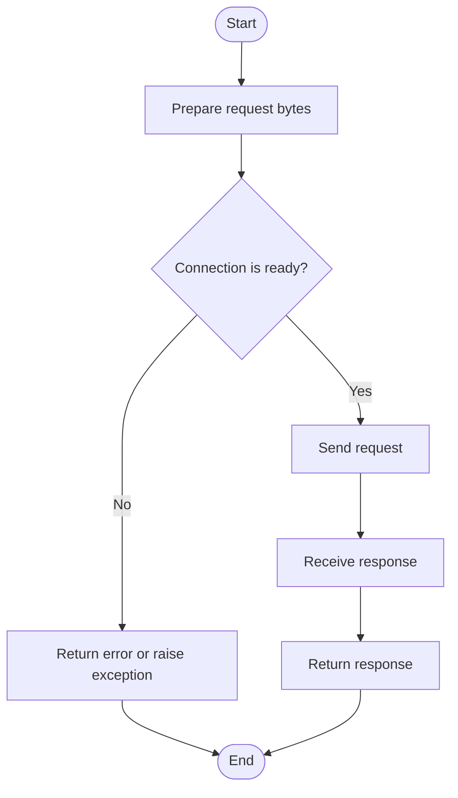
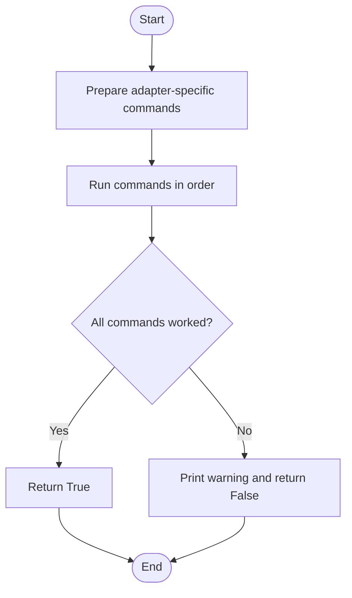

# ELM

Source: `src/ddt4all/core/elm/elm.py`

ELM327 class

## Table Of Contents

- [Method Reference And Flowcharts](#method-reference-and-flowcharts)
- [Initialization Functions](#initialization-functions)
  - [`init_iso(self)`](#init-iso-self)
  - [`init_can_sniffer(self, filter_addr, br)`](#init-can-sniffer-self-filter-addr-br)
  - [`init_can(self)`](#init-can-self)
  - [`__init__(self, portName, rate, adapter_type, maxspeed='No')`](#init-self-portname-rate-adapter-type-maxspeed-no)
  - [`__del__(self)`](#del-self)
- [Main Functions](#main-functions)
  - [`start_session_iso(self, start_session)`](#start-session-iso-self-start-session)
  - [`start_session_can(self, start_session)`](#start-session-can-self-start-session)
  - [`set_iso_addr(self, addr, ecu)`](#set-iso-addr-self-addr-ecu)
  - [`set_iso8_addr(self, addr, ecu)`](#set-iso8-addr-self-addr-ecu)
  - [`set_can_timeout(self, value)`](#set-can-timeout-self-value)
  - [`set_can_addr(self, addr, ecu, canline=0)`](#set-can-addr-self-addr-ecu-canline-0)
  - [`send_stn_command(self, command, enhanced=True)`](#send-stn-command-self-command-enhanced-true)
  - [`send_raw(self, command, expect='>')`](#send-raw-self-command-expect->)
  - [`send_cmd(self, command)`](#send-cmd-self-command)
  - [`send_can_cfc0(self, command)`](#send-can-cfc0-self-command)
  - [`send_can(self, command)`](#send-can-self-command)
  - [`request(self, req, positive='', cache=True, serviceDelay='0')`](#request-self-req-positive-cache-true-servicedelay-0)
  - [`raise_vgate_speed(self, baudrate)`](#raise-vgate-speed-self-baudrate)
  - [`raise_odb_speed(self, baudrate, device_name='OBDLINK')`](#raise-odb-speed-self-baudrate-device-name-obdlink)
  - [`raise_elm_speed(self, baudrate, device_name='ELM')`](#raise-elm-speed-self-baudrate-device-name-elm)
  - [`monitor_can_bus(self, callback)`](#monitor-can-bus-self-callback)
  - [`enable_stpx_mode(self)`](#enable-stpx-mode-self)
  - [`cmd(self, command, serviceDelay='0')`](#cmd-self-command-servicedelay-0)
  - [`close_protocol(self)`](#close-protocol-self)
  - [`clear_cache(self)`](#clear-cache-self)
- [Auxiliary Functions](#auxiliary-functions)
  - [`connectionStat(self)`](#connectionstat-self)
- [Flow Summary](#flow-summary)

## Collaborators

- `Port`: handles low-level serial, Bluetooth, WiFi, or DoIP transport when used by ELM.
- `options`: provides runtime flags and adapter settings.
- `DeviceManager`: applies adapter-specific settings for supported devices.

## State

| Attribute | Purpose |
| --- | --- |
| `adapter_type` | Adapter type. |
| `stpx_enabled` | Internal `stpx_enabled` value used by the class. |
| `rsp_cache` | Response cache. |
| `lastCMDtime` | Internal `lastCMDtime` value used by the class. |
| `srvsDelay` | Internal `srvsDelay` value used by the class. |
| `response_time` | Internal `response_time` value used by the class. |
| `startSession` | Last started diagnostic session. |
| `currentprotocol` | Internal `currentprotocol` value used by the class. |
| `currentaddress` | Current diagnostic address. |
| `l1_cache` | Internal `l1_cache` value used by the class. |
| `canline` | Internal `canline` value used by the class. |
| `currentsubprotocol` | Internal `currentsubprotocol` value used by the class. |
| `lastinitrsp` | Internal `lastinitrsp` value used by the class. |
| `ATCFC0` | Internal `ATCFC0` value used by the class. |
| `port` | Port object. |
| `connectionStatus` | Connection status flag. |
| `lf` | Internal `lf` value used by the class. |
| `vf` | Internal `vf` value used by the class. |
| `ATR1` | Internal `ATR1` value used by the class. |
| `buff` | Internal `buff` value used by the class. |

## Method Reference And Flowcharts

<a id="initialization-functions"></a>
## Initialization Functions

<a id="init-iso-self"></a>
### `init_iso(self)`

Runs the `init_iso` operation for `ELM`.


<a id="init-can-sniffer-self-filter-addr-br"></a>
### `init_can_sniffer(self, filter_addr, br)`

Runs the `init_can_sniffer` operation for `ELM`.



<a id="init-can-self"></a>
### `init_can(self)`

Runs the `init_can` operation for `ELM`.


<a id="init-self-portname-rate-adapter-type-maxspeed-no"></a>
### `__init__(self, portName, rate, adapter_type, maxspeed='No')`

Creates a `ELM` instance and sets its starting state.



<a id="del-self"></a>
### `__del__(self)`

Cleans up the `ELM` instance when it is destroyed.



<a id="main-functions"></a>
## Main Functions

<a id="start-session-iso-self-start-session"></a>
### `start_session_iso(self, start_session)`

Runs the `start_session_iso` operation for `ELM`.



<a id="start-session-can-self-start-session"></a>
### `start_session_can(self, start_session)`

Runs the `start_session_can` operation for `ELM`.


<a id="set-iso-addr-self-addr-ecu"></a>
### `set_iso_addr(self, addr, ecu)`

Sets set iso addr data on the object or connected device.


<a id="set-iso8-addr-self-addr-ecu"></a>
### `set_iso8_addr(self, addr, ecu)`

Sets set iso8 addr data on the object or connected device.



<a id="set-can-timeout-self-value"></a>
### `set_can_timeout(self, value)`

Sets set can timeout data on the object or connected device.


<a id="set-can-addr-self-addr-ecu-canline-0"></a>
### `set_can_addr(self, addr, ecu, canline=0)`

Sets set can addr data on the object or connected device.


<a id="send-stn-command-self-command-enhanced-true"></a>
### `send_stn_command(self, command, enhanced=True)`

Send command using STN protocol with enhanced features



<a id="send-raw-self-command-expect->"></a>
### `send_raw(self, command, expect='>')`

Enhanced send_raw with STN/STPX support


<a id="send-cmd-self-command"></a>
### `send_cmd(self, command)`

Sends data or a command through the active connection.


<a id="send-can-cfc0-self-command"></a>
### `send_can_cfc0(self, command)`

Sends data or a command through the active connection.


<a id="send-can-self-command"></a>
### `send_can(self, command)`

Sends data or a command through the active connection.


<a id="request-self-req-positive-cache-true-servicedelay-0"></a>
### `request(self, req, positive='', cache=True, serviceDelay='0')`

Check if request is saved in L2 cache.



<a id="raise-vgate-speed-self-baudrate"></a>
### `raise_vgate_speed(self, baudrate)`

Runs the `raise_vgate_speed` operation for `ELM`.


<a id="raise-odb-speed-self-baudrate-device-name-obdlink"></a>
### `raise_odb_speed(self, baudrate, device_name='OBDLINK')`

Runs the `raise_odb_speed` operation for `ELM`.


<a id="raise-elm-speed-self-baudrate-device-name-elm"></a>
### `raise_elm_speed(self, baudrate, device_name='ELM')`

Runs the `raise_elm_speed` operation for `ELM`.



<a id="monitor-can-bus-self-callback"></a>
### `monitor_can_bus(self, callback)`

Runs the `monitor_can_bus` operation for `ELM`.

```mermaid
flowchart TD
    A([Start]) --> B[Send protocol message]
    B --> C[Receive response]
    C --> D{Response type is expected?}
    D -- Yes --> E[Parse and return result]
    D -- No --> F[Raise or report protocol error]
    E --> G([End])
    F --> G
```

<a id="enable-stpx-mode-self"></a>
### `enable_stpx_mode(self)`

Enable STPX mode for enhanced long command support on STN-based adapters

```mermaid
flowchart TD
    A([Start]) --> B[Prepare adapter-specific commands]
    B --> C[Run commands in order]
    C --> D{All commands worked?}
    D -- Yes --> E[Return True]
    D -- No --> F[Print warning and return False]
    E --> G([End])
    F --> G
```

<a id="cmd-self-command-servicedelay-0"></a>
### `cmd(self, command, serviceDelay='0')`

Runs the `cmd` operation for `ELM`.

```mermaid
flowchart TD
    A([Start]) --> B[Prepare command or bytes]
    B --> C{Connection is ready?}
    C -- No --> D[Return error or raise exception]
    C -- Yes --> E[Send data]
    E --> F[Read or return response]
    F --> G([End])
    D --> G
```

<a id="close-protocol-self"></a>
### `close_protocol(self)`

Closes the active connection or protocol.

```mermaid
flowchart TD
    A([Start]) --> B{Connection exists?}
    B -- Yes --> C[Close connection]
    B -- No --> D[Skip close]
    C --> E[Clear connection state]
    D --> E
    E --> F([End])
```

<a id="clear-cache-self"></a>
### `clear_cache(self)`

Clear L2 cache before screen update

```mermaid
flowchart TD
    A([Start]) --> B[Run method logic]
    B --> C{Operation succeeds?}
    C -- Yes --> D[Return normal result]
    C -- No --> E[Return fallback or raise error]
    D --> F([End])
    E --> F
```

<a id="auxiliary-functions"></a>
## Auxiliary Functions

<a id="connectionstat-self"></a>
### `connectionStat(self)`

Opens or prepares the connection used by `ELM`.

```mermaid
flowchart TD
    A([Start]) --> B[Prepare connection settings]
    B --> C[Open or configure device]
    C --> D{Setup succeeded?}
    D -- Yes --> E[Store connected state and return True]
    D -- No --> F[Store failed state and return False]
    E --> G([End])
    F --> G
```

## Flow Summary

This summary shows the usual high-level flow through `ELM`.

```mermaid
flowchart LR
    A[Create object] --> B[Connect or initialize]
    B --> C[Send command or request]
    C --> D[Receive or parse response]
    D --> E[Return result]
    E --> F[Close or disconnect]
```
