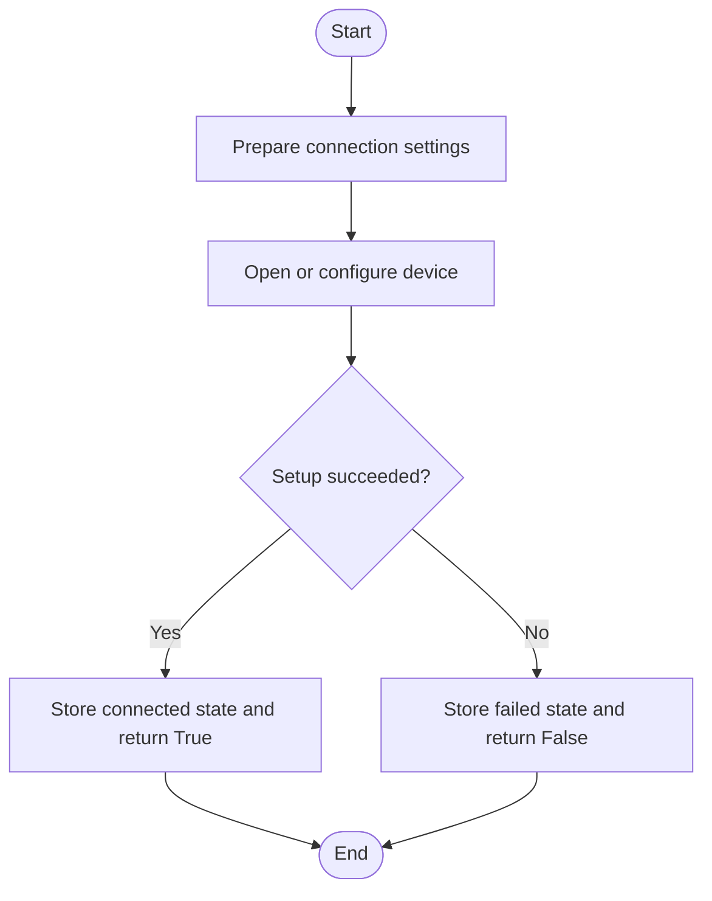
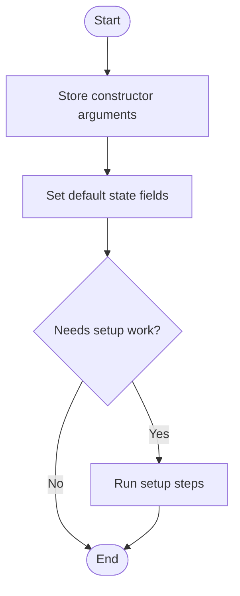
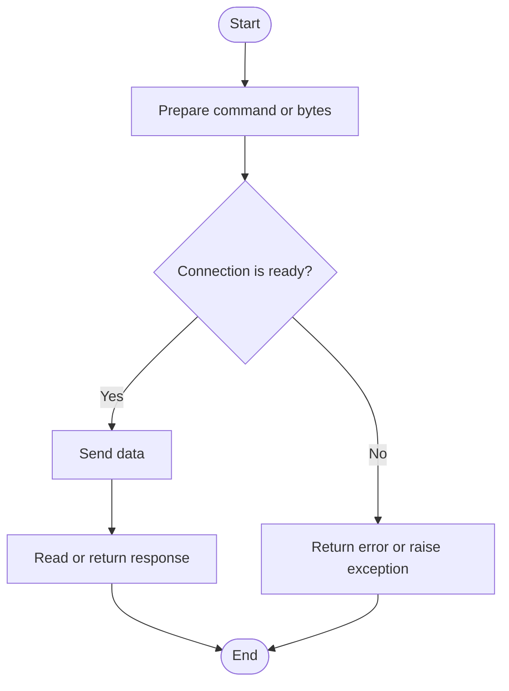
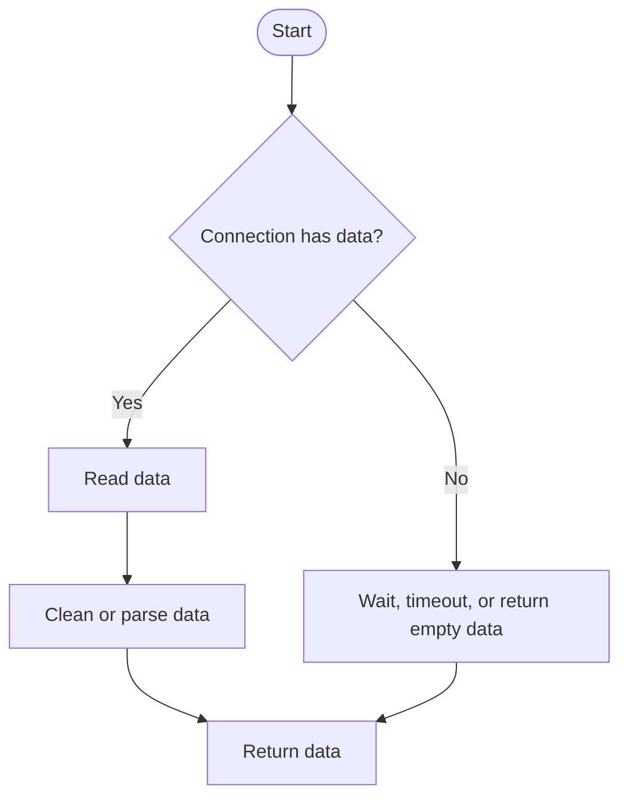
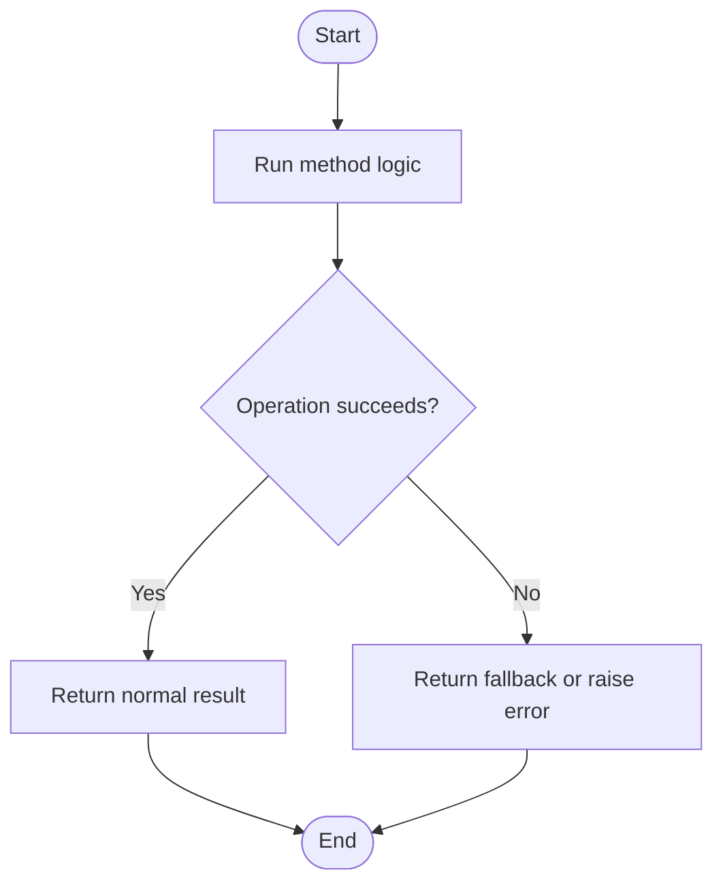
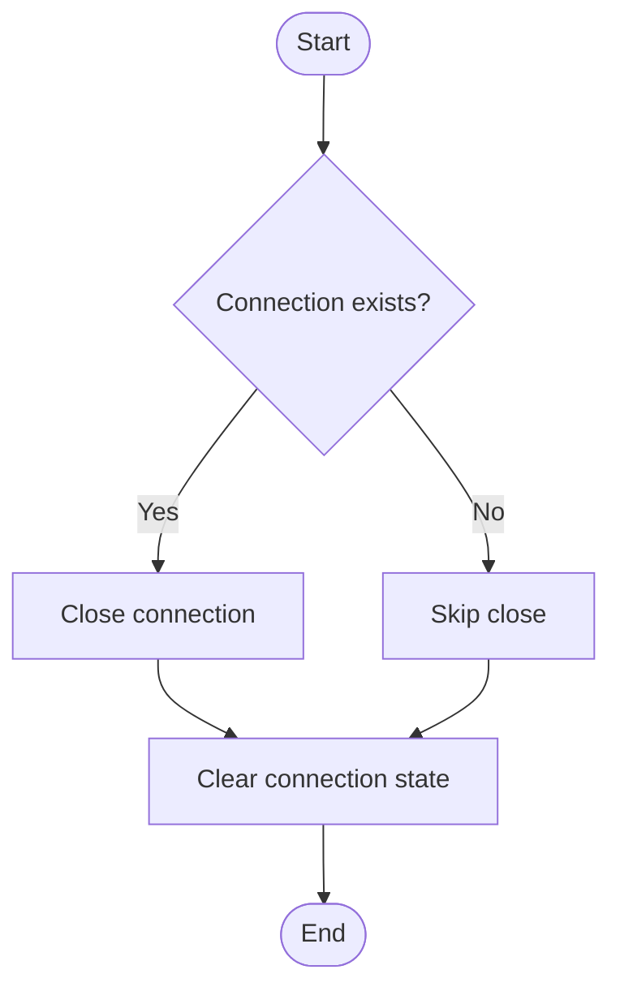
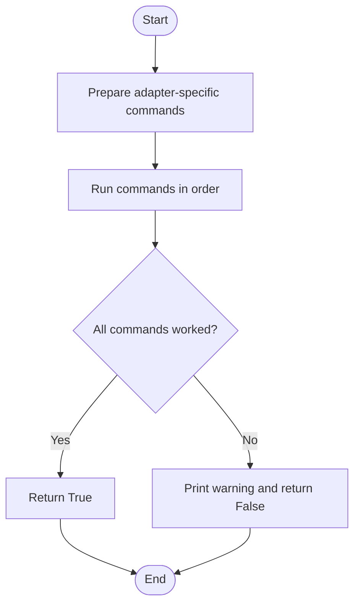
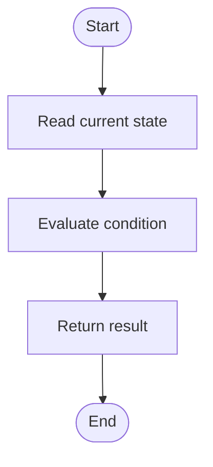

# Port

Source: `src/ddt4all/core/elm/port.py`

Enhanced serial port and TCP connection handler
Supports USB, Bluetooth, WiFi OBD-II devices with cross-platform compatibility
- Serial ports: USB ELM327, Vlinker FS, ObdLink SX, ELS27
- TCP/WiFi: WiFi ELM327 adapters (192.168.0.10:35000 format)
- Bluetooth: Bluetooth ELM327 adapters

## Table Of Contents

- [Method Reference And Flowcharts](#method-reference-and-flowcharts)
- [Initialization Functions](#initialization-functions)
  - [`init_wifi(self, reinit=False)`](#init-wifi-self-reinit-false)
  - [`init_serial(self, speed)`](#init-serial-self-speed)
  - [`init_doip(self, ip, port)`](#init-doip-self-ip-port)
  - [`init_bluetooth(self)`](#init-bluetooth-self)
  - [`__init__(self, portName, speed, adapter_type)`](#init-self-portname-speed-adapter-type)
- [Main Functions](#main-functions)
  - [`write(self, data)`](#write-self-data)
  - [`read_byte(self)`](#read-byte-self)
  - [`read(self)`](#read-self)
  - [`expect_carriage_return(self, time_out=1)`](#expect-carriage-return-self-time-out-1)
  - [`expect(self, pattern, time_out=1)`](#expect-self-pattern-time-out-1)
  - [`close(self)`](#close-self)
  - [`change_rate(self, rate)`](#change-rate-self-rate)
- [Auxiliary Functions](#auxiliary-functions)
  - [`check_elm(self)`](#check-elm-self)
- [Flow Summary](#flow-summary)

## Collaborators

- `Port`: handles low-level serial, Bluetooth, WiFi, or DoIP transport when used by ELM.
- `options`: provides runtime flags and adapter settings.
- `DeviceManager`: applies adapter-specific settings for supported devices.

## State

| Attribute | Purpose |
| --- | --- |
| `adapter_type` | Adapter type. |
| `_lock` | Internal `_lock` value used by the class. |
| `reconnect_attempts` | Internal `reconnect_attempts` value used by the class. |
| `buff` | Internal `buff` value used by the class. |
| `tcpprt` | Internal `tcpprt` value used by the class. |
| `portType` | Internal `portType` value used by the class. |
| `portName` | Port name. |
| `hdr` | Internal `hdr` value used by the class. |
| `connectionStatus` | Connection status flag. |
| `doip_device` | Internal `doip_device` value used by the class. |
| `tcp_needs_reconnect` | Internal `tcp_needs_reconnect` value used by the class. |
| `settings` | Device-specific settings. |

## Method Reference And Flowcharts

## Initialization Functions

### `init_wifi(self, reinit=False)`

Enhanced WiFi/TCP connection with better error handling and reconnection

### `init_serial(self, speed)`

Initialize serial/USB connection with enhanced error handling

### `init_doip(self, ip, port)`

Initialize DoIP connection

### `init_bluetooth(self)`

Initialize Bluetooth connection

### `__init__(self, portName, speed, adapter_type)`

Creates a `Port` instance and sets its starting state.

## Main Functions

### `write(self, data)`

Enhanced write method with automatic reconnection and better error handling

### `read_byte(self)`

Enhanced read_byte with better error handling and reconnection

### `read(self)`

Enhanced read method with better error handling

### `expect_carriage_return(self, time_out=1)`

Runs the `expect_carriage_return` operation for `Port`.

### `expect(self, pattern, time_out=1)`

Runs the `expect` operation for `Port`.

### `close(self)`

Enhanced close method with proper cleanup

### `change_rate(self, rate)`

Runs the `change_rate` operation for `Port`.

## Auxiliary Functions

### `check_elm(self)`

Checks device or protocol state and returns the result.

## Flow Summary

This summary shows the usual high-level flow through `Port`.

