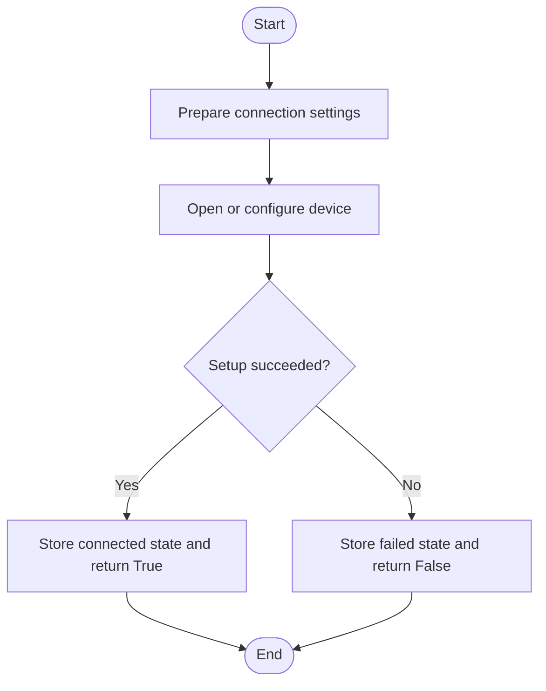
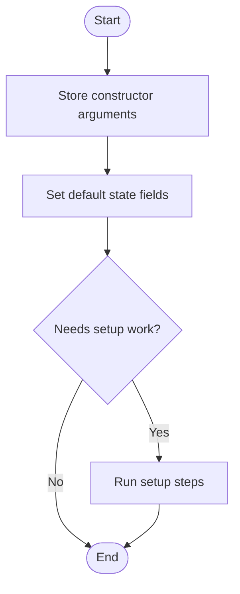
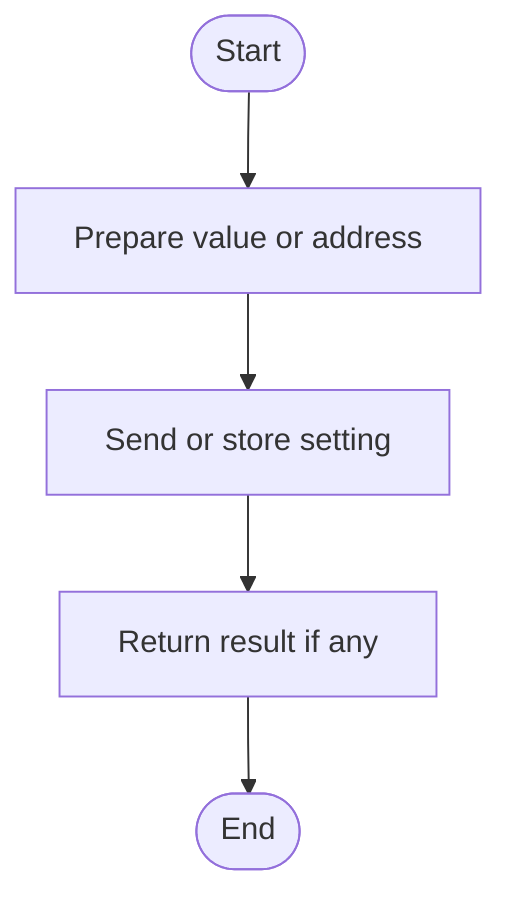
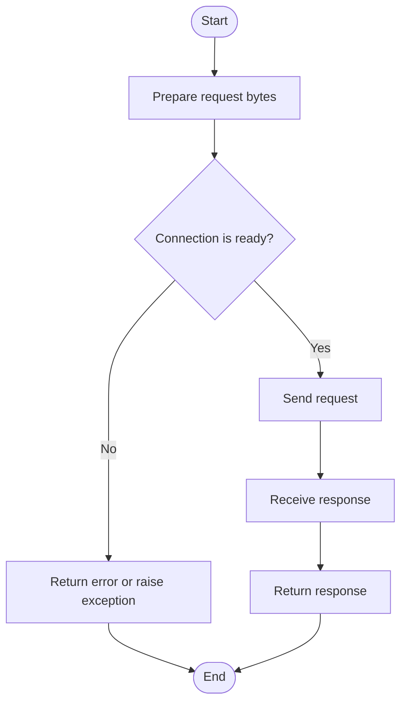
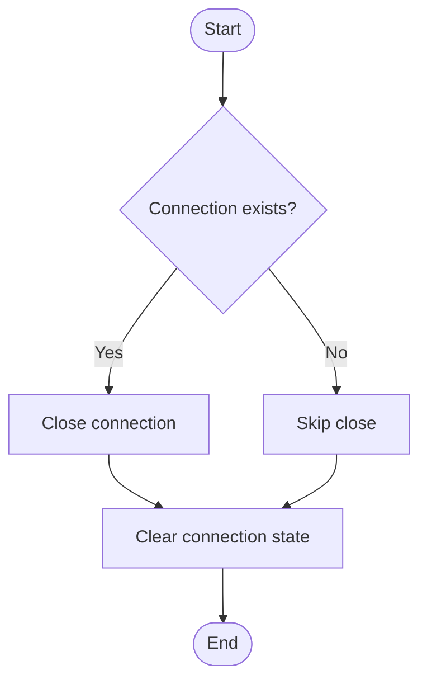
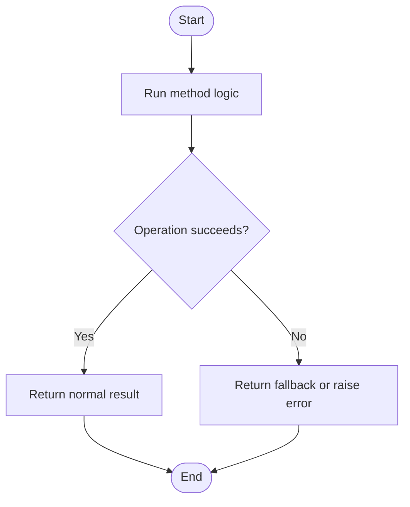
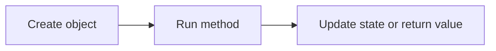

# OBDDevice

Source: `src/ddt4all/core/usbdevice/obd_device.py`

`OBDDevice` is part of the ddt4all core layer.

## Table Of Contents

- [Method Reference And Flowcharts](#method-reference-and-flowcharts)
- [Initialization Functions](#initialization-functions)
  - [`init_can(self)`](#init-can-self)
  - [`__init__(self)`](#init-self)
- [Main Functions](#main-functions)
  - [`start_session_can(self, start_session)`](#start-session-can-self-start-session)
  - [`set_can_addr(self, addr, ecu, canline=0)`](#set-can-addr-self-addr-ecu-canline-0)
  - [`request(self, req, positive='', cache=True, serviceDelay='0')`](#request-self-req-positive-cache-true-servicedelay-0)
  - [`close_protocol(self)`](#close-protocol-self)
  - [`clear_cache(self)`](#clear-cache-self)
- [Auxiliary Functions](#auxiliary-functions)
- [Flow Summary](#flow-summary)

## Collaborators

- `usb.core`, `usb.util`, and `usb.legacy`: access USB devices.
- `options`: provides translated messages and device settings.
- `elm` address helpers: convert ECU addresses for CAN setup.

## State

| Attribute | Purpose |
| --- | --- |
| `device` | Underlying device handle. |
| `connectionStatus` | Connection status flag. |
| `currentaddress` | Current diagnostic address. |
| `startSession` | Last started diagnostic session. |
| `rsp_cache` | Response cache. |
| `device_type` | Detected or configured device type. |
| `settings` | Device-specific settings. |

## Method Reference And Flowcharts

## Initialization Functions

### `init_can(self)`

Runs the `init_can` operation for `OBDDevice`.

### `__init__(self)`

Creates a `OBDDevice` instance and sets its starting state.

## Main Functions

### `start_session_can(self, start_session)`

Runs the `start_session_can` operation for `OBDDevice`.

### `set_can_addr(self, addr, ecu, canline=0)`

Sets set can addr data on the object or connected device.

### `request(self, req, positive='', cache=True, serviceDelay='0')`

Sends a request and returns the response.

### `close_protocol(self)`

Closes the active connection or protocol.

### `clear_cache(self)`

Clear L2 cache before screen update

## Auxiliary Functions

This class has no methods in this group.

## Flow Summary

This summary shows the usual high-level flow through `OBDDevice`.

