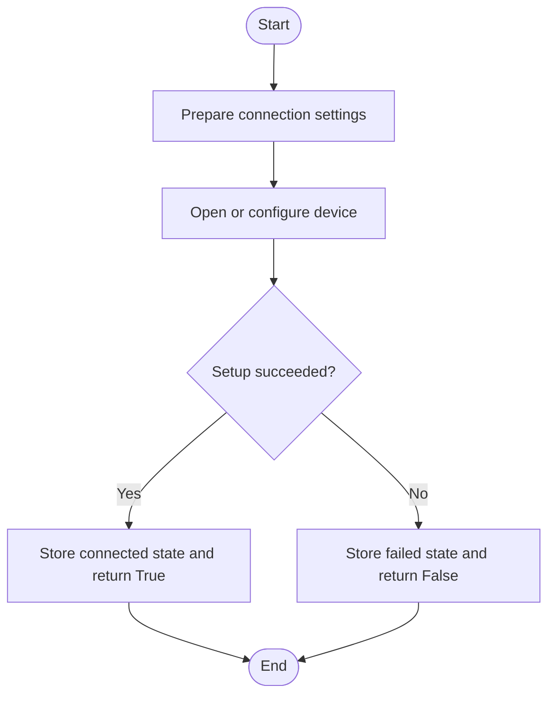
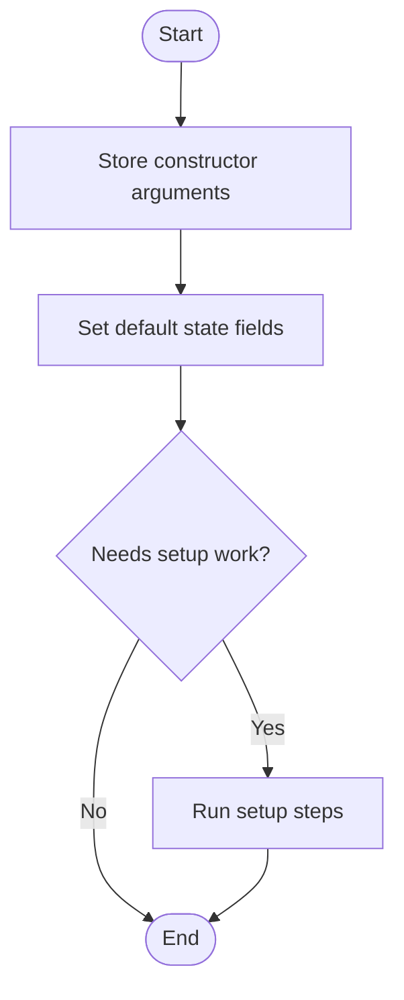
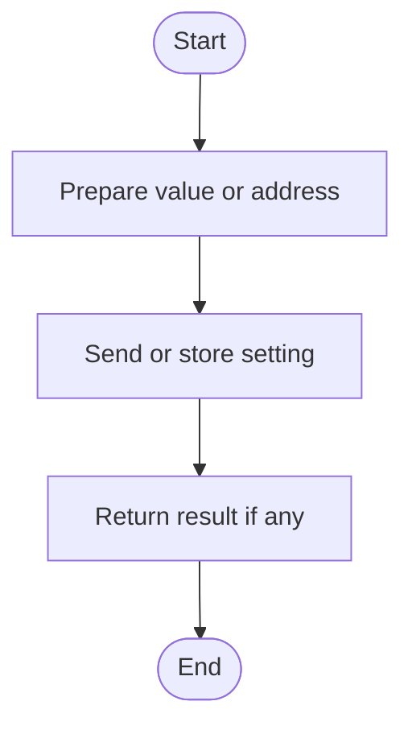
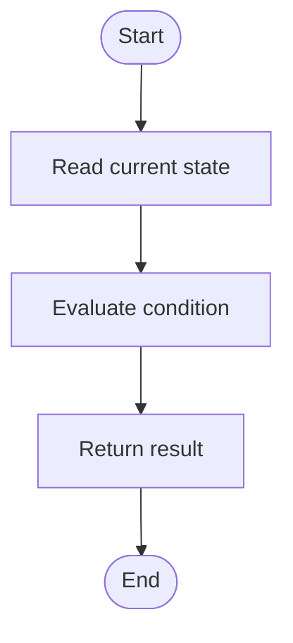
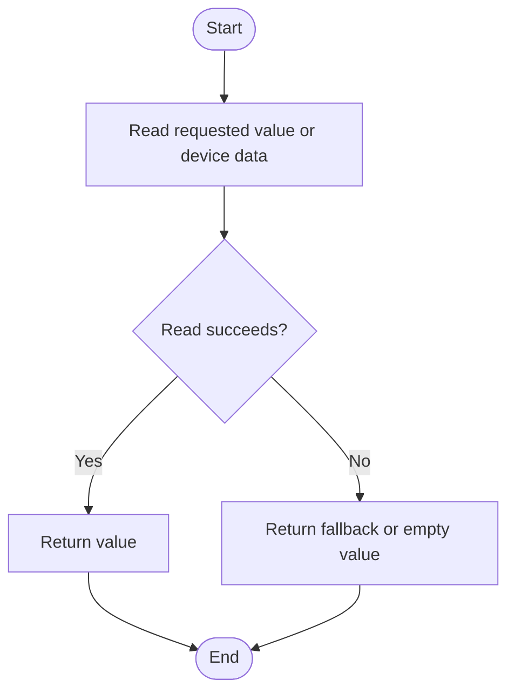
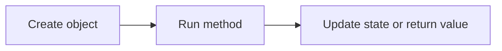

# UsbCan, In Simple English

Source: `src/ddt4all/core/usbdevice/usb_can.py`

`UsbCan` is one part of the core code. This version uses simple English. It keeps the same meaning as the normal document, but uses shorter sentences.

## Table Of Contents

- [Method Reference And Flowcharts](#method-reference-and-flowcharts)
- [Initialization Functions](#initialization-functions)
  - [`init(self)`](#init-self)
  - [`__init__(self)`](#init-self)
- [Main Functions](#main-functions)
  - [`set_vendor_request(self, vendor_id, value)`](#set-vendor-request-self-vendor-id-value)
  - [`set_tx_addr(self, addr)`](#set-tx-addr-self-addr)
  - [`set_rx_addr(self, addr)`](#set-rx-addr-self-addr)
  - [`set_data(self, data)`](#set-data-self-data)
  - [`set_can_mode_monitor(self)`](#set-can-mode-monitor-self)
  - [`set_can_mode_isotp(self)`](#set-can-mode-isotp-self)
- [Auxiliary Functions](#auxiliary-functions)
  - [`is_init(self)`](#is-init-self)
  - [`get_vendor_request(self, vendor_id)`](#get-vendor-request-self-vendor-id)
  - [`get_tx_addr(self)`](#get-tx-addr-self)
  - [`get_string_descriptor(self)`](#get-string-descriptor-self)
  - [`get_rx_addr(self)`](#get-rx-addr-self)
  - [`get_read_buffer_length(self)`](#get-read-buffer-length-self)
  - [`get_data(self, length=511)`](#get-data-self-length-511)
  - [`get_buffer(self, timeout=500)`](#get-buffer-self-timeout-500)
- [Flow Summary](#flow-summary)

## Other Code Used By This Class

- `usb.core`, `usb.util`, and `usb.legacy`: access USB devices.
- `options`: provides translated messages and device settings.
- `elm` address helpers: convert ECU addresses for CAN setup.

## Stored Values

| Attribute | Purpose |
| --- | --- |
| `device` | Underlying device handle. |
| `descriptor` | Text description of the device. |
| `device_type` | Detected or configured device type. |

## Method Reference And Flowcharts

## Initialization Functions

### `init(self)`

Runs the `init` operation for `UsbCan`.

### `__init__(self)`

Creates a `UsbCan` object and sets its starting state.

## Main Functions

### `set_vendor_request(self, vendor_id, value)`

Sets set vendor request data on the object or connected device.

### `set_tx_addr(self, addr)`

Sets set tx addr data on the object or connected device.

### `set_rx_addr(self, addr)`

Sets set rx addr data on the object or connected device.

### `set_data(self, data)`

Sets set data data on the object or connected device.

### `set_can_mode_monitor(self)`

Sets set can mode monitor data on the object or connected device.

### `set_can_mode_isotp(self)`

Sets set can mode isotp data on the object or connected device.

## Auxiliary Functions

### `is_init(self)`

Runs the `is_init` operation for `UsbCan`.

### `get_vendor_request(self, vendor_id)`

Returns or reads get vendor request data from the object or connected device.

### `get_tx_addr(self)`

Returns or reads get tx addr data from the object or connected device.

### `get_string_descriptor(self)`

Returns or reads get string descriptor data from the object or connected device.

### `get_rx_addr(self)`

Returns or reads get rx addr data from the object or connected device.

### `get_read_buffer_length(self)`

Returns or reads get read buffer length data from the object or connected device.

### `get_data(self, length=511)`

Returns or reads get data data from the object or connected device.

### `get_buffer(self, timeout=500)`

Returns or reads get buffer data from the object or connected device.

## Flow Summary

This is the short version of how `UsbCan` is used.

